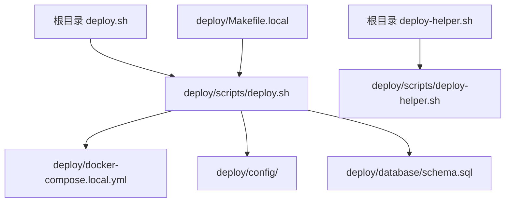

# 📁 项目目录结构

## 目录组织说明

```
chatbot/
├── 📦 backend/                 # Go后端服务
│   ├── cmd/                    # 应用入口
│   ├── internal/               # 内部包
│   ├── pkg/                    # 公共包
│   └── Dockerfile              # 后端镜像
│
├── 🧮 algo/                    # Python算法服务
│   ├── app/                    # FastAPI应用
│   ├── core/                   # 核心算法模块
│   ├── requirements.txt        # Python依赖
│   └── Dockerfile              # 算法服务镜像
│
├── 🎨 frontend/                # Next.js前端
│   ├── app/                    # 页面路由
│   ├── components/             # React组件
│   ├── lib/                    # 工具库
│   ├── miniprogram/            # 微信小程序客户端
│   │   ├── app.js              # 小程序入口
│   │   ├── app.json            # 小程序配置
│   │   ├── pages/              # 页面目录
│   │   └── README.md           # 小程序文档
│   └── Dockerfile              # 前端镜像
│
├── 🛠️ admin/                   # 管理后台
│   └── app.py                  # Flask应用
│
├── 🚀 deploy/                  # 部署相关文件
│   ├── scripts/                # 部署脚本
│   │   ├── deploy.sh           # 智能部署脚本
│   │   ├── deploy-helper.sh   # 部署助手工具
│   │   └── setup.sh            # 初始化脚本
│   ├── config/                 # 配置文件
│   │   ├── env.local           # 环境变量模板
│   │   └── prometheus.yml      # Prometheus配置
│   ├── database/               # 数据库脚本
│   │   └── schema.sql          # 数据库结构
│   ├── k8s/                    # Kubernetes配置
│   │   └── deployment.yaml     # K8s部署文件
│   ├── local/                  # 本地部署生成文件
│   ├── docker-compose.yml      # Docker Compose配置
│   ├── docker-compose.local.yml # 本地环境配置
│   └── Makefile.local          # Make命令集合
│
├── 🧪 tests/                   # 测试文件
│   └── test-voice.sh           # 语音功能测试
│
├── 📚 docs/                    # 项目文档
│   ├── PROJECT_MASTER_DOC.md  # 完整技术文档
│   ├── OPTIMIZATION_PLAN_2025.md # 优化方案
│   ├── DOCUMENTATION_INDEX.md # 文档索引
│   ├── VERSION.md             # 版本管理
│   └── BRANCHING.md           # 分支策略
│
├── 📜 scripts/                 # 开发脚本
│   └── branch-setup.sh         # 分支管理脚本
│
├── 🔧 根目录文件
├── deploy.sh                   # 部署脚本入口（调用deploy/scripts/deploy.sh）
├── deploy-helper.sh            # 部署助手入口（调用deploy/scripts/deploy-helper.sh）
├── README.md                   # 项目说明
├── README-DEPLOY.md            # 部署指南
├── Makefile                    # 主Makefile
├── env.example                 # 环境变量示例
├── .gitignore                  # Git忽略配置
└── .cursorignore              # Cursor AI忽略配置
```

## 🎯 目录职责说明

### 应用代码目录
- **backend/**: Go语言编写的API网关服务
- **algo/**: Python编写的算法服务（LangChain、RAG、Agent）
- **frontend/**: Next.js编写的Web前端
- **frontend/miniprogram/**: 微信小程序客户端（集成在frontend中）
- **admin/**: Flask编写的管理后台

### 部署相关目录
- **deploy/scripts/**: 所有部署脚本的实际位置
- **deploy/config/**: 配置文件模板
- **deploy/database/**: 数据库初始化脚本
- **deploy/k8s/**: Kubernetes部署配置
- **deploy/local/**: 本地部署时生成的文件（自动创建）

### 开发支持目录
- **tests/**: 测试脚本和测试用例
- **docs/**: 完整的项目文档
- **scripts/**: 开发辅助脚本

## 🔄 文件调用关系



## 📝 使用说明

### 部署操作
```bash
# 从根目录执行（推荐）
./deploy.sh --full              # 完整部署
./deploy-helper.sh              # 打开部署助手

# 或直接调用deploy目录下的脚本
deploy/scripts/deploy.sh --chatbot   # 部署应用
```

### 开发操作
```bash
# 运行测试
tests/test-voice.sh

# 分支管理
scripts/branch-setup.sh

# 使用Makefile
make -f deploy/Makefile.local up
```

### 配置文件
- 环境变量: 复制 `env.example` 为 `.env`
- 部署配置: 在 `deploy/config/` 目录下
- Docker配置: `deploy/docker-compose.local.yml`

## 🌟 最佳实践

1. **部署脚本**: 统一放在 `deploy/scripts/` 目录
2. **测试脚本**: 统一放在 `tests/` 目录
3. **配置文件**: 统一放在 `deploy/config/` 目录
4. **文档**: 统一放在 `docs/` 目录
5. **根目录脚本**: 仅作为便捷入口，实际逻辑在子目录

## 🔍 快速定位

| 需求 | 位置 |
|------|------|
| 部署系统 | `./deploy.sh` 或 `deploy/scripts/deploy.sh` |
| 查看文档 | `docs/PROJECT_MASTER_DOC.md` |
| 修改配置 | `deploy/config/` |
| 运行测试 | `tests/` |
| 数据库脚本 | `deploy/database/` |
| K8s部署 | `deploy/k8s/` |
