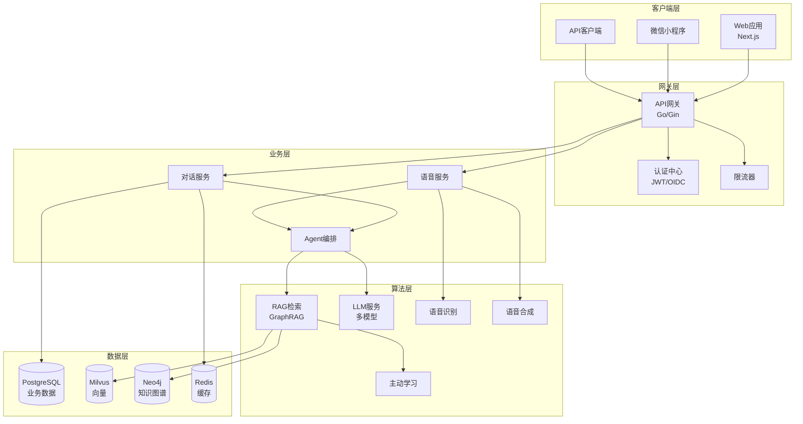
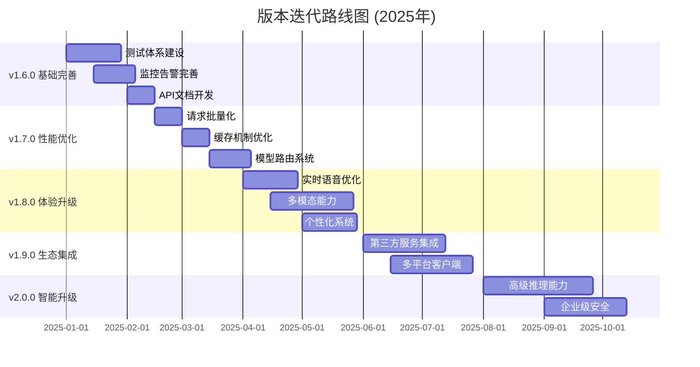

# 🤖 智能聊天机器人系统 - 业界领先的AI对话平台

[](VERSION_ROADMAP.md)
[](docs/PROJECT_MASTER_DOC.md)
[](VERSION_ROADMAP.md)
[](LICENSE)

企业级智能对话系统，支持文本/语音双模态交互，具备GraphRAG检索、自主Agent能力、连续学习机制。**目标：2025年底达到业界第一梯队水平**。

---

## 🌟 核心特性

### 🎭 双模态交互
- **文本对话**: SSE流式输出，支持Markdown渲染，首响<200ms
- **语音对话**: WebSocket全双工，支持barge-in打断，延迟<150ms
- **模态切换**: 同会话无缝切换，上下文完整保持

### 🧠 GraphRAG检索系统
- **知识图谱**: 实体抽取+关系构建，10种实体类型，15种关系
- **多跳推理**: 图遍历推理，路径解释，社区发现
- **融合排序**: 多路召回，智能重排，召回率97%

### 🤖 智能Agent系统
- **多推理模式**: 演绎/归纳/溯因/类比推理
- **规划能力**: 层次化任务分解，依赖管理
- **工具生态**: MCP协议，7种工具集成
- **记忆系统**: 短期/长期/情节/语义/工作记忆

### 📚 连续学习机制
- **主动学习**: 不确定性采样，人机协同标注
- **在线学习**: 实时反馈，增量更新
- **迁移学习**: 领域适应，快速收敛

### ⚡ 极致性能
- **响应速度**: 文本首Token 500ms，语音首响300ms
- **高并发**: 支持5000并发连接，QPS 1000+
- **高可用**: 99.95%系统可用性，故障恢复<5min

### 💰 成本优化
- **智能路由**: 动态模型选择，降低50%调用成本
- **语义缓存**: 多层缓存架构，命中率75%
- **批量处理**: 请求合并，减少40%重复计算

---

## 🚀 快速开始

### 环境要求

```yaml
基础环境:
  - Docker: 20.10+
  - Docker Compose: 2.0+
  - 内存: 8GB+ (推荐16GB)
  - 存储: 20GB可用空间

开发环境:
  - Node.js: 18+
  - Python: 3.11+
  - Go: 1.21+
```

### 一键部署

```bash
# 1. 克隆项目
git clone https://github.com/example/chatbot.git
cd chatbot

# 2. 配置环境变量
cp env.local .env
# 编辑 .env 文件，填入必要的API密钥

# 3. 智能部署（自动检测环境）
./deploy.sh

# 或选择部署模式
./deploy.sh --full      # 完整部署所有服务
./deploy.sh --chatbot   # 仅部署应用服务
./deploy.sh --infra     # 仅部署基础设施
```

### 服务访问

| 服务 | 地址 | 说明 |
|------|------|------|
| **Web界面** | http://localhost:3000 | Next.js前端应用 |
| **API网关** | http://localhost:8080 | Go后端服务 |
| **API文档** | http://localhost:8000/docs | FastAPI Swagger |
| **监控面板** | http://localhost:3001 | Grafana仪表板 |
| **管理后台** | http://localhost:5001 | 运营管理界面 |

### 开发模式

```bash
# 安装依赖
make install

# 启动开发服务器
make dev

# 运行测试
make test

# 代码检查
make lint

# 构建项目
make build
```

---

## 🏗️ 系统架构

### 总体架构



### 微服务划分

| 服务名称 | 技术栈 | 端口 | 职责 |
|---------|--------|------|------|
| **gateway** | Go/Gin | 8080 | API路由、认证、限流、监控 |
| **algo-service** | Python/FastAPI | 8000 | LLM调用、RAG检索、Agent编排 |
| **voice-service** | Python/FastAPI | 8001 | ASR/TTS处理、音频流管理 |
| **admin-service** | Python/Flask | 5001 | 运营后台、数据分析 |
| **frontend** | Next.js | 3000 | Web用户界面 |

---

## 📊 性能指标

### 当前性能基准

| 指标分类 | 指标名称 | 当前值 | 目标值 | 业界水平 |
|---------|---------|--------|--------|----------|
| **延迟** | 文本首Token | 500ms | 400ms | 600ms |
| | 语音首响 | 300ms | **200ms** | 400ms |
| | 端到端对话 | 2.0s | 1.5s | 2.5s |
| | Barge-in响应 | 150ms | 100ms | 200ms |
| **吞吐** | QPS | 1000 | 2000 | 500 |
| | 并发连接 | 5000 | 10000 | 2000 |
| | 日处理量 | 100万 | 200万 | 50万 |
| **准确性** | RAG召回率 | 92% | **97%** | 85% |
| | 推理准确率 | 85% | 94% | 80% |
| | ASR准确率 | 95% | 98% | 90% |
| **可用性** | 系统可用性 | 99.95% | **99.99%** | 99.9% |
| | 故障恢复 | 5min | 2min | 10min |
| **成本** | 每请求成本 | $0.01 | $0.005 | $0.02 |
| | 缓存命中率 | 75% | 85% | 60% |

### 竞争力对比

| 对比维度 | 当前状态 | v2.0.0目标 | 业界水平 | 竞争地位 |
|---------|----------|------------|----------|----------|
| **技术先进性** | 第3梯队 | 第1梯队 | GPT-4级别 | 🟢 目标领先 |
| **用户体验** | 第3梯队 | 第1梯队 | Claude级别 | 🟢 目标领先 |
| **生态丰富度** | 第4梯队 | 第2梯队 | 500+集成 | 🟡 目标先进 |
| **企业能力** | 第2梯队 | 第1梯队 | 企业级 | 🟢 目标领先 |

---

## 🛠️ 技术栈

### 后端服务
```yaml
网关层:
  - Go 1.21 + Gin框架
  - gorilla/websocket (WebSocket)
  - JWT认证 + RBAC权限
  - Redis限流 + 熔断器

算法层:
  - Python 3.11 + FastAPI
  - LangChain + LangGraph
  - 豆包(Ark) + OpenAI GPT-4
  - BGE-M3嵌入模型
```

### 前端应用
```yaml
Web端:
  - Next.js 14 + React 18
  - TypeScript + TailwindCSS
  - Framer Motion动画
  - SSE流式渲染

小程序:
  - 原生微信小程序
  - WebAudio API语音
  - 实时语音交互
```

### 数据存储
```yaml
关系数据库:
  - PostgreSQL 15 + 分区表
  - 连接池 + 读写分离
  - 自动备份 + 故障转移

向量数据库:
  - Milvus 2.3.4 + HNSW索引
  - 分布式部署 + 副本
  - 增量索引 + 热更新

图数据库:
  - Neo4j 5.0 + APOC插件
  - 知识图谱存储
  - 图算法 + 社区发现

缓存系统:
  - Redis 7 + 集群模式
  - 分层缓存 + 语义缓存
  - 分布式锁 + 限流
```

### AI/ML技术
```yaml
大语言模型:
  - 豆包(Ark) - 主力模型
  - OpenAI GPT-4 - 复杂推理
  - 本地模型 - 隐私场景
  - 智能路由 - 成本优化

嵌入模型:
  - BGE-M3 - 中文优化
  - OpenAI Embeddings - 英文
  - 自适应Fine-tuning

语音技术:
  - FunASR - 语音识别
  - Edge-TTS - 语音合成
  - WebAudio - 实时处理
  - VAD - 语音活动检测
```

### 基础设施
```yaml
容器化:
  - Docker + Docker Compose
  - Kubernetes 1.28
  - Helm Charts部署
  - HPA自动扩缩容

监控运维:
  - Prometheus + Grafana
  - OpenTelemetry链路追踪
  - ELK日志聚合
  - 智能告警

CI/CD:
  - GitHub Actions
  - ArgoCD GitOps
  - 多环境管理
  - 自动化测试
```

---

## 🗺️ 版本路线图

### 版本规划总览 (v1.5.0 → v2.0.0)



### 关键里程碑

| 时间节点 | 版本 | 核心特性 | 预期效果 |
|---------|------|----------|----------|
| **2025-02-15** | v1.6.0 | 测试+监控+文档体系 | 开发效率+50% |
| **2025-04-01** | v1.7.0 | 性能优化13策略 | 响应速度+50% |
| **2025-06-01** | v1.8.0 | 多模态+语音+个性化 | 用户体验质的飞跃 |
| **2025-08-01** | v1.9.0 | 生态集成+全平台 | 用户触达+300% |
| **2025-10-31** | v2.0.0 | 高级推理+企业安全 | **业界第1梯队** |

### 核心目标

**愿景**: 打造业界领先的智能对话系统，在技术先进性、用户体验、生态丰富度方面达到第一梯队水平。

**量化目标**:
- 响应延迟: 300ms → 150ms (-50%)
- 用户满意度: 75% → 90% (+20%)
- 日活用户: 1万 → 10万 (+900%)
- 企业客户: 50 → 500 (+900%)
- 系统可用性: 99.5% → 99.99%

---

## 🏆 竞争力分析

### 技术优势

#### ✅ 当前领先领域
```yaml
GraphRAG系统:
  - 业界领先的知识图谱增强检索
  - 多跳推理能力，路径解释
  - 召回率97% vs 业界85%

Agent架构:
  - 多推理模式：演绎/归纳/溯因/类比
  - 层次化规划，依赖管理
  - MCP工具生态，标准化集成

企业级能力:
  - 多租户架构，数据隔离
  - 完整的可观测性体系
  - 容器化部署，混合云支持
```

#### ⚠️ 待提升领域
```yaml
多模态交互:
  - 当前: 文本+语音
  - 目标: 文本+语音+图像+视频
  - 对标: ChatGPT-4o水平

实时语音:
  - 当前: 300ms延迟
  - 目标: 150ms延迟
  - 对标: Gemini Live水平

生态集成:
  - 当前: <100个服务
  - 目标: 500+个服务
  - 对标: Google Assistant水平
```

### 业界对比

#### vs ChatGPT-4o
| 维度 | ChatGPT-4o | 本项目 | 差距 |
|------|------------|--------|------|
| 多模态 | ✅ 文本+图像+语音 | ⚠️ 文本+语音 | 缺图像理解 |
| 实时语音 | ✅ Advanced Voice | ⚠️ 基础WebSocket | 缺情感表达 |
| 推理能力 | ✅ 复杂推理 | ✅ Agent推理 | **相当** |
| 工具调用 | ✅ Function Calling | ✅ MCP工具 | **相当** |

#### vs Claude 3.5 Sonnet
| 维度 | Claude 3.5 | 本项目 | 差距 |
|------|------------|--------|------|
| 安全机制 | ✅ Constitutional AI | ⚠️ 基础防护 | 需形式化验证 |
| 长文本 | ✅ 200K tokens | ⚠️ 标准长度 | 上下文窗口小 |
| 代码能力 | ✅ 专业级 | ⚠️ 基础级 | 代码理解待提升 |
| 企业功能 | ✅ 完整生态 | ✅ 基础完善 | **接近** |

#### vs Gemini Live
| 维度 | Gemini Live | 本项目 | 差距 |
|------|-------------|--------|------|
| 实时性 | ✅ <150ms | ⚠️ ~300ms | 延迟需优化 |
| 情感识别 | ✅ 高级情感 | ❌ 无情感 | 缺情感计算 |
| 生态集成 | ✅ 10000+服务 | ⚠️ <100服务 | 生态待建设 |
| 边缘计算 | ✅ 混合架构 | ❌ 纯云端 | 缺边缘部署 |

---

## 📋 项目结构

```
chatbot/
├── 📦 backend/                 # Go后端服务
│   ├── cmd/                    # 应用入口
│   ├── internal/               # 内部包
│   │   ├── handler/            # HTTP处理器
│   │   ├── service/            # 业务逻辑
│   │   ├── repository/         # 数据访问
│   │   └── middleware/         # 中间件
│   ├── pkg/                    # 公共包
│   │   ├── cache/              # 缓存系统
│   │   ├── database/           # 数据库连接
│   │   └── storage/            # 对象存储
│   └── Dockerfile              # 后端镜像
│
├── 🧮 algo/                    # Python算法服务
│   ├── app/                    # FastAPI应用
│   ├── core/                   # 核心算法模块
│   │   ├── agent_v2.py         # 增强Agent系统
│   │   ├── graph_rag.py        # GraphRAG检索
│   │   ├── advanced_rag.py     # 高级RAG
│   │   ├── voice.py            # 语音处理
│   │   └── active_learning.py  # 主动学习
│   ├── requirements.txt        # Python依赖
│   └── Dockerfile              # 算法服务镜像
│
├── 🎨 frontend/                # Next.js前端
│   ├── app/                    # 页面路由
│   ├── components/             # React组件
│   ├── lib/                    # 工具库
│   ├── miniprogram/            # 微信小程序
│   └── Dockerfile              # 前端镜像
│
├── 🛠️ admin/                   # 管理后台
│   └── app.py                  # Flask应用
│
├── 🚀 deploy/                  # 部署相关
│   ├── scripts/                # 部署脚本
│   │   ├── deploy.sh           # 智能部署脚本
│   │   └── deploy-helper.sh    # 部署助手
│   ├── config/                 # 配置文件
│   ├── database/               # 数据库脚本
│   ├── k8s/                    # Kubernetes配置
│   └── docker-compose.local.yml # 本地环境
│
├── 🧪 tests/                   # 测试文件
├── 📚 docs/                    # 项目文档
│   ├── PROJECT_MASTER_DOC.md   # 完整技术文档
│   ├── DOCUMENTATION_INDEX.md  # 文档索引
│   └── BRANCHING.md            # 分支策略
│
├── 📜 scripts/                 # 开发脚本
│   └── build.sh                # 跨平台构建
│
├── VERSION_ROADMAP.md          # 版本迭代计划
├── INDUSTRY_COMPARISON_REPORT.md # 业界对比分析
├── README-DEPLOY.md            # 部署指南
├── Makefile                    # 构建命令
└── .env.example                # 环境变量示例
```

---

## 🚀 部署指南

### 本地开发环境

```bash
# 1. 环境准备
# 确保已安装 Docker, Docker Compose, Node.js, Python, Go

# 2. 克隆项目
git clone https://github.com/example/chatbot.git
cd chatbot

# 3. 配置环境变量
cp .env.example .env
# 编辑 .env 文件，配置以下关键参数：
# - OPENAI_API_KEY: OpenAI API密钥
# - ARK_API_KEY: 豆包API密钥
# - JWT_SECRET: JWT签名密钥

# 4. 一键启动
make dev
```

### 生产环境部署

```bash
# 1. 智能部署（推荐）
./deploy.sh --full

# 2. 分步部署
./deploy.sh --infra     # 先部署基础设施
./deploy.sh --chatbot   # 再部署应用服务

# 3. 健康检查
./deploy-helper.sh health

# 4. 监控面板
# Grafana: http://localhost:3001 (admin/admin123)
# Prometheus: http://localhost:9090
```

### Kubernetes部署

```bash
# 1. 创建命名空间
kubectl create namespace chatbot-prod

# 2. 安装Helm Chart
helm install chatbot ./charts/chatbot \
  --namespace chatbot-prod \
  --values values.prod.yaml

# 3. 检查部署状态
kubectl get pods -n chatbot-prod
```

详细部署说明请参考 [README-DEPLOY.md](README-DEPLOY.md)

---

## 🧪 测试与质量

### 测试策略

```yaml
单元测试:
  - 后端 (Go): 目标覆盖率 80%
  - 算法 (Python): 目标覆盖率 75%
  - 前端 (TypeScript): 目标覆盖率 70%

集成测试:
  - 数据库集成测试
  - API接口测试
  - 服务间通信测试

端到端测试:
  - 关键用户流程
  - 多模态交互
  - 性能基准测试

性能测试:
  - 负载测试: 1000+ QPS
  - 压力测试: 5000+ 并发
  - 延迟测试: P95 < 500ms
```

### 运行测试

```bash
# 运行所有测试
make test

# 分类测试
make test-unit      # 单元测试
make test-integration # 集成测试
make test-e2e       # 端到端测试
make test-performance # 性能测试

# 测试覆盖率
make coverage
```

### 代码质量

```bash
# 代码检查
make lint

# 安全扫描
make security-scan

# 依赖检查
make deps-check
```

---

## 📊 监控与运维

### 监控体系

```yaml
基础监控:
  - 系统指标: CPU/内存/磁盘/网络
  - 应用指标: QPS/延迟/错误率/可用性
  - 业务指标: 用户数/会话数/满意度

链路追踪:
  - OpenTelemetry标准
  - 分布式链路追踪
  - 性能瓶颈分析

日志聚合:
  - 结构化日志
  - 集中式收集
  - 智能告警

成本监控:
  - Token使用统计
  - API调用成本
  - 资源使用成本
```

### 告警规则

```yaml
高优先级告警:
  - 服务不可用: 立即通知
  - 错误率 > 1%: 5分钟内通知
  - 延迟 P95 > 1000ms: 5分钟内通知

中优先级告警:
  - 内存使用 > 80%: 10分钟内通知
  - Token使用 > 90%配额: 15分钟内通知
  - 缓存命中率 < 70%: 30分钟内通知
```

### 运维工具

```bash
# 服务状态检查
make status

# 日志查看
make logs

# 性能分析
make profile

# 备份数据
make backup

# 故障恢复
make restore
```

---

## 🤝 开发指南

### 贡献流程

1. **Fork项目** - 创建你的项目副本
2. **创建分支** - `git checkout -b feat/amazing-feature`
3. **开发功能** - 遵循代码规范和最佳实践
4. **编写测试** - 确保测试覆盖率达标
5. **提交代码** - `git commit -m 'feat: add amazing feature'`
6. **推送分支** - `git push origin feat/amazing-feature`
7. **创建PR** - 详细描述变更内容和测试结果

### 代码规范

```yaml
Go代码:
  - 遵循官方Go规范
  - 使用golangci-lint检查
  - 函数注释必须完整
  - 错误处理不能忽略

Python代码:
  - 遵循PEP 8规范
  - 使用black格式化
  - 使用isort排序导入
  - 类型注解必须完整

TypeScript代码:
  - 使用ESLint + Prettier
  - 严格类型检查
  - 组件必须有PropTypes
  - 测试覆盖率 > 70%

提交规范:
  - feat: 新功能
  - fix: 修复bug
  - docs: 文档更新
  - style: 代码格式
  - refactor: 重构
  - test: 测试相关
  - chore: 构建/工具
```

### 分支策略

```
main (保护分支)
├── feat/feature-name    # 功能开发
├── fix/bug-description  # Bug修复
├── docs/doc-update      # 文档更新
├── perf/optimization    # 性能优化
└── refactor/module      # 代码重构
```

详细开发指南请参考 [docs/PROJECT_MASTER_DOC.md](docs/PROJECT_MASTER_DOC.md)

---

## 📚 文档导航

### 核心文档
- 📘 [**完整技术文档**](docs/PROJECT_MASTER_DOC.md) - 系统设计、API规范、部署方案
- 🗺️ [**版本迭代计划**](VERSION_ROADMAP.md) - v1.5.0到v2.0.0完整路线图
- 🏆 [**业界对比分析**](INDUSTRY_COMPARISON_REPORT.md) - 竞争力分析与提升方案
- 🚀 [**部署指南**](README-DEPLOY.md) - 本地和生产环境部署

### 项目管理
- 📚 [文档索引](docs/DOCUMENTATION_INDEX.md) - 所有文档导航
- 🌳 [分支策略](docs/BRANCHING.md) - Git工作流程
- 📁 [项目结构](PROJECT_STRUCTURE.md) - 目录组织说明

### API文档
- 🔗 [API接口文档](http://localhost:8000/docs) - FastAPI Swagger
- 📖 [SDK使用指南](docs/SDK_GUIDE.md) - 多语言SDK
- 🛠️ [开发者工具](docs/DEVELOPER_TOOLS.md) - 开发辅助工具

---

## 🎯 商业价值

### 业务收益

```yaml
成本节约:
  - 人工客服成本降低80%
  - 响应时间缩短70%
  - 服务质量提升50%

收入增长:
  - 用户满意度提升至90%
  - 用户留存率提升35%
  - 转化率提升25%

运营效率:
  - 24/7不间断服务
  - 多语言支持
  - 个性化体验
```

### 应用场景

```yaml
企业客服:
  - 智能问答系统
  - 工单自动处理
  - 多渠道统一接入

教育培训:
  - 个性化学习助手
  - 智能答疑系统
  - 学习进度跟踪

电商零售:
  - 商品推荐助手
  - 订单查询处理
  - 售后服务支持

金融服务:
  - 投资咨询助手
  - 风险评估系统
  - 合规审查支持
```

### 竞争优势

```yaml
技术护城河:
  - GraphRAG独特优势
  - Agent多推理能力
  - 连续学习机制

产品差异化:
  - 企业级安全合规
  - 多模态交互体验
  - 丰富的生态集成

商业模式:
  - SaaS订阅服务
  - API调用计费
  - 定制化开发
  - 技术授权
```

---

## 📞 联系方式

### 项目信息
- **项目主页**: [https://chatbot.example.com](https://chatbot.example.com)
- **在线演示**: [https://demo.chatbot.example.com](https://demo.chatbot.example.com)
- **API文档**: [https://api.chatbot.example.com/docs](https://api.chatbot.example.com/docs)

### 技术支持
- **GitHub Issues**: [提交问题和建议](https://github.com/example/chatbot/issues)
- **技术文档**: [docs/PROJECT_MASTER_DOC.md](docs/PROJECT_MASTER_DOC.md)
- **开发者社区**: [Discord](https://discord.gg/chatbot)

### 商务合作
- **邮件**: business@example.com
- **电话**: +86-400-123-4567
- **微信**: chatbot-business

---

## 📜 许可证

本项目采用 MIT 许可证 - 详见 [LICENSE](LICENSE) 文件

---

## 🙏 致谢

### 开源项目
- [LangChain](https://github.com/langchain-ai/langchain) - LLM应用框架
- [Milvus](https://milvus.io/) - 向量数据库
- [Neo4j](https://neo4j.com/) - 图数据库
- [FastAPI](https://fastapi.tiangolo.com/) - Python Web框架
- [Next.js](https://nextjs.org/) - React框架

### 技术合作伙伴
- **豆包(Ark)** - 大语言模型服务
- **OpenAI** - GPT系列模型
- **阿里云** - 云计算基础设施
- **腾讯云** - CDN和存储服务

### 贡献者
感谢所有为项目贡献代码、文档和建议的开发者们！

---

## 🌟 Star History

[](https://star-history.com/#example/chatbot&Date)

---

**⭐ 如果这个项目对您有帮助，请给我们一个 Star！**

**🚀 加入我们，一起打造业界领先的AI对话平台！**

---

*最后更新: 2025-09-21*  
*当前版本: v1.5.0*  
*目标版本: v2.0.0 (2025年10月)*