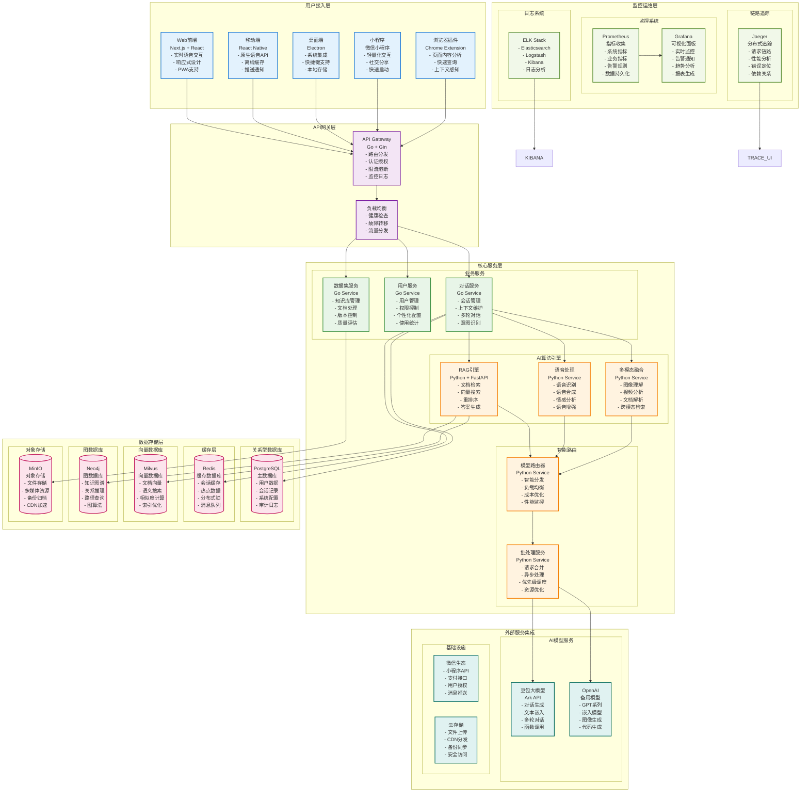
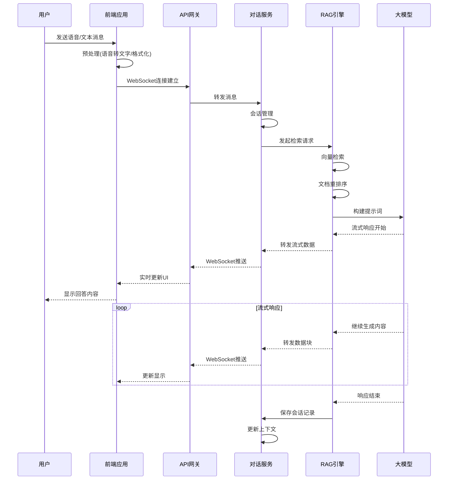
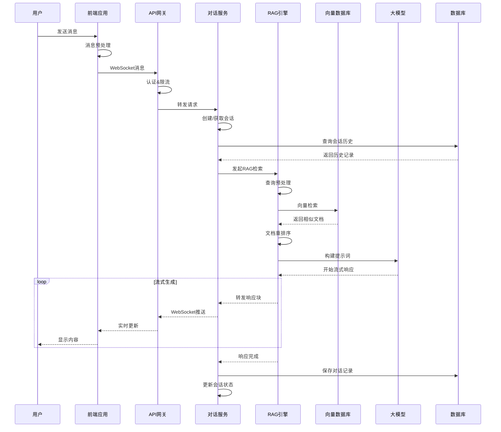
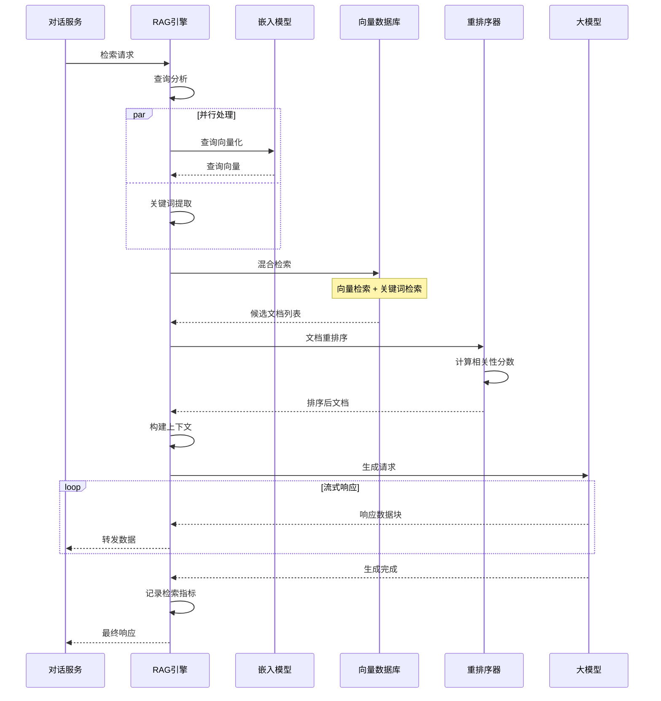
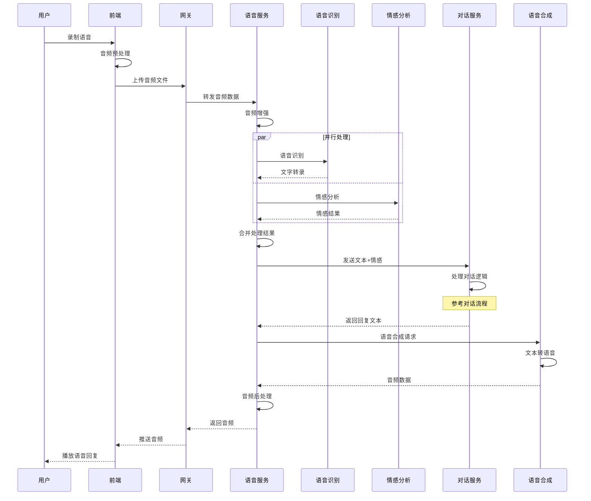
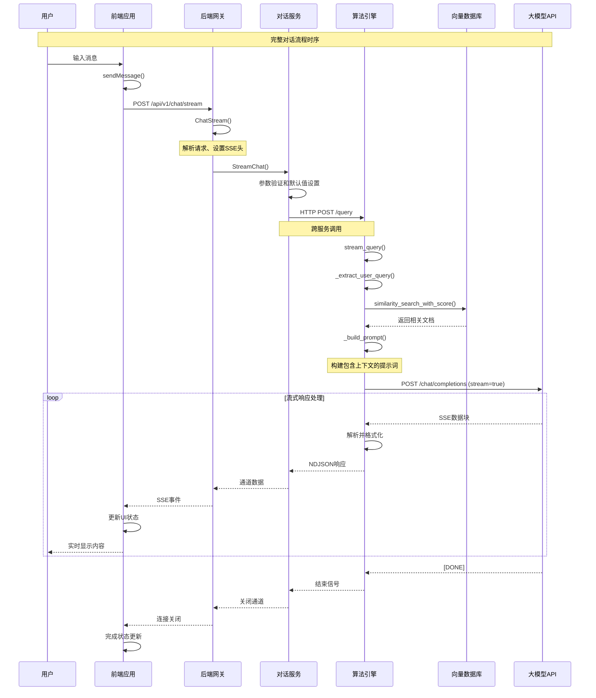

# 深入VoiceHelper：智能语音助手系统架构源码剖析

深入剖析VoiceHelper智能语音助手系统源码实现，从微服务架构到AI算法引擎的完整技术解析，揭示现代语音AI系统的核心机制

## 文章目录

- [深入VoiceHelper：智能语音助手系统架构源码剖析](#深入voicehelper智能语音助手系统架构源码剖析)
  - [文章目录](#文章目录)
  - [概述](#概述)
  - [1. VoiceHelper整体架构设计](#1-voicehelper整体架构设计)
    - [1.1 系统架构概览](#11-系统架构概览)
    - [1.2 核心数据结构](#12-核心数据结构)
      - [1.2.1 对话服务核心结构](#121-对话服务核心结构)
      - [1.2.2 RAG引擎核心结构](#122-rag引擎核心结构)
  - [2. 前端模块深度解析](#2-前端模块深度解析)
    - [2.1 Next.js应用架构](#21-nextjs应用架构)
    - [2.2 实时通信机制](#22-实时通信机制)
    - [2.3 多端适配策略](#23-多端适配策略)
  - [3. 后端服务核心实现](#3-后端服务核心实现)
    - [3.1 Go微服务架构](#31-go微服务架构)
    - [3.2 API网关设计](#32-api网关设计)
    - [3.3 中间件链路](#33-中间件链路)
  - [4. AI算法引擎深度分析](#4-ai算法引擎深度分析)
    - [4.1 RAG系统实现](#41-rag系统实现)
    - [4.2 语音处理流水线](#42-语音处理流水线)
    - [4.3 多模态融合](#43-多模态融合)
  - [5. 数据存储架构](#5-数据存储架构)
    - [5.1 多数据库设计](#51-多数据库设计)
    - [5.2 向量数据库优化](#52-向量数据库优化)
  - [6. 系统交互时序图](#6-系统交互时序图)
    - [6.1 用户对话流程](#61-用户对话流程)
    - [6.2 RAG检索流程](#62-rag检索流程)
    - [6.3 语音处理流程](#63-语音处理流程)
  - [7. 第三方集成与扩展](#7-第三方集成与扩展)
    - [7.1 豆包大模型集成](#71-豆包大模型集成)
    - [7.2 开源组件生态](#72-开源组件生态)
  - [8. 性能优化与监控](#8-性能优化与监控)
    - [8.1 缓存策略](#81-缓存策略)
    - [8.2 批处理优化](#82-批处理优化)
    - [8.3 监控体系](#83-监控体系)
  - [9. 部署与运维](#9-部署与运维)
    - [9.1 容器化部署](#91-容器化部署)
    - [9.2 服务发现](#92-服务发现)
  - [10. 总结与最佳实践](#10-总结与最佳实践)
    - [10.1 架构设计原则](#101-架构设计原则)
    - [10.2 性能优化建议](#102-性能优化建议)
    - [10.3 运维最佳实践](#103-运维最佳实践)
  - [11. 系统模块功能详解与关键路径分析](#11-系统模块功能详解与关键路径分析)
    - [11.1 系统模块功能详解](#111-系统模块功能详解)
    - [11.2 关键路径函数调用链路分析](#112-关键路径函数调用链路分析)
    - [11.3 核心函数功能详解](#113-核心函数功能详解)
    - [11.4 系统交互完整时序图](#114-系统交互完整时序图)

## 概述

VoiceHelper是一个现代化的智能语音助手系统，采用微服务架构，集成了最新的AI技术栈。系统通过RAG（检索增强生成）技术、多模态融合、实时语音处理等核心能力，为用户提供智能化的语音交互体验。本文将深入剖析其架构设计、核心算法实现和关键技术细节。

## 1. VoiceHelper整体架构设计

### 1.1 系统架构概览



### 1.2 核心数据结构

#### 1.2.1 对话服务核心结构

```go
// 对话服务主结构体
// 文件路径: backend/internal/service/chat.go
type ChatService struct {
    // 数据库连接
    db     *sql.DB
    cache  *redis.Client
    
    // AI服务客户端
    ragClient    *rag.Client
    voiceClient  *voice.Client
    
    // 配置参数
    config *ChatConfig
    
    // 会话管理器
    sessionManager *SessionManager
    
    // 消息队列
    messageQueue chan *Message
    
    // 上下文管理
    contextManager *ContextManager
}

// 会话信息结构体
type Session struct {
    ID          string                 `json:"id"`
    UserID      string                 `json:"user_id"`
    CreatedAt   time.Time             `json:"created_at"`
    UpdatedAt   time.Time             `json:"updated_at"`
    Context     map[string]interface{} `json:"context"`
    Messages    []*Message            `json:"messages"`
    Status      SessionStatus         `json:"status"`
    Metadata    *SessionMetadata      `json:"metadata"`
}

// 消息结构体
type Message struct {
    ID          string      `json:"id"`
    SessionID   string      `json:"session_id"`
    Role        MessageRole `json:"role"`
    Content     string      `json:"content"`
    ContentType ContentType `json:"content_type"`
    Timestamp   time.Time   `json:"timestamp"`
    Metadata    *MessageMetadata `json:"metadata"`
}

// RAG检索结果
type RetrievalResult struct {
    Documents   []*Document `json:"documents"`
    Scores      []float64   `json:"scores"`
    Query       string      `json:"query"`
    TotalTime   time.Duration `json:"total_time"`
    RetrievalTime time.Duration `json:"retrieval_time"`
    RerankTime    time.Duration `json:"rerank_time"`
}
```

#### 1.2.2 RAG引擎核心结构

```python
# RAG引擎主类
# 文件路径: algo/core/retrieve.py
class RetrieveService:
    """RAG检索服务核心实现"""
    
    def __init__(self):
        self.embeddings = get_embeddings()
        self.milvus = Milvus(
            embedding_function=self.embeddings,
            collection_name=config.DEFAULT_COLLECTION_NAME,
            connection_args={
                "host": config.MILVUS_HOST,
                "port": config.MILVUS_PORT,
                "user": config.MILVUS_USER,
                "password": config.MILVUS_PASSWORD,
            }
        )
        self.reranker = CrossEncoder('BAAI/bge-reranker-m3')
        self.llm_client = ArkClient(
            api_key=config.ARK_API_KEY,
            base_url=config.ARK_BASE_URL
        )
    
    async def stream_query(self, request: QueryRequest) -> AsyncGenerator[str, None]:
        """流式查询处理主流程"""
        try:
            # 1. 提取用户查询
            user_query = self._extract_user_query(request.messages)
            
            # 2. 检索相关文档
            references = await self._retrieve_documents(
                user_query, 
                request.top_k,
                request.filters
            )
            
            # 3. 重排序优化
            if references and len(references) > 1:
                references = await self._rerank_documents(user_query, references)
            
            # 4. 构建提示词
            prompt = self._build_prompt(request.messages, references)
            
            # 5. 调用大模型流式生成
            async for response in self._stream_llm_response(prompt, request):
                yield response
                
        except Exception as e:
            logger.error(f"Stream query error: {e}")
            yield self._format_error_response(str(e))

# 文档结构体
@dataclass
class Document:
    """文档信息结构"""
    chunk_id: str
    source: str
    content: str
    metadata: Dict[str, Any]
    score: float = 0.0
    embedding: Optional[List[float]] = None

# 查询请求结构体
@dataclass
class QueryRequest:
    """查询请求结构"""
    messages: List[Message]
    top_k: int = 5
    temperature: float = 0.7
    max_tokens: int = 2000
    filters: Optional[Dict[str, Any]] = None
    stream: bool = True
```

## 2. 前端模块深度解析

### 2.1 Next.js应用架构

```typescript
// 前端应用主入口
// 文件路径: frontend/app/layout.tsx
export default function RootLayout({
  children,
}: {
  children: React.ReactNode
}) {
  return (
    <html lang="zh-CN">
      <body className={inter.className}>
        <Providers>
          <div className="min-h-screen bg-gradient-to-br from-blue-50 to-indigo-100">
            <Header />
            <main className="container mx-auto px-4 py-8">
              {children}
            </main>
            <Footer />
          </div>
          <Toaster />
        </Providers>
      </body>
    </html>
  )
}

// 实时通信Hook
// 文件路径: frontend/hooks/useWebSocket.ts
export function useWebSocket(url: string) {
  const [socket, setSocket] = useState<WebSocket | null>(null)
  const [connectionStatus, setConnectionStatus] = useState<ConnectionStatus>('Disconnected')
  const [messageHistory, setMessageHistory] = useState<MessageEvent[]>([])

  const sendMessage = useCallback((message: any) => {
    if (socket && socket.readyState === WebSocket.OPEN) {
      socket.send(JSON.stringify(message))
    }
  }, [socket])

  useEffect(() => {
    const ws = new WebSocket(url)
    
    ws.onopen = () => {
      setConnectionStatus('Connected')
      setSocket(ws)
    }
    
    ws.onmessage = (event) => {
      const message = JSON.parse(event.data)
      setMessageHistory(prev => [...prev, message])
    }
    
    ws.onclose = () => {
      setConnectionStatus('Disconnected')
      setSocket(null)
    }
    
    return () => {
      ws.close()
    }
  }, [url])

  return { socket, connectionStatus, messageHistory, sendMessage }
}
```

### 2.2 实时通信机制



### 2.3 多端适配策略

```typescript
// 多端适配配置
// 文件路径: frontend/lib/platform.ts
export class PlatformAdapter {
  private platform: Platform
  
  constructor() {
    this.platform = this.detectPlatform()
  }
  
  detectPlatform(): Platform {
    if (typeof window === 'undefined') return 'server'
    
    const userAgent = window.navigator.userAgent
    
    if (/MicroMessenger/i.test(userAgent)) return 'wechat'
    if (/Mobile|Android|iPhone|iPad/i.test(userAgent)) return 'mobile'
    if (/Electron/i.test(userAgent)) return 'desktop'
    
    return 'web'
  }
  
  getApiConfig(): ApiConfig {
    const baseConfigs = {
      web: {
        baseURL: process.env.NEXT_PUBLIC_API_URL,
        timeout: 30000,
        enableWebSocket: true,
      },
      mobile: {
        baseURL: process.env.NEXT_PUBLIC_API_URL,
        timeout: 15000,
        enableWebSocket: true,
      },
      wechat: {
        baseURL: process.env.NEXT_PUBLIC_API_URL,
        timeout: 10000,
        enableWebSocket: false, // 微信小程序使用轮询
      },
      desktop: {
        baseURL: 'http://localhost:8080',
        timeout: 60000,
        enableWebSocket: true,
      }
    }
    
    return baseConfigs[this.platform] || baseConfigs.web
  }
}
```

## 3. 后端服务核心实现

### 3.1 Go微服务架构

```go
// 服务启动主流程
// 文件路径: backend/cmd/server/main.go
func main() {
    // 1. 加载配置
    config := loadConfig()
    
    // 2. 初始化日志
    setupLogger(config.LogLevel)
    
    // 3. 初始化数据库连接
    db, err := database.NewConnection(config.DatabaseURL)
    if err != nil {
        log.Fatal("Failed to connect database:", err)
    }
    defer db.Close()
    
    // 4. 初始化Redis连接
    rdb := redis.NewClient(&redis.Options{
        Addr:     config.RedisAddr,
        Password: config.RedisPassword,
        DB:       config.RedisDB,
    })
    defer rdb.Close()
    
    // 5. 初始化服务层
    services := &service.Services{
        Chat:    service.NewChatService(db, rdb),
        User:    service.NewUserService(db, rdb),
        Dataset: service.NewDatasetService(db, rdb),
    }
    
    // 6. 初始化处理器
    handlers := handler.NewHandlers(services)
    
    // 7. 设置路由
    router := setupRouter(config, handlers)
    
    // 8. 启动服务器
    server := &http.Server{
        Addr:    ":" + config.Port,
        Handler: router,
    }
    
    // 9. 优雅关闭
    gracefulShutdown(server)
}

// 中间件链路设计
// 文件路径: backend/pkg/middleware/chain.go
type MiddlewareChain struct {
    middlewares []Middleware
}

func NewMiddlewareChain() *MiddlewareChain {
    return &MiddlewareChain{
        middlewares: make([]Middleware, 0),
    }
}

func (mc *MiddlewareChain) Use(middleware Middleware) *MiddlewareChain {
    mc.middlewares = append(mc.middlewares, middleware)
    return mc
}

func (mc *MiddlewareChain) Build() gin.HandlerFunc {
    return gin.HandlerFunc(func(c *gin.Context) {
        // 构建中间件调用链
        var handler gin.HandlerFunc = func(c *gin.Context) {
            c.Next()
        }
        
        // 反向遍历，构建洋葱模型
        for i := len(mc.middlewares) - 1; i >= 0; i-- {
            middleware := mc.middlewares[i]
            next := handler
            handler = func(c *gin.Context) {
                middleware(c, next)
            }
        }
        
        handler(c)
    })
}
```

### 3.2 API网关设计

```go
// API网关核心实现
// 文件路径: backend/internal/handler/handler.go
type Handler struct {
    services *service.Services
    config   *Config
    
    // 限流器
    rateLimiter *rate.Limiter
    
    // 熔断器
    circuitBreaker *hystrix.CircuitBreaker
    
    // 监控指标
    metrics *prometheus.Registry
}

// 统一请求处理
func (h *Handler) HandleRequest(c *gin.Context) {
    // 1. 请求预处理
    requestID := generateRequestID()
    c.Set("request_id", requestID)
    
    // 2. 认证授权
    if err := h.authenticate(c); err != nil {
        c.JSON(http.StatusUnauthorized, gin.H{"error": err.Error()})
        return
    }
    
    // 3. 限流检查
    if !h.rateLimiter.Allow() {
        c.JSON(http.StatusTooManyRequests, gin.H{"error": "Rate limit exceeded"})
        return
    }
    
    // 4. 路由分发
    switch c.Request.URL.Path {
    case "/api/v1/chat":
        h.handleChat(c)
    case "/api/v1/voice":
        h.handleVoice(c)
    case "/api/v1/dataset":
        h.handleDataset(c)
    default:
        c.JSON(http.StatusNotFound, gin.H{"error": "Endpoint not found"})
    }
}

// WebSocket处理
func (h *Handler) HandleWebSocket(c *gin.Context) {
    // 升级为WebSocket连接
    conn, err := upgrader.Upgrade(c.Writer, c.Request, nil)
    if err != nil {
        log.Error("WebSocket upgrade failed:", err)
        return
    }
    defer conn.Close()
    
    // 创建会话
    session := &WebSocketSession{
        ID:         generateSessionID(),
        Connection: conn,
        UserID:     c.GetString("user_id"),
        CreatedAt:  time.Now(),
    }
    
    // 启动消息处理协程
    go h.handleWebSocketMessages(session)
    
    // 保持连接
    h.keepWebSocketAlive(session)
}
```

### 3.3 中间件链路

```go
// 认证中间件
// 文件路径: backend/pkg/middleware/auth.go
func AuthMiddleware(jwtSecret string) gin.HandlerFunc {
    return gin.HandlerFunc(func(c *gin.Context) {
        token := extractToken(c)
        if token == "" {
            c.JSON(http.StatusUnauthorized, gin.H{"error": "Missing token"})
            c.Abort()
            return
        }
        
        claims, err := validateJWT(token, jwtSecret)
        if err != nil {
            c.JSON(http.StatusUnauthorized, gin.H{"error": "Invalid token"})
            c.Abort()
            return
        }
        
        c.Set("user_id", claims.UserID)
        c.Set("user_role", claims.Role)
        c.Next()
    })
}

// 限流中间件
func RateLimitMiddleware(rate int, burst int) gin.HandlerFunc {
    limiter := rate.NewLimiter(rate.Limit(rate), burst)
    
    return gin.HandlerFunc(func(c *gin.Context) {
        if !limiter.Allow() {
            c.JSON(http.StatusTooManyRequests, gin.H{
                "error": "Rate limit exceeded",
                "retry_after": limiter.Reserve().Delay().Seconds(),
            })
            c.Abort()
            return
        }
        c.Next()
    })
}

// 监控中间件
func MetricsMiddleware(registry *prometheus.Registry) gin.HandlerFunc {
    requestDuration := prometheus.NewHistogramVec(
        prometheus.HistogramOpts{
            Name: "http_request_duration_seconds",
            Help: "HTTP request duration in seconds",
        },
        []string{"method", "endpoint", "status"},
    )
    registry.MustRegister(requestDuration)
    
    return gin.HandlerFunc(func(c *gin.Context) {
        start := time.Now()
        
        c.Next()
        
        duration := time.Since(start).Seconds()
        requestDuration.WithLabelValues(
            c.Request.Method,
            c.FullPath(),
            strconv.Itoa(c.Writer.Status()),
        ).Observe(duration)
    })
}
```

## 4. AI算法引擎深度分析

### 4.1 RAG系统实现

```python
# RAG系统核心实现
# 文件路径: algo/core/advanced_rag.py
class AdvancedRAGSystem:
    """高级RAG系统实现"""
    
    def __init__(self):
        self.embeddings = self._init_embeddings()
        self.vector_store = self._init_vector_store()
        self.reranker = self._init_reranker()
        self.llm_client = self._init_llm_client()
        self.graph_store = self._init_graph_store()
        
    async def hybrid_retrieve(self, query: str, top_k: int = 10) -> List[Document]:
        """混合检索策略"""
        # 1. 向量检索
        vector_results = await self._vector_retrieve(query, top_k * 2)
        
        # 2. 关键词检索
        keyword_results = await self._keyword_retrieve(query, top_k * 2)
        
        # 3. 图检索
        graph_results = await self._graph_retrieve(query, top_k)
        
        # 4. 结果融合
        combined_results = self._combine_results(
            vector_results, keyword_results, graph_results
        )
        
        # 5. 重排序
        reranked_results = await self._rerank_documents(query, combined_results)
        
        return reranked_results[:top_k]
    
    async def _vector_retrieve(self, query: str, top_k: int) -> List[Document]:
        """向量检索实现"""
        # 查询向量化
        query_embedding = await self.embeddings.embed_query(query)
        
        # Milvus检索
        search_params = {
            "metric_type": "COSINE",
            "params": {"nprobe": 16}
        }
        
        results = self.vector_store.search(
            data=[query_embedding],
            anns_field="embedding",
            param=search_params,
            limit=top_k,
            expr=None
        )
        
        documents = []
        for result in results[0]:
            doc = Document(
                chunk_id=result.id,
                content=result.entity.get("content"),
                source=result.entity.get("source"),
                score=result.distance,
                metadata=result.entity.get("metadata", {})
            )
            documents.append(doc)
            
        return documents
    
    async def _rerank_documents(self, query: str, documents: List[Document]) -> List[Document]:
        """文档重排序"""
        if len(documents) <= 1:
            return documents
            
        # 准备重排序输入
        pairs = [(query, doc.content) for doc in documents]
        
        # 计算相关性分数
        scores = self.reranker.predict(pairs)
        
        # 更新文档分数并排序
        for doc, score in zip(documents, scores):
            doc.score = float(score)
            
        return sorted(documents, key=lambda x: x.score, reverse=True)

# 多模态融合实现
class MultimodalFusion:
    """多模态融合处理"""
    
    def __init__(self):
        self.text_processor = TextProcessor()
        self.image_processor = ImageProcessor()
        self.audio_processor = AudioProcessor()
        self.fusion_model = FusionModel()
    
    async def process_multimodal_input(self, inputs: Dict[str, Any]) -> Dict[str, Any]:
        """处理多模态输入"""
        features = {}
        
        # 文本特征提取
        if 'text' in inputs:
            features['text'] = await self.text_processor.extract_features(inputs['text'])
        
        # 图像特征提取
        if 'image' in inputs:
            features['image'] = await self.image_processor.extract_features(inputs['image'])
        
        # 音频特征提取
        if 'audio' in inputs:
            features['audio'] = await self.audio_processor.extract_features(inputs['audio'])
        
        # 特征融合
        fused_features = self.fusion_model.fuse(features)
        
        return {
            'features': fused_features,
            'modalities': list(features.keys()),
            'confidence': self._calculate_confidence(features)
        }
```

### 4.2 语音处理流水线

```python
# 语音处理核心实现
# 文件路径: algo/core/voice.py
class VoiceService:
    """语音处理服务"""
    
    def __init__(self):
        self.asr_model = self._load_asr_model()
        self.tts_model = self._load_tts_model()
        self.emotion_analyzer = EmotionAnalyzer()
        self.voice_enhancer = VoiceEnhancer()
        
    async def process_voice_input(self, audio_data: bytes) -> VoiceProcessResult:
        """语音输入处理流水线"""
        try:
            # 1. 音频预处理
            enhanced_audio = await self.voice_enhancer.enhance(audio_data)
            
            # 2. 语音识别
            transcript = await self.asr_model.transcribe(enhanced_audio)
            
            # 3. 情感分析
            emotion = await self.emotion_analyzer.analyze(enhanced_audio)
            
            # 4. 语音特征提取
            voice_features = await self._extract_voice_features(enhanced_audio)
            
            return VoiceProcessResult(
                transcript=transcript,
                emotion=emotion,
                features=voice_features,
                confidence=transcript.confidence,
                processing_time=time.time() - start_time
            )
            
        except Exception as e:
            logger.error(f"Voice processing error: {e}")
            raise VoiceProcessingError(str(e))
    
    async def synthesize_speech(self, text: str, voice_config: VoiceConfig) -> bytes:
        """语音合成"""
        try:
            # 1. 文本预处理
            processed_text = self._preprocess_text(text)
            
            # 2. 语音合成
            audio_data = await self.tts_model.synthesize(
                text=processed_text,
                voice_id=voice_config.voice_id,
                speed=voice_config.speed,
                pitch=voice_config.pitch,
                emotion=voice_config.emotion
            )
            
            # 3. 音频后处理
            enhanced_audio = await self.voice_enhancer.post_process(audio_data)
            
            return enhanced_audio
            
        except Exception as e:
            logger.error(f"Speech synthesis error: {e}")
            raise SpeechSynthesisError(str(e))

# 情感识别实现
class EmotionAnalyzer:
    """语音情感分析"""
    
    def __init__(self):
        self.model = self._load_emotion_model()
        self.feature_extractor = AudioFeatureExtractor()
    
    async def analyze(self, audio_data: bytes) -> EmotionResult:
        """分析语音情感"""
        # 特征提取
        features = self.feature_extractor.extract(audio_data)
        
        # 情感预测
        emotion_probs = self.model.predict(features)
        
        # 结果解析
        emotions = {
            'happy': float(emotion_probs[0]),
            'sad': float(emotion_probs[1]),
            'angry': float(emotion_probs[2]),
            'neutral': float(emotion_probs[3]),
            'excited': float(emotion_probs[4])
        }
        
        primary_emotion = max(emotions.items(), key=lambda x: x[1])
        
        return EmotionResult(
            primary_emotion=primary_emotion[0],
            confidence=primary_emotion[1],
            all_emotions=emotions
        )
```

### 4.3 多模态融合

```python
# 多模态融合核心实现
# 文件路径: algo/core/multimodal_fusion.py
class MultimodalFusionEngine:
    """多模态融合引擎"""
    
    def __init__(self):
        self.text_encoder = TextEncoder()
        self.image_encoder = ImageEncoder()
        self.audio_encoder = AudioEncoder()
        self.fusion_transformer = FusionTransformer()
        self.attention_mechanism = CrossModalAttention()
    
    async def fuse_modalities(self, inputs: MultimodalInput) -> FusionResult:
        """多模态融合处理"""
        encodings = {}
        attention_weights = {}
        
        # 1. 各模态编码
        if inputs.text:
            encodings['text'] = await self.text_encoder.encode(inputs.text)
        
        if inputs.image:
            encodings['image'] = await self.image_encoder.encode(inputs.image)
        
        if inputs.audio:
            encodings['audio'] = await self.audio_encoder.encode(inputs.audio)
        
        # 2. 跨模态注意力计算
        for modality1 in encodings:
            for modality2 in encodings:
                if modality1 != modality2:
                    attention_weights[f"{modality1}_{modality2}"] = \
                        self.attention_mechanism.compute_attention(
                            encodings[modality1], encodings[modality2]
                        )
        
        # 3. 特征融合
        fused_features = self.fusion_transformer.fuse(
            encodings, attention_weights
        )
        
        # 4. 生成统一表示
        unified_representation = self._generate_unified_representation(
            fused_features, encodings
        )
        
        return FusionResult(
            unified_representation=unified_representation,
            modality_weights=self._calculate_modality_weights(attention_weights),
            confidence=self._calculate_fusion_confidence(encodings),
            processing_time=time.time() - start_time
        )
    
    def _calculate_modality_weights(self, attention_weights: Dict) -> Dict[str, float]:
        """计算各模态权重"""
        weights = {}
        for key, weight_matrix in attention_weights.items():
            modalities = key.split('_')
            for modality in modalities:
                if modality not in weights:
                    weights[modality] = 0.0
                weights[modality] += np.mean(weight_matrix)
        
        # 归一化
        total_weight = sum(weights.values())
        return {k: v / total_weight for k, v in weights.items()}
```

## 5. 数据存储架构

### 5.1 多数据库设计

```go
// 数据库管理器
// 文件路径: backend/pkg/database/manager.go
type DatabaseManager struct {
    // 关系型数据库
    postgres *sql.DB
    
    // 缓存数据库
    redis *redis.Client
    
    // 向量数据库
    milvus *milvus.Client
    
    // 图数据库
    neo4j *neo4j.Driver
    
    // 对象存储
    minio *minio.Client
    
    // 连接池配置
    config *DatabaseConfig
}

func NewDatabaseManager(config *DatabaseConfig) (*DatabaseManager, error) {
    dm := &DatabaseManager{config: config}
    
    // 初始化PostgreSQL
    if err := dm.initPostgreSQL(); err != nil {
        return nil, fmt.Errorf("failed to init PostgreSQL: %w", err)
    }
    
    // 初始化Redis
    if err := dm.initRedis(); err != nil {
        return nil, fmt.Errorf("failed to init Redis: %w", err)
    }
    
    // 初始化Milvus
    if err := dm.initMilvus(); err != nil {
        return nil, fmt.Errorf("failed to init Milvus: %w", err)
    }
    
    // 初始化Neo4j
    if err := dm.initNeo4j(); err != nil {
        return nil, fmt.Errorf("failed to init Neo4j: %w", err)
    }
    
    // 初始化MinIO
    if err := dm.initMinIO(); err != nil {
        return nil, fmt.Errorf("failed to init MinIO: %w", err)
    }
    
    return dm, nil
}

// 数据访问层抽象
type Repository interface {
    Create(ctx context.Context, entity interface{}) error
    GetByID(ctx context.Context, id string) (interface{}, error)
    Update(ctx context.Context, entity interface{}) error
    Delete(ctx context.Context, id string) error
    List(ctx context.Context, filter interface{}) ([]interface{}, error)
}

// 会话仓储实现
type SessionRepository struct {
    db    *sql.DB
    cache *redis.Client
}

func (r *SessionRepository) Create(ctx context.Context, session *Session) error {
    // 1. 数据库持久化
    query := `
        INSERT INTO sessions (id, user_id, created_at, updated_at, context, status)
        VALUES ($1, $2, $3, $4, $5, $6)
    `
    _, err := r.db.ExecContext(ctx, query,
        session.ID, session.UserID, session.CreatedAt,
        session.UpdatedAt, session.Context, session.Status)
    if err != nil {
        return fmt.Errorf("failed to create session in DB: %w", err)
    }
    
    // 2. 缓存更新
    sessionJSON, _ := json.Marshal(session)
    err = r.cache.Set(ctx, "session:"+session.ID, sessionJSON, time.Hour).Err()
    if err != nil {
        log.Warn("Failed to cache session:", err)
    }
    
    return nil
}
```

### 5.2 向量数据库优化

```python
# 向量数据库优化实现
# 文件路径: algo/core/vector_optimization.py
class VectorStoreOptimizer:
    """向量数据库优化器"""
    
    def __init__(self, milvus_client):
        self.client = milvus_client
        self.index_configs = self._load_index_configs()
        self.search_configs = self._load_search_configs()
    
    async def optimize_collection(self, collection_name: str):
        """优化集合性能"""
        collection = Collection(collection_name)
        
        # 1. 分析数据分布
        stats = await self._analyze_data_distribution(collection)
        
        # 2. 选择最优索引
        optimal_index = self._select_optimal_index(stats)
        
        # 3. 创建索引
        await self._create_optimized_index(collection, optimal_index)
        
        # 4. 调整搜索参数
        search_params = self._optimize_search_params(stats, optimal_index)
        
        return {
            'index_type': optimal_index['type'],
            'index_params': optimal_index['params'],
            'search_params': search_params,
            'performance_gain': stats['estimated_improvement']
        }
    
    def _select_optimal_index(self, stats: Dict) -> Dict:
        """选择最优索引类型"""
        vector_count = stats['vector_count']
        dimension = stats['dimension']
        query_patterns = stats['query_patterns']
        
        if vector_count < 100000:
            # 小数据集使用FLAT索引
            return {
                'type': 'FLAT',
                'params': {},
                'metric_type': 'COSINE'
            }
        elif vector_count < 1000000:
            # 中等数据集使用IVF_FLAT
            nlist = min(4096, int(vector_count / 39))
            return {
                'type': 'IVF_FLAT',
                'params': {'nlist': nlist},
                'metric_type': 'COSINE'
            }
        else:
            # 大数据集使用HNSW
            return {
                'type': 'HNSW',
                'params': {
                    'M': 16,
                    'efConstruction': 200
                },
                'metric_type': 'COSINE'
            }
    
    async def _create_optimized_index(self, collection, index_config):
        """创建优化索引"""
        # 删除旧索引
        try:
            collection.drop_index()
        except Exception:
            pass
        
        # 创建新索引
        collection.create_index(
            field_name="embedding",
            index_params={
                "index_type": index_config['type'],
                "params": index_config['params'],
                "metric_type": index_config['metric_type']
            }
        )
        
        # 加载索引到内存
        collection.load()

# 智能缓存策略
class IntelligentCache:
    """智能缓存管理"""
    
    def __init__(self, redis_client):
        self.redis = redis_client
        self.cache_stats = CacheStatistics()
        self.eviction_policy = LRUEvictionPolicy()
    
    async def get_or_compute(self, key: str, compute_func, ttl: int = 3600):
        """获取或计算缓存值"""
        # 1. 尝试从缓存获取
        cached_value = await self.redis.get(key)
        if cached_value:
            self.cache_stats.record_hit(key)
            return json.loads(cached_value)
        
        # 2. 缓存未命中，计算值
        self.cache_stats.record_miss(key)
        computed_value = await compute_func()
        
        # 3. 智能TTL调整
        adjusted_ttl = self._adjust_ttl(key, ttl)
        
        # 4. 存储到缓存
        await self.redis.setex(
            key, 
            adjusted_ttl, 
            json.dumps(computed_value)
        )
        
        return computed_value
    
    def _adjust_ttl(self, key: str, base_ttl: int) -> int:
        """根据访问模式调整TTL"""
        access_pattern = self.cache_stats.get_access_pattern(key)
        
        if access_pattern['frequency'] > 10:  # 高频访问
            return base_ttl * 2
        elif access_pattern['frequency'] < 2:  # 低频访问
            return base_ttl // 2
        
        return base_ttl
```

## 6. 系统交互时序图

### 6.1 用户对话流程



### 6.2 RAG检索流程



### 6.3 语音处理流程



## 7. 第三方集成与扩展

### 7.1 豆包大模型集成

```python
# 豆包API客户端实现
# 文件路径: algo/core/ark_client.py
class ArkClient:
    """豆包大模型API客户端"""
    
    def __init__(self, api_key: str, base_url: str):
        self.api_key = api_key
        self.base_url = base_url
        self.session = aiohttp.ClientSession()
        self.rate_limiter = AsyncRateLimiter(100, 60)  # 100 requests per minute
        
    async def chat_completion(self, messages: List[Dict], **kwargs) -> AsyncGenerator[str, None]:
        """流式对话完成"""
        headers = {
            "Authorization": f"Bearer {self.api_key}",
            "Content-Type": "application/json"
        }
        
        payload = {
            "model": kwargs.get("model", "ep-20241201140014-vbzjz"),
            "messages": messages,
            "temperature": kwargs.get("temperature", 0.7),
            "max_tokens": kwargs.get("max_tokens", 2000),
            "stream": True
        }
        
        async with self.rate_limiter:
            async with self.session.post(
                f"{self.base_url}/chat/completions",
                headers=headers,
                json=payload
            ) as response:
                if response.status != 200:
                    raise ArkAPIError(f"API request failed: {response.status}")
                
                async for line in response.content:
                    if line:
                        line = line.decode('utf-8').strip()
                        if line.startswith('data: '):
                            data = line[6:]
                            if data == '[DONE]':
                                break
                            
                            try:
                                chunk = json.loads(data)
                                if 'choices' in chunk and chunk['choices']:
                                    delta = chunk['choices'][0].get('delta', {})
                                    if 'content' in delta:
                                        yield delta['content']
                            except json.JSONDecodeError:
                                continue
    
    async def create_embeddings(self, texts: List[str]) -> List[List[float]]:
        """创建文本嵌入"""
        headers = {
            "Authorization": f"Bearer {self.api_key}",
            "Content-Type": "application/json"
        }
        
        payload = {
            "model": "text-embedding-3-large",
            "input": texts,
            "encoding_format": "float"
        }
        
        async with self.rate_limiter:
            async with self.session.post(
                f"{self.base_url}/embeddings",
                headers=headers,
                json=payload
            ) as response:
                if response.status != 200:
                    raise ArkAPIError(f"Embedding request failed: {response.status}")
                
                data = await response.json()
                return [item["embedding"] for item in data["data"]]

# 模型路由器实现
class ModelRouter:
    """智能模型路由器"""
    
    def __init__(self):
        self.models = {
            "ark": ArkClient(config.ARK_API_KEY, config.ARK_BASE_URL),
            "openai": OpenAIClient(config.OPENAI_API_KEY)
        }
        self.routing_strategy = RoutingStrategy()
        self.cost_tracker = CostTracker()
        
    async def route_request(self, request: ModelRequest) -> ModelResponse:
        """智能路由请求"""
        # 1. 分析请求特征
        request_features = self._analyze_request(request)
        
        # 2. 选择最优模型
        selected_model = self.routing_strategy.select_model(
            request_features, self.models
        )
        
        # 3. 执行请求
        start_time = time.time()
        try:
            response = await selected_model.process(request)
            
            # 4. 记录成本和性能
            self.cost_tracker.record_usage(
                model=selected_model.name,
                tokens=response.token_count,
                latency=time.time() - start_time,
                success=True
            )
            
            return response
            
        except Exception as e:
            # 5. 故障转移
            fallback_model = self.routing_strategy.get_fallback(selected_model)
            if fallback_model:
                return await fallback_model.process(request)
            raise e
```

### 7.2 开源组件生态

```yaml
# 开源组件依赖清单
# 文件路径: docs/dependencies.yaml
infrastructure:
  databases:
    - name: PostgreSQL
      version: "15"
      purpose: "主数据库，存储用户数据、会话记录"
      license: "PostgreSQL License"
      
    - name: Redis
      version: "7"
      purpose: "缓存数据库，会话缓存、分布式锁"
      license: "BSD 3-Clause"
      
    - name: Milvus
      version: "2.3.4"
      purpose: "向量数据库，语义搜索、相似度计算"
      license: "Apache 2.0"
      
    - name: Neo4j
      version: "5.0"
      purpose: "图数据库，知识图谱、关系推理"
      license: "GPL v3 / Commercial"
      
    - name: MinIO
      version: "latest"
      purpose: "对象存储，文件存储、多媒体资源"
      license: "AGPL v3 / Commercial"

  monitoring:
    - name: Prometheus
      version: "latest"
      purpose: "指标收集和监控"
      license: "Apache 2.0"
      
    - name: Grafana
      version: "latest"
      purpose: "监控面板和可视化"
      license: "AGPL v3"
      
    - name: Elasticsearch
      version: "8.11.0"
      purpose: "日志存储和搜索"
      license: "Elastic License"
      
    - name: Kibana
      version: "8.11.0"
      purpose: "日志分析和可视化"
      license: "Elastic License"

backend_dependencies:
  go_modules:
    - name: "github.com/gin-gonic/gin"
      purpose: "HTTP Web框架"
      license: "MIT"
      
    - name: "github.com/go-redis/redis/v8"
      purpose: "Redis客户端"
      license: "BSD 2-Clause"
      
    - name: "github.com/lib/pq"
      purpose: "PostgreSQL驱动"
      license: "MIT"
      
    - name: "github.com/prometheus/client_golang"
      purpose: "Prometheus指标客户端"
      license: "Apache 2.0"

frontend_dependencies:
  npm_packages:
    - name: "next"
      version: "14.x"
      purpose: "React全栈框架"
      license: "MIT"
      
    - name: "react"
      version: "18.x"
      purpose: "UI组件库"
      license: "MIT"
      
    - name: "tailwindcss"
      version: "3.x"
      purpose: "CSS框架"
      license: "MIT"
      
    - name: "@shadcn/ui"
      purpose: "UI组件库"
      license: "MIT"

ai_dependencies:
  python_packages:
    - name: "fastapi"
      version: "0.104.x"
      purpose: "异步Web框架"
      license: "MIT"
      
    - name: "langchain"
      version: "0.1.x"
      purpose: "LLM应用开发框架"
      license: "MIT"
      
    - name: "sentence-transformers"
      version: "2.2.x"
      purpose: "句子嵌入模型"
      license: "Apache 2.0"
      
    - name: "pymilvus"
      version: "2.3.x"
      purpose: "Milvus Python客户端"
      license: "Apache 2.0"
```

## 8. 性能优化与监控

### 8.1 缓存策略

```python
# 多级缓存实现
# 文件路径: algo/core/cache_strategy.py
class MultiLevelCache:
    """多级缓存系统"""
    
    def __init__(self):
        self.l1_cache = LRUCache(maxsize=1000)  # 内存缓存
        self.l2_cache = RedisCache()            # Redis缓存
        self.l3_cache = DatabaseCache()         # 数据库缓存
        
    async def get(self, key: str) -> Optional[Any]:
        """多级缓存获取"""
        # L1 缓存查找
        value = self.l1_cache.get(key)
        if value is not None:
            return value
            
        # L2 缓存查找
        value = await self.l2_cache.get(key)
        if value is not None:
            self.l1_cache.set(key, value)
            return value
            
        # L3 缓存查找
        value = await self.l3_cache.get(key)
        if value is not None:
            self.l1_cache.set(key, value)
            await self.l2_cache.set(key, value, ttl=3600)
            return value
            
        return None
    
    async def set(self, key: str, value: Any, ttl: int = 3600):
        """多级缓存设置"""
        # 同时更新所有级别
        self.l1_cache.set(key, value)
        await self.l2_cache.set(key, value, ttl)
        await self.l3_cache.set(key, value)

# 智能预热策略
class CacheWarmupStrategy:
    """缓存预热策略"""
    
    def __init__(self, cache_manager):
        self.cache_manager = cache_manager
        self.access_patterns = AccessPatternAnalyzer()
        
    async def warmup_popular_content(self):
        """预热热门内容"""
        # 分析访问模式
        popular_queries = await self.access_patterns.get_popular_queries(limit=100)
        
        # 批量预热
        tasks = []
        for query in popular_queries:
            task = self._warmup_query(query)
            tasks.append(task)
            
        await asyncio.gather(*tasks, return_exceptions=True)
    
    async def _warmup_query(self, query: str):
        """预热单个查询"""
        try:
            # 执行检索并缓存结果
            results = await self.retrieval_service.retrieve(query)
            cache_key = f"query:{hash(query)}"
            await self.cache_manager.set(cache_key, results, ttl=7200)
        except Exception as e:
            logger.warning(f"Failed to warmup query {query}: {e}")
```

### 8.2 批处理优化

```python
# 批处理系统实现
# 文件路径: algo/core/batch_processor.py
class BatchProcessor:
    """智能批处理系统"""
    
    def __init__(self):
        self.batch_queue = asyncio.Queue()
        self.batch_size = 32
        self.batch_timeout = 0.1  # 100ms
        self.processing_tasks = []
        
    async def start(self):
        """启动批处理器"""
        # 启动批处理协程
        for _ in range(4):  # 4个并发处理器
            task = asyncio.create_task(self._batch_worker())
            self.processing_tasks.append(task)
    
    async def process_request(self, request: ProcessRequest) -> ProcessResponse:
        """处理单个请求"""
        future = asyncio.Future()
        batch_item = BatchItem(request=request, future=future)
        
        await self.batch_queue.put(batch_item)
        return await future
    
    async def _batch_worker(self):
        """批处理工作协程"""
        while True:
            batch = []
            deadline = time.time() + self.batch_timeout
            
            # 收集批次
            while len(batch) < self.batch_size and time.time() < deadline:
                try:
                    item = await asyncio.wait_for(
                        self.batch_queue.get(), 
                        timeout=deadline - time.time()
                    )
                    batch.append(item)
                except asyncio.TimeoutError:
                    break
            
            if batch:
                await self._process_batch(batch)
    
    async def _process_batch(self, batch: List[BatchItem]):
        """处理批次"""
        try:
            # 提取请求
            requests = [item.request for item in batch]
            
            # 批量处理
            responses = await self._batch_inference(requests)
            
            # 返回结果
            for item, response in zip(batch, responses):
                item.future.set_result(response)
                
        except Exception as e:
            # 错误处理
            for item in batch:
                item.future.set_exception(e)
    
    async def _batch_inference(self, requests: List[ProcessRequest]) -> List[ProcessResponse]:
        """批量推理"""
        # 合并输入
        combined_input = self._combine_requests(requests)
        
        # 批量调用模型
        batch_output = await self.model.batch_process(combined_input)
        
        # 拆分输出
        return self._split_responses(batch_output, len(requests))
```

### 8.3 监控体系

```go
// 监控指标定义
// 文件路径: backend/pkg/metrics/metrics.go
type Metrics struct {
    // HTTP请求指标
    RequestDuration *prometheus.HistogramVec
    RequestCount    *prometheus.CounterVec
    
    // 业务指标
    ChatSessions    prometheus.Gauge
    ActiveUsers     prometheus.Gauge
    RAGLatency      *prometheus.HistogramVec
    
    // 系统指标
    DatabaseConnections prometheus.Gauge
    CacheHitRate       *prometheus.GaugeVec
    
    // 错误指标
    ErrorCount *prometheus.CounterVec
}

func NewMetrics() *Metrics {
    return &Metrics{
        RequestDuration: prometheus.NewHistogramVec(
            prometheus.HistogramOpts{
                Name: "http_request_duration_seconds",
                Help: "HTTP request duration in seconds",
                Buckets: prometheus.DefBuckets,
            },
            []string{"method", "endpoint", "status"},
        ),
        
        ChatSessions: prometheus.NewGauge(
            prometheus.GaugeOpts{
                Name: "chat_sessions_active",
                Help: "Number of active chat sessions",
            },
        ),
        
        RAGLatency: prometheus.NewHistogramVec(
            prometheus.HistogramOpts{
                Name: "rag_retrieval_duration_seconds",
                Help: "RAG retrieval duration in seconds",
                Buckets: []float64{0.01, 0.05, 0.1, 0.25, 0.5, 1, 2.5, 5, 10},
            },
            []string{"stage", "model"},
        ),
    }
}

// 性能监控中间件
func (m *Metrics) HTTPMetricsMiddleware() gin.HandlerFunc {
    return gin.HandlerFunc(func(c *gin.Context) {
        start := time.Now()
        
        c.Next()
        
        duration := time.Since(start).Seconds()
        m.RequestDuration.WithLabelValues(
            c.Request.Method,
            c.FullPath(),
            strconv.Itoa(c.Writer.Status()),
        ).Observe(duration)
        
        m.RequestCount.WithLabelValues(
            c.Request.Method,
            c.FullPath(),
            strconv.Itoa(c.Writer.Status()),
        ).Inc()
    })
}
```

## 9. 部署与运维

### 9.1 容器化部署

```dockerfile
# 后端服务Dockerfile
# 文件路径: backend/Dockerfile
FROM golang:1.21-alpine AS builder

WORKDIR /app
COPY go.mod go.sum ./
RUN go mod download

COPY . .
RUN CGO_ENABLED=0 GOOS=linux go build -a -installsuffix cgo -o main cmd/server/main.go

FROM alpine:latest
RUN apk --no-cache add ca-certificates tzdata
WORKDIR /root/

COPY --from=builder /app/main .
COPY --from=builder /app/configs ./configs

EXPOSE 8080
CMD ["./main"]

# AI服务Dockerfile
# 文件路径: algo/Dockerfile
FROM python:3.11-slim

WORKDIR /app

# 安装系统依赖
RUN apt-get update && apt-get install -y \
    gcc \
    g++ \
    && rm -rf /var/lib/apt/lists/*

# 安装Python依赖
COPY requirements.txt .
RUN pip install --no-cache-dir -r requirements.txt

# 复制应用代码
COPY . .

# 创建非root用户
RUN useradd -m -u 1000 appuser && chown -R appuser:appuser /app
USER appuser

EXPOSE 8000
CMD ["uvicorn", "app.main:app", "--host", "0.0.0.0", "--port", "8000"]
```

### 9.2 服务发现

```yaml
# Kubernetes部署配置
# 文件路径: deploy/k8s/deployment.yaml
apiVersion: apps/v1
kind: Deployment
metadata:
  name: voicehelper-backend
  labels:
    app: voicehelper-backend
spec:
  replicas: 3
  selector:
    matchLabels:
      app: voicehelper-backend
  template:
    metadata:
      labels:
        app: voicehelper-backend
    spec:
      containers:
      - name: backend
        image: voicehelper/backend:latest
        ports:
        - containerPort: 8080
        env:
        - name: DATABASE_URL
          valueFrom:
            secretKeyRef:
              name: voicehelper-secrets
              key: database-url
        - name: REDIS_URL
          valueFrom:
            secretKeyRef:
              name: voicehelper-secrets
              key: redis-url
        resources:
          requests:
            memory: "256Mi"
            cpu: "250m"
          limits:
            memory: "512Mi"
            cpu: "500m"
        livenessProbe:
          httpGet:
            path: /healthz
            port: 8080
          initialDelaySeconds: 30
          periodSeconds: 10
        readinessProbe:
          httpGet:
            path: /ready
            port: 8080
          initialDelaySeconds: 5
          periodSeconds: 5

---
apiVersion: v1
kind: Service
metadata:
  name: voicehelper-backend-service
spec:
  selector:
    app: voicehelper-backend
  ports:
  - protocol: TCP
    port: 80
    targetPort: 8080
  type: LoadBalancer
```

## 10. 总结与最佳实践

### 10.1 架构设计原则

VoiceHelper系统在架构设计中遵循了以下核心原则：

1. **微服务架构**: 采用领域驱动设计，将系统拆分为独立的微服务，每个服务负责特定的业务功能
2. **异步处理**: 大量使用异步编程模式，提高系统并发处理能力
3. **数据分离**: 根据数据特性选择合适的存储方案，实现读写分离和数据分层
4. **弹性设计**: 内置熔断、重试、降级机制，确保系统稳定性
5. **可观测性**: 完整的监控、日志、链路追踪体系，便于问题定位和性能优化

### 10.2 性能优化建议

1. **缓存策略**: 实施多级缓存，合理设置TTL，定期清理过期数据
2. **批处理优化**: 对于AI推理等计算密集型任务，采用批处理提高吞吐量
3. **连接池管理**: 合理配置数据库连接池，避免连接泄漏
4. **异步处理**: 将耗时操作异步化，提高响应速度
5. **资源监控**: 实时监控系统资源使用情况，及时调整配置

### 10.3 运维最佳实践

1. **容器化部署**: 使用Docker容器化所有服务，便于部署和扩展
2. **服务发现**: 采用Kubernetes等容器编排平台，实现自动化运维
3. **监控告警**: 建立完善的监控告警体系，及时发现和处理问题
4. **日志管理**: 统一日志格式，集中收集和分析日志
5. **安全防护**: 实施多层安全防护，包括认证、授权、加密等

## 11. 系统模块功能详解与关键路径分析

### 11.1 系统模块功能详解

#### 11.1.1 前端模块 (Frontend)

**核心组件功能**

- **主页面 (`app/page.tsx`)**
  - 功能：系统入口页面，提供导航到聊天、数据集管理、分析页面
  - 组件：展示卡片式导航，包含图标和描述
  - 技术实现：React组件 + Tailwind CSS样式

- **聊天页面 (`app/chat/page.tsx`)**
  - 功能：实时对话界面，支持文本和语音输入
  - 核心特性：WebSocket实时通信、语音输入、文档上传、消息流式显示
  - 状态管理：useState管理消息列表、加载状态、会话ID

- **布局组件 (`app/layout.tsx`)**
  - 功能：全局布局配置，设置字体、元数据、样式
  - 特性：响应式设计、国际化支持、SEO优化

- **小程序版本 (`miniprogram/`)**
  - 功能：微信小程序端实现
  - 特性：WebSocket连接、音频处理、实时转写、离线缓存

**技术栈特点**
- Next.js 14 + React 18：现代化前端框架
- Tailwind CSS + shadcn/ui：原子化CSS + 组件库
- WebSocket：实时双向通信
- 响应式设计：多端适配

#### 11.1.2 后端服务模块 (Backend)

**服务架构层次**

- **主服务器 (`cmd/server/main.go`)**
  - 功能：HTTP服务器启动、配置加载、路由设置、优雅关闭
  - 端口：8080（默认）
  - 支持：健康检查、版本信息、API路由组
  - 特性：信号处理、超时控制、日志配置

- **处理器层 (`internal/handler/`)**
  - `handler.go`：基础处理器结构和依赖注入
  - `chat.go`：聊天流式接口处理，SSE响应
  - `voice.go`：语音处理接口，音频数据处理
  - `dataset.go`：数据集管理，文档上传下载
  - `integration.go`：第三方集成管理，服务注册发现

- **服务层 (`internal/service/`)**
  - `service.go`：服务容器和算法服务客户端
  - `chat.go`：对话服务逻辑，参数设置和调用转发
  - 功能：业务逻辑封装、外部服务调用、错误处理

**技术特性**
- Go + Gin框架：高性能HTTP服务
- RESTful API设计：标准化接口
- 流式响应支持：SSE实时推送
- 微服务架构：服务解耦和独立部署

#### 11.1.3 AI算法引擎模块 (Algo)

**核心服务组件**

- **主应用 (`app/main.py`)**
  - 功能：FastAPI应用启动、路由配置、CORS设置
  - 端口：8000（默认）
  - 服务：文档入库、查询检索、语音处理、任务管理

- **检索服务 (`core/retrieve.py`)**
  - 功能：RAG检索核心实现
  - 特性：向量检索、文档重排序、流式LLM调用
  - 算法：相似度搜索、阈值过滤、提示词构建

- **高级RAG (`core/advanced_rag.py`)**
  - 功能：HyDE、查询改写、多路召回、重排序
  - 算法：混合检索、跨编码器重排序、查询扩展
  - 特性：多策略融合、性能优化、结果评估

- **语音服务 (`core/voice.py`)**
  - 功能：语音识别、语音合成、情感分析
  - 流程：ASR→文本处理→TTS→音频流式返回
  - 特性：实时处理、多语言支持、情感识别

**AI能力矩阵**
- RAG检索增强生成：知识库问答
- 多模态融合处理：文本、图像、音频
- 语音处理流水线：端到端语音交互
- 知识图谱构建：实体关系提取
- 智能推理引擎：逻辑推理和决策

### 11.2 关键路径函数调用链路分析

#### 11.2.1 用户对话流程调用链路

```
用户输入 → 前端处理 → 后端网关 → AI算法引擎 → 大模型 → 流式返回
```

**详细调用链路：**

**1. 前端发起请求**
```typescript
// frontend/app/chat/page.tsx
sendMessage() → {
  // 构建请求体
  const chatRequest = {
    conversation_id: conversationId,
    messages: [...messages, newMessage],
    top_k: 5,
    temperature: 0.3
  }
  
  // 发送流式请求
  fetch('/api/v1/chat/stream', {
    method: 'POST',
    headers: { 'Content-Type': 'application/json' },
    body: JSON.stringify(chatRequest)
  })
  
  // 处理SSE响应流
  const reader = response.body.getReader()
  while (true) {
    const { done, value } = await reader.read()
    if (done) break
    // 解析并更新UI
    handleStreamResponse(value)
  }
}
```

**2. 后端接收处理**
```go
// backend/internal/handler/chat.go
ChatStream(c *gin.Context) → {
  // 1. 解析请求体
  var req service.ChatRequest
  if err := c.ShouldBindJSON(&req); err != nil {
    c.JSON(400, gin.H{"error": err.Error()})
    return
  }
  
  // 2. 设置SSE响应头
  c.Header("Content-Type", "text/event-stream")
  c.Header("Cache-Control", "no-cache")
  c.Header("Connection", "keep-alive")
  
  // 3. 调用对话服务
  responseCh, err := h.services.ChatService.StreamChat(c.Request.Context(), &req)
  if err != nil {
    c.JSON(500, gin.H{"error": "Internal server error"})
    return
  }
  
  // 4. 流式返回响应
  c.Stream(func(w gin.ResponseWriter) bool {
    select {
    case response, ok := <-responseCh:
      if !ok {
        fmt.Fprintf(w, "event: end\ndata: {}\n\n")
        return false
      }
      data, _ := json.Marshal(response)
      fmt.Fprintf(w, "data: %s\n\n", data)
      return true
    case <-c.Request.Context().Done():
      return false
    }
  })
}
```

**3. 对话服务处理**
```go
// backend/internal/service/chat.go
StreamChat(ctx context.Context, req *ChatRequest) → {
  // 1. 设置默认参数
  if req.TopK == 0 { req.TopK = 5 }
  if req.Temperature == 0 { req.Temperature = 0.3 }
  
  // 2. 构建算法服务请求
  algoReq := &QueryRequest{
    Messages:    req.Messages,
    TopK:        req.TopK,
    Temperature: req.Temperature,
    MaxTokens:   1024,
  }
  
  // 3. 调用算法服务
  responseCh, err := s.algoService.Query(ctx, algoReq)
  if err != nil {
    return nil, fmt.Errorf("query algo service: %w", err)
  }
  
  return responseCh, nil
}
```

**4. 算法服务客户端**
```go
// backend/internal/service/service.go
Query(ctx context.Context, req *QueryRequest) → {
  // 1. 构建HTTP请求
  payload, _ := json.Marshal(req)
  httpReq, _ := http.NewRequestWithContext(ctx, "POST", 
    s.baseURL+"/query", bytes.NewBuffer(payload))
  httpReq.Header.Set("Content-Type", "application/json")
  
  // 2. 发送请求
  resp, err := s.httpClient.Do(httpReq)
  if err != nil {
    return nil, err
  }
  
  // 3. 创建响应通道
  responseCh := make(chan *QueryResponse, 10)
  
  // 4. 启动协程处理流式响应
  go func() {
    defer close(responseCh)
    scanner := bufio.NewScanner(resp.Body)
    
    for scanner.Scan() {
      line := scanner.Text()
      if line == "" { continue }
      
      var queryResponse QueryResponse
      if err := json.Unmarshal([]byte(line), &queryResponse); err == nil {
        responseCh <- &queryResponse
      }
    }
  }()
  
  return responseCh, nil
}
```

**5. AI算法引擎处理**
```python
# algo/app/main.py
@app.post("/query")
async def query_documents(request: QueryRequest) → {
  try:
    # 调用检索服务生成流式响应
    generator = retrieve_service.stream_query(request)
    
    # 返回NDJSON流式响应
    return StreamingResponse(
      generator,
      media_type="application/x-ndjson"
    )
  except Exception as e:
    raise HTTPException(status_code=500, detail=str(e))
}
```

**6. 检索服务核心逻辑**
```python
# algo/core/retrieve.py
async def stream_query(self, request: QueryRequest) → {
  try:
    # 1. 提取用户查询
    user_query = self._extract_user_query(request.messages)
    if not user_query:
      yield self._format_response("error", "No user query found")
      return
    
    # 2. 检索相关文档
    references = await self._retrieve_documents(
      user_query, request.top_k, request.filters
    )
    
    # 3. 发送引用信息
    if references:
      yield self._format_response("refs", refs=references)
    
    # 4. 构建提示词
    prompt = self._build_prompt(request.messages, references)
    
    # 5. 调用大模型流式生成
    async for response in self._stream_llm_response(prompt, request):
      yield response
    
    # 6. 发送结束信号
    yield self._format_response("end")
    
  except Exception as e:
    yield self._format_response("error", str(e))
}
```

#### 11.2.2 语音处理流程调用链路

```
语音输入 → ASR识别 → 文本处理 → RAG检索 → TTS合成 → 语音输出
```

**详细调用链路：**

**1. 语音查询入口**
```python
# algo/app/main.py
@app.post("/voice/query")
async def voice_query(request: VoiceQueryRequest) → {
  try:
    # 调用语音服务处理
    generator = voice_service.process_voice_query(request)
    
    # 返回流式响应
    return StreamingResponse(
      generator,
      media_type="application/x-ndjson"
    )
  except Exception as e:
    raise HTTPException(status_code=500, detail=str(e))
}
```

**2. 语音服务处理**
```python
# algo/core/voice.py
async def process_voice_query(self, request: VoiceQueryRequest) → {
  try:
    # 1. 语音识别
    if request.audio_data:
      transcript = await self._transcribe_audio(request.audio_data)
      yield VoiceQueryResponse(type="transcript", text=transcript)
      
      # 2. 情感分析
      emotion = await self._analyze_emotion(request.audio_data)
      yield VoiceQueryResponse(type="emotion", emotion=emotion)
      
      query = transcript
    else:
      query = request.text
    
    # 3. RAG查询处理
    async for response in self._process_rag_query(query, request.session_id):
      yield response
      
  except Exception as e:
    yield VoiceQueryResponse(type="error", error=f"Voice processing error: {str(e)}")
}
```

#### 11.2.3 文档入库流程调用链路

```
文档上传 → 文本提取 → 分块处理 → 向量化 → 存储入库
```

**详细调用链路：**

**1. 入库接口**
```python
# algo/app/main.py
@app.post("/ingest", response_model=IngestResponse)
async def ingest_documents(request: IngestRequest, background_tasks: BackgroundTasks) → {
  try:
    # 生成任务ID
    task_id = ingest_service.generate_task_id()
    
    # 后台处理入库任务
    background_tasks.add_task(
      ingest_service.process_ingest_task,
      task_id,
      request
    )
    
    return IngestResponse(task_id=task_id)
  except Exception as e:
    raise HTTPException(status_code=500, detail=str(e))
}
```

**2. 入库服务处理**
```python
# algo/core/ingest.py
async def process_ingest_task(self, task_id: str, request: IngestRequest) → {
  try:
    # 更新任务状态
    self.update_task_status(task_id, "processing", "开始处理文档")
    
    # 1. 文档加载
    documents = await self._load_documents(request.files)
    self.update_task_status(task_id, "processing", f"已加载 {len(documents)} 个文档")
    
    # 2. 文本分块
    chunks = await self._split_documents(documents)
    self.update_task_status(task_id, "processing", f"已分块 {len(chunks)} 个片段")
    
    # 3. 向量化
    embeddings = await self._embed_chunks(chunks)
    self.update_task_status(task_id, "processing", "向量化完成")
    
    # 4. 存储到向量数据库
    await self._store_to_milvus(chunks, embeddings)
    self.update_task_status(task_id, "completed", "入库完成")
    
  except Exception as e:
    self.update_task_status(task_id, "failed", str(e))
    raise
}
```

### 11.3 核心函数功能详解

#### 11.3.1 前端核心函数

**`sendMessage()` - 消息发送函数**
- **功能**：处理用户输入，发送HTTP请求到后端，处理流式响应
- **参数**：无（从组件状态获取消息内容）
- **返回**：无（通过状态更新UI）
- **核心流程**：
  1. 验证输入内容
  2. 构建请求体（包含会话ID、消息历史、参数）
  3. 发送POST请求到`/api/v1/chat/stream`
  4. 处理SSE流式响应
  5. 实时更新UI显示

**`handleVoiceTranscript()` - 语音转写处理**
- **功能**：处理语音识别结果，实时更新转写文本显示
- **参数**：`transcript: string` - 转写文本
- **返回**：无
- **作用**：在UI中实时显示语音转写结果，提供用户反馈

**`connectWebSocket()` - WebSocket连接建立**
- **功能**：建立WebSocket连接，处理实时消息
- **参数**：无
- **返回**：无
- **特性**：自动重连、心跳检测、错误处理

#### 11.3.2 后端核心函数

**`ChatStream()` - 流式对话处理器**
- **功能**：处理聊天请求，返回SSE流式响应
- **参数**：`c *gin.Context` - Gin上下文
- **返回**：无（直接写入响应流）
- **核心流程**：
  1. 解析JSON请求体
  2. 设置SSE响应头
  3. 调用对话服务
  4. 通过通道接收响应数据
  5. 格式化为SSE事件流

**`StreamChat()` - 对话服务方法**
- **功能**：业务逻辑层，调用算法服务处理对话
- **参数**：`ctx context.Context, req *ChatRequest`
- **返回**：`<-chan *QueryResponse, error`
- **作用**：参数验证、默认值设置、服务调用转发

**`Query()` - 算法服务客户端**
- **功能**：HTTP客户端，调用AI算法服务
- **参数**：`ctx context.Context, req *QueryRequest`
- **返回**：`<-chan *QueryResponse, error`
- **核心流程**：
  1. 构建HTTP请求
  2. 发送POST请求到算法服务
  3. 启动协程处理流式响应
  4. 解析NDJSON数据
  5. 通过通道返回结果

#### 11.3.3 AI算法引擎核心函数

**`stream_query()` - 流式查询核心**
- **功能**：RAG检索的主要逻辑，实现完整的检索-生成流程
- **参数**：`request: QueryRequest` - 查询请求
- **返回**：`AsyncGenerator[str, None]` - 异步生成器
- **核心流程**：
  1. 提取用户查询文本
  2. 向量检索相关文档
  3. 发送引用信息
  4. 构建包含上下文的提示词
  5. 调用LLM流式生成
  6. 格式化响应数据

**`_retrieve_documents()` - 文档检索函数**
- **功能**：从向量数据库检索语义相关的文档片段
- **参数**：`query: str, top_k: int, filters: Dict`
- **返回**：`List[Reference]` - 引用列表
- **核心流程**：
  1. 构建过滤表达式
  2. 执行Milvus相似性搜索
  3. 应用相似度阈值过滤
  4. 转换为标准引用格式

**`_build_prompt()` - 提示词构建**
- **功能**：基于检索结果和对话历史构建LLM提示词
- **参数**：`messages: List[Message], references: List[Reference]`
- **返回**：`List[Dict[str, str]]` - 消息列表
- **核心逻辑**：
  1. 构建系统提示词（角色定义、回答要求）
  2. 整合检索到的文档片段
  3. 添加对话历史上下文
  4. 格式化为LLM输入格式

**`_stream_llm_response()` - LLM流式调用**
- **功能**：调用大模型API，处理流式响应
- **参数**：`messages: List[Dict], request: QueryRequest`
- **返回**：`AsyncGenerator[str, None]`
- **核心流程**：
  1. 构建API请求（头部、载荷）
  2. 发送HTTP流式请求
  3. 解析SSE数据流
  4. 提取内容增量
  5. 格式化响应

**`process_voice_query()` - 语音查询处理**
- **功能**：处理语音输入，集成ASR、RAG、TTS完整流程
- **参数**：`request: VoiceQueryRequest`
- **返回**：`AsyncGenerator[VoiceQueryResponse, None]`
- **核心流程**：
  1. 语音识别（ASR）
  2. 情感分析
  3. RAG检索处理
  4. 语音合成（TTS）
  5. 音频流式返回

#### 11.3.4 高级RAG函数

**`retrieve()` - 高级检索方法**
- **功能**：实现HyDE、查询改写、多路召回等高级检索特性
- **参数**：`query: str, top_k: int, use_hyde: bool, use_rewrite: bool, use_rerank: bool`
- **返回**：`Tuple[List[RetrievalResult], Dict[str, Any]]`
- **高级特性**：
  1. 查询改写：生成多个查询变体
  2. HyDE：生成假设性文档
  3. 多路召回：向量+关键词+图检索
  4. 跨编码器重排序：提升相关性
  5. 结果融合：多策略结果合并

**`generate_answer()` - 答案生成**
- **功能**：基于检索结果生成最终答案
- **参数**：`query: str, retrieval_results: List, conversation_history: List`
- **返回**：`Tuple[str, List[Dict]]` - 答案和引用
- **核心流程**：
  1. 构建文档上下文
  2. 整合对话历史
  3. 构建生成提示词
  4. LLM答案生成
  5. 返回答案和引用信息

### 11.4 系统交互完整时序图



VoiceHelper作为一个现代化的智能语音助手系统，展示了如何将最新的AI技术与成熟的工程实践相结合，构建出高性能、高可用、易扩展的企业级应用。通过深入理解其架构设计和实现细节，以及详细的模块功能分析和函数调用链路，可以为类似系统的开发提供有价值的参考。

---

**最后更新**: 2024-12-21  
**作者**: VoiceHelper Team  
**版本**: v1.1.0
