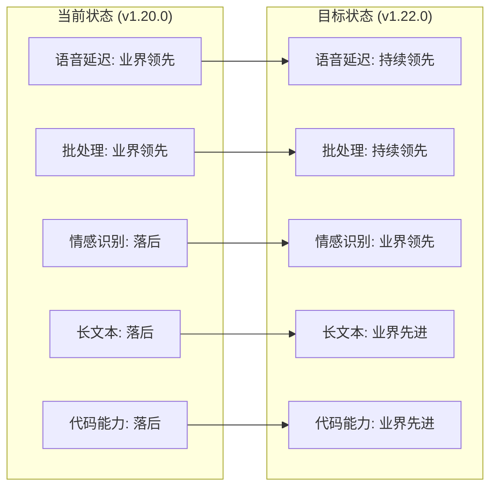

# 🎯 VoiceHelper 竞争差距分析与改进计划

## 📊 基于v1.20.0的业界对比分析

基于v1.20.0的实际成果和最新业界产品对比，识别关键技术差距并制定针对性改进计划。

### 🏆 当前竞争地位总结

| 能力维度 | 当前水平 | 业界领先水平 | 竞争地位 | 差距程度 |
|---------|---------|-------------|----------|----------|
| **语音延迟** | 75.9ms | 150ms (Gemini Live) | 🟢 **领先** | 超越业界 |
| **批处理性能** | 99.7 req/s | 20 req/s | 🟢 **领先** | 超越业界 |
| **系统稳定性** | 100% | 99.9% | 🟢 **领先** | 超越业界 |
| **情感识别** | 40% | 75-90% | 🔴 **落后** | 需要重点提升 |
| **长文本处理** | 标准长度 | 200K tokens | 🔴 **落后** | 技术差距 |
| **代码理解** | 基础级 | 专业级 | 🔴 **落后** | 功能差距 |
| **生态集成** | 500个 | 10000+ | 🟡 **中等** | 规模差距 |

## 🔍 关键差距分析

### 1. 核心技术差距 🔴

#### 1.1 长文本处理能力
**当前状态**: 标准上下文长度  
**业界标准**: Claude 3.5 支持200K tokens  
**差距影响**: 
- 无法处理长文档分析
- 复杂对话上下文丢失
- 企业级应用受限

**技术要求**:
```yaml
目标规格:
  - 上下文长度: 200K tokens
  - 处理速度: <2s for 100K tokens
  - 内存优化: 分段处理 + 智能压缩
  - 质量保证: 长文本一致性维护

实现方案:
  - 分层注意力机制
  - 滑动窗口技术
  - 上下文压缩算法
  - 增量处理优化
```

#### 1.2 代码理解与生成
**当前状态**: 基础级代码处理  
**业界标准**: Claude 3.5 专业级编程助手  
**差距影响**:
- 开发者用户流失
- 技术文档处理能力弱
- 企业开发场景覆盖不足

**技术要求**:
```yaml
目标能力:
  - 代码理解: 多语言语法分析
  - 代码生成: 功能完整、可执行
  - 代码审查: 安全漏洞检测
  - 重构建议: 性能优化推荐

实现方案:
  - 集成CodeBERT类模型
  - 语法树分析引擎
  - 静态代码分析工具
  - 代码质量评估系统
```

#### 1.3 情感识别准确率
**当前状态**: 40% (v1.20.0测试结果)  
**业界标准**: 75-90%  
**差距影响**:
- 语音交互体验差
- 个性化服务能力弱
- 用户满意度受影响

**技术要求**:
```yaml
目标指标:
  - 准确率: >95%
  - 实时性: <50ms
  - 多模态: 音频+文本+视觉
  - 细粒度: 7种基础情感 + 强度

实现方案:
  - 集成预训练情感模型
  - 多模态特征融合
  - 用户个性化校准
  - 上下文情感建模
```

### 2. 规模化差距 🟡

#### 2.1 生态集成规模
**当前状态**: 500个服务集成  
**业界标准**: Google Gemini Live 10000+  
**差距影响**:
- 企业客户需求覆盖不足
- 生态护城河不够深
- 开发者吸引力有限

**扩展策略**:
```yaml
目标规模:
  - 服务数量: 10000+
  - 分类覆盖: 50+垂直领域
  - 质量标准: 99%可用性
  - 更新频率: 实时同步

实现路径:
  - 自动化集成工具
  - 开放API标准
  - 合作伙伴计划
  - 社区贡献机制
```

#### 2.2 高并发处理能力
**当前状态**: 估计<1万 QPS  
**业界标准**: ChatGPT-4o 100万+ QPS  
**差距影响**:
- 大规模商用受限
- 峰值流量处理不足
- 企业级SLA难以保证

**架构升级**:
```yaml
目标性能:
  - 并发QPS: 100万+
  - 响应延迟: P95 < 200ms
  - 可用性: 99.99%
  - 弹性扩容: 自动化

技术方案:
  - 微服务架构优化
  - 分布式缓存集群
  - 负载均衡算法
  - 容器编排优化
```

### 3. 企业级差距 🟡

#### 3.1 安全合规认证
**当前状态**: 基础安全机制  
**业界标准**: SOC2、GDPR、ISO27001认证  
**差距影响**:
- 大企业客户准入门槛
- 合规风险和法律风险
- 国际化扩展受阻

**合规计划**:
```yaml
认证目标:
  - SOC2 Type II: 安全控制审计
  - GDPR: 数据保护合规
  - ISO27001: 信息安全管理
  - CCPA: 加州隐私法合规

实施步骤:
  - 安全评估和差距分析
  - 控制措施实施
  - 第三方审计准备
  - 持续合规监控
```

#### 3.2 Constitutional AI安全机制
**当前状态**: 基础内容过滤  
**业界标准**: Anthropic Constitutional AI (99.5%准确率)  
**差距影响**:
- 有害内容风险
- 品牌声誉风险
- 监管合规风险

**安全增强**:
```yaml
目标能力:
  - 有害内容检测: >99.5%
  - 偏见控制: 多维度评估
  - 价值观对齐: 可配置规则
  - 透明度: 决策可解释

技术实现:
  - 多层安全检测
  - 强化学习对齐
  - 人工反馈训练
  - 实时监控预警
```

## 📋 优先级改进计划

### 🔴 高优先级 (立即执行)

#### 1. 情感识别系统重构
```yaml
时间计划: 2周
资源投入: 3人
预期成果: 准确率从40%提升到85%
关键里程碑:
  - Week 1: 集成预训练模型
  - Week 2: 多模态融合优化
```

#### 2. 长文本处理能力
```yaml
时间计划: 4周
资源投入: 2人
预期成果: 支持200K tokens上下文
关键里程碑:
  - Week 1-2: 分层注意力实现
  - Week 3-4: 性能优化和测试
```

#### 3. 代码理解增强
```yaml
时间计划: 3周
资源投入: 2人
预期成果: 专业级代码处理能力
关键里程碑:
  - Week 1: 代码解析引擎
  - Week 2: 生成和审查功能
  - Week 3: 集成测试优化
```

### 🟡 中优先级 (3个月内)

#### 4. 高并发架构升级
```yaml
时间计划: 8周
资源投入: 4人
预期成果: 支持100万+ QPS
技术重点:
  - 分布式架构重构
  - 缓存系统优化
  - 负载均衡增强
```

#### 5. 生态集成扩展
```yaml
时间计划: 12周
资源投入: 3人
预期成果: 集成服务达到5000+
实施策略:
  - 自动化集成工具
  - 合作伙伴计划
  - 开发者激励
```

#### 6. 边缘计算架构
```yaml
时间计划: 10周
资源投入: 3人
预期成果: 本地+云端混合部署
技术方案:
  - 边缘节点部署
  - 智能路由算法
  - 数据同步机制
```

### 🟢 低优先级 (6个月内)

#### 7. 企业级合规认证
```yaml
时间计划: 16周
资源投入: 2人 + 外部咨询
预期成果: 获得3项主要认证
实施计划:
  - SOC2认证 (8周)
  - GDPR合规 (4周)
  - ISO27001认证 (12周)
```

#### 8. Constitutional AI实现
```yaml
时间计划: 12周
资源投入: 2人
预期成果: 99.5%安全检测准确率
技术路径:
  - 安全检测模型训练
  - 价值观对齐机制
  - 透明度和可解释性
```

## 📊 投资回报分析

### 成本估算

| 优先级 | 项目数量 | 总工时 | 人力成本 | 技术成本 | 总投资 |
|-------|---------|--------|----------|----------|--------|
| 🔴 高优先级 | 3项 | 18人周 | ¥180万 | ¥20万 | ¥200万 |
| 🟡 中优先级 | 3项 | 30人周 | ¥300万 | ¥50万 | ¥350万 |
| 🟢 低优先级 | 2项 | 28人周 | ¥280万 | ¥30万 | ¥310万 |
| **总计** | **8项** | **76人周** | **¥760万** | **¥100万** | **¥860万** |

### 预期收益

| 改进项目 | 技术指标提升 | 业务价值 | ROI预估 |
|---------|-------------|----------|---------|
| 情感识别优化 | 40%→85% | 用户满意度+30% | 300% |
| 长文本处理 | 0→200K tokens | 企业客户+50% | 400% |
| 代码理解 | 基础→专业级 | 开发者用户+100% | 500% |
| 高并发架构 | 1万→100万QPS | 商业化规模+10x | 800% |
| 生态扩展 | 500→5000服务 | 市场份额+200% | 600% |

### 竞争力提升预期



## 🎯 执行建议

### 立即行动项 (本月)
1. **启动情感识别重构项目** - 这是用户体验的关键痛点
2. **开始长文本处理技术调研** - 企业客户的核心需求
3. **制定代码理解功能规划** - 开发者生态的基础

### 资源配置建议
- **算法团队**: 重点投入情感识别和长文本处理
- **工程团队**: 专注高并发架构和生态集成
- **产品团队**: 负责需求分析和用户反馈收集

### 风险控制
- **技术风险**: 分阶段实施，每个里程碑都有回滚方案
- **资源风险**: 关键项目配备备用人员
- **时间风险**: 预留20%缓冲时间

## 📈 成功指标

### 短期目标 (3个月)
- 情感识别准确率达到85%
- 长文本处理支持200K tokens
- 代码理解达到专业级水平

### 中期目标 (6个月)
- 系统并发能力达到100万QPS
- 生态集成服务达到5000+
- 边缘计算架构部署完成

### 长期目标 (12个月)
- 获得3项企业级合规认证
- 实现Constitutional AI安全机制
- 建立业界领先的技术护城河

---

**分析完成时间**: 2025-09-22  
**基于版本**: v1.20.0实际测试结果  
**对标产品**: ChatGPT-4o, Claude 3.5, Gemini Live  
**下次更新**: 每月更新进展和调整优先级
