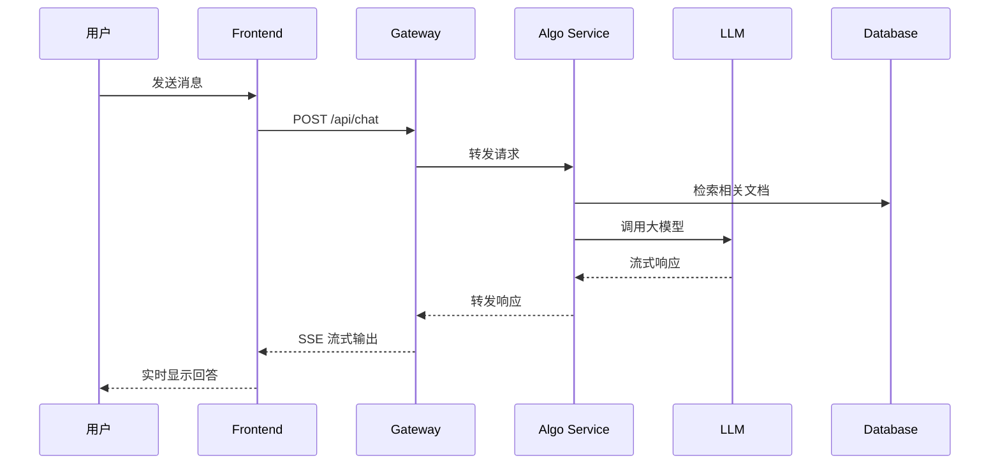
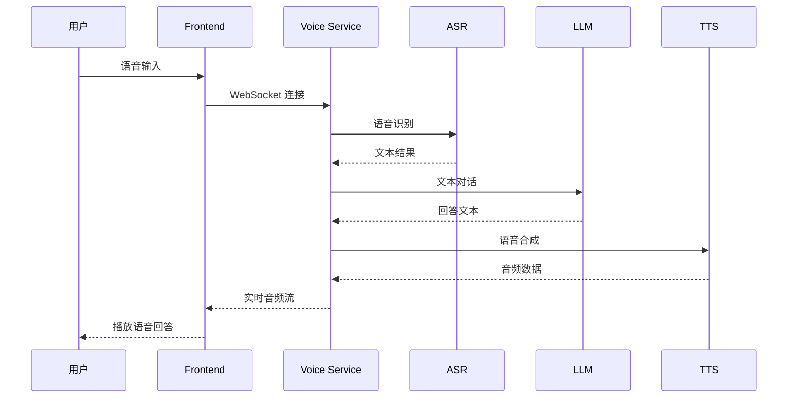

# VoiceHelper 开发者快速理解指南

## 🎯 项目概览

VoiceHelper 是一个基于 RAG（检索增强生成）的企业级智能对话系统，支持文本和语音双模态交互。项目采用微服务架构，提供完整的 AI 对话解决方案。

### 核心特性
- 🤖 **智能对话**: 基于豆包大模型的文本对话
- 🎙️ **语音交互**: 支持 ASR/TTS 的实时语音对话
- 📚 **知识检索**: GraphRAG 增强的文档检索系统
- 🌐 **多平台支持**: Web、移动端、小程序、浏览器扩展
- 🔧 **开发者生态**: 完整的 SDK 和 API 文档

## 🏗️ 系统架构

### 整体架构图
```
┌─────────────────────────────────────────────────────────────┐
│                        客户端层                              │
├─────────────┬─────────────┬─────────────┬─────────────────────┤
│   Web 应用   │   移动应用   │  微信小程序  │    浏览器扩展        │
│  (Next.js)  │ (iOS/Android)│             │                    │
└─────────────┴─────────────┴─────────────┴─────────────────────┘
                              │
┌─────────────────────────────────────────────────────────────┐
│                      API 网关层                              │
├─────────────────────────────────────────────────────────────┤
│              Go Gateway (端口: 8080)                         │
│          • 路由转发  • 认证授权  • 限流熔断                    │
└─────────────────────────────────────────────────────────────┘
                              │
┌─────────────────────────────────────────────────────────────┐
│                       业务服务层                             │
├──────────────┬──────────────┬──────────────┬─────────────────┤
│  算法服务     │   语音服务    │   前端服务    │    管理后台      │
│ (Python:8000)│(Python:8001) │(Next.js:3000)│  (Flask:5001)   │
│ • RAG检索    │ • ASR/TTS    │ • 用户界面    │ • 数据分析       │
│ • LLM调用    │ • 语音处理    │ • 实时交互    │ • 用户管理       │
└──────────────┴──────────────┴──────────────┴─────────────────┘
                              │
┌─────────────────────────────────────────────────────────────┐
│                       数据存储层                             │
├──────────────┬──────────────┬──────────────┬─────────────────┤
│  PostgreSQL  │    Redis     │    Neo4j     │     MinIO       │
│   (5432)     │   (6379)     │   (7474)     │                │
│ • 业务数据    │ • 缓存会话    │ • 知识图谱    │ • 文件存储       │
└──────────────┴──────────────┴──────────────┴─────────────────┘
```

## 📁 项目结构详解

### 核心目录结构
```
voicehelper/
├── 🔧 backend/           # Go API 网关服务
│   ├── cmd/server/       # 服务入口
│   ├── internal/         # 内部业务逻辑
│   └── pkg/             # 公共包
│
├── 🧮 algo/             # Python 算法服务
│   ├── app/             # FastAPI 应用
│   ├── core/            # 核心算法模块
│   └── services/        # 业务服务
│
├── 🎨 frontend/         # Next.js 前端应用
│   ├── app/             # 页面路由
│   ├── components/      # React 组件
│   └── lib/             # 工具库
│
├── 🛠️ admin/            # Flask 管理后台
├── 🚀 deploy/           # 部署配置
├── 📚 docs/             # 项目文档
├── 🧪 tests/            # 测试文件
└── 📦 sdks/             # 客户端 SDK
```

## 🔄 服务交互流程

### 1. 文本对话流程


### 2. 语音对话流程


## 🛠️ 核心服务详解

### 1. Gateway Service (Go - 端口 8080)
**职责**: API 网关和路由中心
- **技术栈**: Go + Gin + WebSocket
- **核心功能**:
  - HTTP 路由转发
  - JWT 认证授权
  - 请求限流和熔断
  - 跨域处理
  - 健康检查

**关键文件**:
- `backend/cmd/server/main.go` - 服务入口
- `backend/internal/handler/` - 路由处理器
- `backend/pkg/middleware/` - 中间件

### 2. Algorithm Service (Python - 端口 8000)
**职责**: 核心算法和 AI 服务
- **技术栈**: Python + FastAPI + LangChain
- **核心功能**:
  - RAG 文档检索
  - LLM 模型调用
  - 知识图谱构建
  - 文档入库处理

**关键文件**:
- `algo/app/main.py` - 服务入口
- `algo/core/retrieve.py` - 检索服务
- `algo/core/ingest.py` - 文档入库
- `algo/core/models.py` - 数据模型

**API 端点**:
```
POST /ingest        # 文档入库
POST /query         # 文本查询 (流式响应)
GET  /tasks/{id}    # 任务状态查询
GET  /health        # 健康检查
```

### 3. Voice Service (Python - 端口 8001)
**职责**: 语音处理和实时交互
- **技术栈**: Python + FastAPI + WebSocket
- **核心功能**:
  - ASR 语音识别
  - TTS 语音合成
  - 实时语音流处理
  - 语音会话管理

**关键文件**:
- `algo/core/voice.py` - 语音处理核心
- WebSocket 实时通信

### 4. Frontend Service (Next.js - 端口 3000)
**职责**: 用户界面和交互体验
- **技术栈**: Next.js + React + TypeScript + TailwindCSS
- **核心功能**:
  - 聊天界面
  - 文件上传
  - 实时消息流
  - 语音录制播放

**关键文件**:
- `frontend/app/page.tsx` - 首页
- `frontend/components/` - React 组件
- `frontend/lib/` - 工具函数

### 5. Admin Service (Flask - 端口 5001)
**职责**: 运营管理和数据分析
- **技术栈**: Python + Flask + SQLAlchemy
- **核心功能**:
  - 用户管理
  - 数据分析
  - 系统监控
  - 内容管理

**关键文件**:
- `admin/app.py` - 管理后台入口

## 🗄️ 数据存储架构

### 1. PostgreSQL (端口 5432)
**用途**: 主要业务数据存储
```sql
-- 核心表结构
users           # 用户信息
conversations   # 会话记录  
messages        # 消息内容
documents       # 文档元数据
usage_stats     # 使用统计
```

### 2. Redis (端口 6379)
**用途**: 缓存和会话存储
- 用户会话缓存
- API 限流计数
- 实时数据缓存
- 任务队列

### 3. Neo4j (端口 7474)
**用途**: 知识图谱存储
- 实体关系图谱
- 文档关联网络
- 推理路径存储

## 🚀 快速开发指南

### 1. 环境准备
```bash
# 必需软件
- Docker & Docker Compose
- Node.js 18+
- Python 3.11+
- Go 1.21+

# 克隆项目
git clone <repository>
cd voicehelper
```

### 2. 配置环境变量
```bash
# 复制环境变量模板
cp env.example .env

# 编辑关键配置
OPENAI_API_KEY=your_openai_key
ARK_API_KEY=your_doubao_key
JWT_SECRET=your_jwt_secret
```

### 3. 一键启动开发环境
```bash
# 启动所有服务
docker-compose -f docker-compose.local.yml up -d

# 或使用 Makefile
make dev
```

### 4. 服务访问地址
| 服务 | 地址 | 说明 |
|------|------|------|
| 前端应用 | http://localhost:3000 | 用户界面 |
| API 网关 | http://localhost:8080 | 后端 API |
| 算法服务 | http://localhost:8000 | AI 服务 |
| 语音服务 | http://localhost:8001 | 语音处理 |
| 管理后台 | http://localhost:5001 | 运营管理 |
| API 文档 | http://localhost:8000/docs | Swagger 文档 |

## 🔧 开发工作流

### 1. 添加新功能
```bash
# 1. 创建功能分支
git checkout -b feat/new-feature

# 2. 开发和测试
# 修改相应服务代码
# 添加单元测试

# 3. 运行测试
make test

# 4. 提交代码
git commit -m "feat: add new feature"
git push origin feat/new-feature
```

### 2. API 开发规范
```python
# 算法服务 API 示例
@app.post("/api/v1/new-endpoint")
async def new_endpoint(request: RequestModel):
    """
    新端点描述
    """
    try:
        # 业务逻辑
        result = process_request(request)
        
        # 记录日志
        logger.business("操作完成", context={
            "request_id": request.id,
            "result": result
        })
        
        return ResponseModel(data=result)
        
    except Exception as e:
        logger.exception("操作失败", e)
        raise VoiceHelperError(ErrorCode.OPERATION_FAILED, str(e))
```

### 3. 前端组件开发
```typescript
// React 组件示例
export function NewComponent({ data }: Props) {
  const [state, setState] = useState(initialState);
  
  const handleAction = async () => {
    try {
      const response = await api.post('/api/v1/new-endpoint', data);
      setState(response.data);
    } catch (error) {
      console.error('操作失败:', error);
    }
  };
  
  return (
    <div className="component-container">
      {/* 组件内容 */}
    </div>
  );
}
```

## 📊 监控和调试

### 1. 日志查看
```bash
# 查看所有服务日志
docker-compose logs -f

# 查看特定服务日志
docker-compose logs -f gateway
docker-compose logs -f algo-service
```

### 2. 健康检查
```bash
# 检查所有服务状态
curl http://localhost:8080/health
curl http://localhost:8000/health
curl http://localhost:8001/health
```

### 3. 数据库管理
```bash
# PostgreSQL 管理界面
http://localhost:5050  # pgAdmin

# Redis 管理界面  
http://localhost:8081  # Redis Commander

# Neo4j 管理界面
http://localhost:7474  # Neo4j Browser
```

## 🧪 测试指南

### 1. 运行测试
```bash
# 运行所有测试
make test

# 分类测试
make test-unit        # 单元测试
make test-integration # 集成测试
make test-e2e        # 端到端测试
```

### 2. 测试覆盖率
```bash
# 生成覆盖率报告
make coverage

# 查看报告
open coverage/index.html
```

## 📚 扩展阅读

### 核心文档
- [API 接口文档](API_GUIDE.md)
- [部署指南](DEPLOYMENT_GUIDE.md)
- [架构深度解析](ARCHITECTURE_DEEP_DIVE.md)
- [最佳实践](BEST_PRACTICES.md)

### 开发资源
- [JavaScript SDK](../sdks/javascript/README.md)
- [Python SDK](../sdks/python/README.md)
- [测试数据集](../tests/datasets/)
- [性能基准](../tests/performance/)

## 🤝 贡献指南

### 1. 代码规范
- **Go**: 遵循官方 Go 规范，使用 `golangci-lint`
- **Python**: 遵循 PEP 8，使用 `black` 格式化
- **TypeScript**: 使用 ESLint + Prettier

### 2. 提交规范
```
feat: 新功能
fix: 修复 bug  
docs: 文档更新
style: 代码格式
refactor: 重构
test: 测试相关
chore: 构建/工具
```

### 3. 分支策略
```
main                    # 主分支
├── feat/feature-name   # 功能开发
├── fix/bug-description # Bug 修复  
├── docs/doc-update     # 文档更新
└── refactor/module     # 代码重构
```

## 🔍 常见问题

### Q1: 服务启动失败怎么办？
```bash
# 检查端口占用
lsof -i :8080

# 清理 Docker 容器
docker-compose down
docker system prune -f
```

### Q2: 如何添加新的 LLM 模型？
1. 在 `algo/core/models.py` 中添加模型配置
2. 在 `algo/core/retrieve.py` 中实现模型调用
3. 更新环境变量配置

### Q3: 如何自定义前端主题？
1. 修改 `frontend/tailwind.config.js` 配置
2. 更新 `frontend/app/globals.css` 样式
3. 重新构建前端应用

---

## 📞 技术支持

- **GitHub Issues**: [提交问题](https://github.com/example/voicehelper/issues)
- **技术文档**: [完整文档](DOCUMENTATION_INDEX.md)
- **开发者社区**: [Discord 频道](https://discord.gg/voicehelper)

---

*最后更新: 2025-09-22*
*文档版本: v1.0.0*
