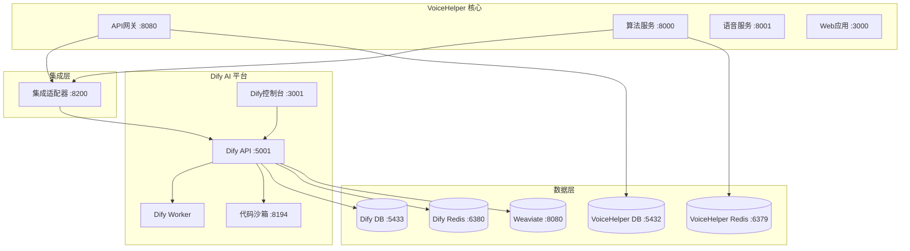

# VoiceHelper + Dify AI 平台集成指南

## 📋 概述

本指南介绍如何将Dify AI平台集成到VoiceHelper项目中，实现强大的AI应用构建和管理能力。

### 🎯 集成优势

- **可视化AI应用构建**: 通过Dify的图形化界面构建复杂AI工作流
- **多模型支持**: 统一管理多个AI模型和提供商
- **知识库管理**: 高效的文档处理和向量检索
- **API统一**: 通过标准API接口调用AI能力
- **监控和分析**: 完整的使用统计和性能监控

---

## 🚀 快速开始

### 1. 一键启动

```bash
# 启动完整服务 (VoiceHelper + Dify)
./start-dify.sh

# 仅启动Dify平台
./start-dify.sh dify

# 仅启动VoiceHelper核心服务
./start-dify.sh core
```

### 2. 使用部署脚本

```bash
# 启动Dify服务
./deploy.sh -p dify up -d

# 启动Dify管理工具
./deploy.sh -p dify-tools up -d

# 查看Dify服务状态
./deploy.sh -s dify-api status
```

### 3. 手动启动

```bash
# 启动VoiceHelper核心服务
docker-compose -f docker-compose.yml up -d postgres redis gateway algo-service

# 启动Dify平台
docker-compose -f docker-compose.yml -f docker-compose.dify.yml up -d
```

---

## 🏗️ 架构设计

### 服务组件



### 端口分配

| 服务 | 端口 | 描述 |
|------|------|------|
| **VoiceHelper 服务** | | |
| Web应用 | 3000 | Next.js前端 |
| API网关 | 8080 | Go网关服务 |
| 算法服务 | 8000 | Python AI服务 |
| 语音服务 | 8001 | 语音处理服务 |
| **Dify AI 平台** | | |
| Dify控制台 | 3001 | Web管理界面 |
| Dify API | 5001 | API服务 |
| 代码沙箱 | 8194 | 代码执行环境 |
| 集成适配器 | 8200 | VoiceHelper-Dify桥接 |
| **数据库服务** | | |
| PostgreSQL | 5432 | VoiceHelper主数据库 |
| Dify PostgreSQL | 5433 | Dify独立数据库 |
| Redis | 6379 | VoiceHelper缓存 |
| Dify Redis | 6380 | Dify独立缓存 |
| Weaviate | 8080 | 向量数据库 |
| **管理工具** | | |
| pgAdmin | 5050 | VoiceHelper数据库管理 |
| Dify pgAdmin | 5051 | Dify数据库管理 |
| Redis Commander | 8081 | VoiceHelper Redis管理 |
| Dify Redis Commander | 8083 | Dify Redis管理 |

---

## ⚙️ 配置说明

### 环境变量配置

主要配置在 `env.unified` 文件中：

```bash
# Dify 基础配置
DIFY_SECRET_KEY=your-dify-secret-key-here
DIFY_INIT_PASSWORD=password123
DIFY_LOG_LEVEL=INFO

# Dify 服务URL
DIFY_CONSOLE_WEB_URL=http://localhost:3001
DIFY_CONSOLE_API_URL=http://localhost:5001
DIFY_SERVICE_API_URL=http://localhost:5001

# Dify 数据库 (独立实例)
DIFY_POSTGRES_DB=dify
DIFY_POSTGRES_USER=dify
DIFY_POSTGRES_PASSWORD=dify123
DIFY_POSTGRES_PORT=5433

# Dify Redis (独立实例)
DIFY_REDIS_PASSWORD=dify123
DIFY_REDIS_PORT=6380

# 集成适配器
DIFY_ADAPTER_PORT=8200
DIFY_API_KEY=app-
```

### 模型配置

Dify会自动继承VoiceHelper的模型配置：

```bash
# 主要模型配置
ARK_API_KEY=your-ark-api-key        # 豆包大模型
GLM_API_KEY=your-glm-api-key        # GLM-4
OPENAI_API_KEY=your-openai-key      # OpenAI (可选)
ANTHROPIC_API_KEY=your-claude-key   # Claude (可选)
```

---

## 🔗 集成使用

### 1. 通过集成适配器调用

```bash
# 聊天接口
curl -X POST http://localhost:8200/api/v1/chat \
  -H "Content-Type: application/json" \
  -d '{
    "message": "你好，请介绍一下VoiceHelper项目",
    "app_id": "your-dify-app-id",
    "user_id": "user123"
  }'

# 工作流接口
curl -X POST http://localhost:8200/api/v1/workflow/run \
  -H "Content-Type: application/json" \
  -d '{
    "workflow_id": "your-workflow-id",
    "inputs": {"query": "分析这个文档"},
    "user_id": "user123"
  }'
```

### 2. 直接调用Dify API

```bash
# 获取应用列表
curl -X GET http://localhost:5001/v1/apps \
  -H "Authorization: Bearer your-api-key"

# 发送聊天消息
curl -X POST http://localhost:5001/v1/chat-messages \
  -H "Authorization: Bearer your-api-key" \
  -H "Content-Type: application/json" \
  -d '{
    "inputs": {},
    "query": "Hello, Dify!",
    "response_mode": "blocking",
    "user": "user123"
  }'
```

### 3. 在VoiceHelper中集成

```python
# Python示例
import httpx

class DifyIntegration:
    def __init__(self, adapter_url="http://localhost:8200"):
        self.adapter_url = adapter_url
        
    async def chat_with_dify(self, message: str, app_id: str, user_id: str = None):
        async with httpx.AsyncClient() as client:
            response = await client.post(
                f"{self.adapter_url}/api/v1/chat",
                json={
                    "message": message,
                    "app_id": app_id,
                    "user_id": user_id
                }
            )
            return response.json()
```

```javascript
// JavaScript示例
class DifyIntegration {
    constructor(adapterUrl = 'http://localhost:8200') {
        this.adapterUrl = adapterUrl;
    }
    
    async chatWithDify(message, appId, userId = null) {
        const response = await fetch(`${this.adapterUrl}/api/v1/chat`, {
            method: 'POST',
            headers: {
                'Content-Type': 'application/json',
            },
            body: JSON.stringify({
                message,
                app_id: appId,
                user_id: userId
            })
        });
        
        return await response.json();
    }
}
```

---

## 📊 监控和管理

### 服务健康检查

```bash
# 检查所有服务状态
./deploy.sh health

# 检查特定服务
curl http://localhost:8200/health  # 集成适配器
curl http://localhost:5001/health  # Dify API
curl http://localhost:8080/health  # VoiceHelper网关
```

### 日志查看

```bash
# 查看所有Dify服务日志
./deploy.sh -p dify logs

# 查看特定服务日志
docker logs voicehelper-dify-api
docker logs voicehelper-dify-adapter
docker logs voicehelper-dify-worker
```

### 数据库管理

访问管理界面：

- **VoiceHelper数据库**: http://localhost:5050
  - 用户名: admin@voicehelper.ai
  - 密码: admin123

- **Dify数据库**: http://localhost:5051
  - 用户名: dify-admin@voicehelper.ai
  - 密码: dify123

### Redis管理

- **VoiceHelper Redis**: http://localhost:8081
- **Dify Redis**: http://localhost:8083

---

## 🔧 故障排除

### 常见问题

#### 1. 端口冲突

```bash
# 检查端口占用
lsof -i :3001  # Dify Web
lsof -i :5001  # Dify API
lsof -i :8200  # 集成适配器

# 修改端口配置
# 编辑 env.unified 文件中的端口配置
```

#### 2. 服务启动失败

```bash
# 查看服务日志
docker logs voicehelper-dify-api
docker logs voicehelper-dify-postgres

# 检查依赖服务
docker ps | grep dify
```

#### 3. 数据库连接问题

```bash
# 检查数据库状态
docker exec -it voicehelper-dify-postgres pg_isready -U dify

# 重置数据库
docker-compose -f docker-compose.dify.yml down -v
docker-compose -f docker-compose.dify.yml up -d dify-postgres
```

#### 4. 集成适配器连接失败

```bash
# 检查网络连通性
docker exec -it voicehelper-dify-adapter curl http://gateway:8080/health
docker exec -it voicehelper-dify-adapter curl http://dify-api:5001/health

# 重启适配器
docker restart voicehelper-dify-adapter
```

### 性能优化

#### 1. 内存优化

```yaml
# docker-compose.dify.yml 中调整资源限制
dify-api:
  deploy:
    resources:
      limits:
        memory: 2G
      reservations:
        memory: 1G
```

#### 2. 数据库优化

```sql
-- 在Dify数据库中执行
-- 优化查询性能
CREATE INDEX IF NOT EXISTS idx_conversations_user_id ON conversations(user_id);
CREATE INDEX IF NOT EXISTS idx_messages_conversation_id ON messages(conversation_id);
```

#### 3. Redis优化

```bash
# 调整Redis配置
# 编辑 tools/deployment/config/redis-dify.conf
maxmemory 1gb
maxmemory-policy allkeys-lru
```

---

## 📚 API文档

### 集成适配器API

#### 聊天接口

**POST** `/api/v1/chat`

```json
{
  "message": "用户消息",
  "app_id": "Dify应用ID",
  "conversation_id": "会话ID (可选)",
  "user_id": "用户ID (可选)",
  "stream": false,
  "metadata": {}
}
```

**响应:**

```json
{
  "answer": "AI回复",
  "conversation_id": "会话ID",
  "message_id": "消息ID",
  "metadata": {},
  "created_at": "2025-09-23T10:00:00Z"
}
```

#### 工作流接口

**POST** `/api/v1/workflow/run`

```json
{
  "workflow_id": "工作流ID",
  "inputs": {
    "query": "输入内容"
  },
  "user_id": "用户ID (可选)"
}
```

#### 数据同步接口

**POST** `/api/v1/sync`

```json
{
  "sync_type": "users|conversations|knowledge",
  "direction": "dify_to_vh|vh_to_dify|bidirectional",
  "filters": {}
}
```

### Dify原生API

详细API文档请参考：http://localhost:3001/api-docs

---

## 🔄 数据同步

### 自动同步

集成适配器会自动同步以下数据：

- **用户数据**: VoiceHelper用户 ↔ Dify用户
- **会话历史**: 聊天记录双向同步
- **知识库**: 文档和向量数据同步

### 手动同步

```bash
# 同步用户数据
curl -X POST http://localhost:8200/api/v1/sync \
  -H "Content-Type: application/json" \
  -d '{"sync_type": "users", "direction": "bidirectional"}'

# 同步知识库
curl -X POST http://localhost:8200/api/v1/knowledge/sync
```

---

## 🚀 生产部署

### 1. 环境准备

```bash
# 生产环境配置
cp env.unified .env
# 编辑 .env 文件，设置生产环境参数

# 启动生产环境
./deploy.sh -e prod -p dify up -d
```

### 2. 安全配置

```bash
# 修改默认密码
DIFY_INIT_PASSWORD=your-secure-password
DIFY_POSTGRES_PASSWORD=your-db-password
DIFY_REDIS_PASSWORD=your-redis-password

# 配置HTTPS
# 编辑 tools/deployment/config/nginx/conf.d/dify.conf
```

### 3. 备份策略

```bash
# 备份Dify数据
./deploy.sh backup

# 自动备份脚本
# 添加到 crontab
0 2 * * * /path/to/voicehelper/deploy.sh backup
```

---

## 📈 扩展功能

### 1. 自定义工作流

在Dify控制台中创建自定义工作流，然后通过API调用：

```python
# 调用自定义工作流
workflow_result = await dify_integration.run_workflow(
    workflow_id="custom-workflow-id",
    inputs={"document": document_content}
)
```

### 2. 插件开发

创建自定义插件扩展Dify功能：

```python
# 示例插件
class VoiceHelperPlugin:
    def process_voice(self, audio_data):
        # 调用VoiceHelper语音服务
        pass
    
    def enhance_response(self, text_response):
        # 增强AI回复
        pass
```

### 3. 多租户支持

配置多租户环境：

```yaml
# 为不同租户配置独立的Dify实例
dify-tenant-1:
  image: langgenius/dify-api:0.6.16
  environment:
    - DB_DATABASE=dify_tenant_1
    
dify-tenant-2:
  image: langgenius/dify-api:0.6.16
  environment:
    - DB_DATABASE=dify_tenant_2
```

---

## 📞 技术支持

### 问题反馈

- **GitHub Issues**: https://github.com/voicehelper/voicehelper/issues
- **文档更新**: 请提交PR到docs目录

### 社区资源

- **Dify官方文档**: https://docs.dify.ai/
- **VoiceHelper文档**: ./docs/README.md

---

*最后更新: 2025-09-23*  
*版本: v1.0.0 - Dify集成首版*
