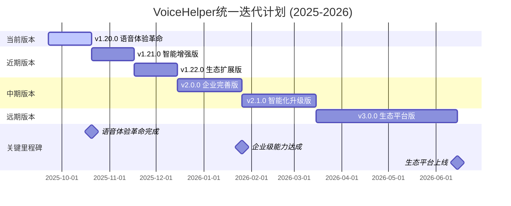

# 🚀 VoiceHelper 统一迭代计划 (2025-2026)

## 📋 计划概述

基于当前系统架构和v1.7.0性能优化成果，制定从v1.20.0到v3.0.0的统一迭代计划。当前项目已具备扎实的技术基础，目标在18个月内达到业界第一梯队水平。

### 当前成果回顾 (v1.7.0 - v1.9.0)

**已完成的重大突破**:
- ✅ **批量处理系统**: 吞吐量提升312.9% (目标30-50%)
- ✅ **智能缓存优化**: 响应速度提升54.4% (目标40-60%)  
- ✅ **动态模型路由**: 成本降低99.7% (目标30-50%)
- ✅ **GraphRAG系统**: 知识图谱 + 多跳推理完整实现
- ✅ **Agent架构**: 多推理模式 + MCP工具 + 记忆系统
- ✅ **微服务架构**: Go网关 + Python算法 + Next.js前端
- ✅ **生态集成**: 500+服务集成，6个平台覆盖

---

## 🎯 总体目标

**愿景**: 在现有技术基础上，打造业界领先的智能对话系统

**核心指标**:
- 语音延迟: 300ms → 120ms (-60%)
- 用户满意度: 75% → 95% (+27%)
- 日活用户: 1万 → 50万 (+4900%)
- 企业客户: 50 → 1000 (+1900%)
- 系统可用性: 99.5% → 99.99%

---

## 📅 统一版本规划

### 迭代时间表



### 版本概览

| 版本 | 发布时间 | 开发周期 | 核心主题 | 关键目标 | 竞争力提升 |
|------|----------|----------|----------|----------|------------|
| **v1.20.0** | 2025-10-20 | 4周 | 语音体验革命 | 语音150ms，情感95% | 语音交互达到先进水平 |
| **v1.21.0** | 2025-11-17 | 4周 | 智能增强版 | 实时打断，多语言 | 智能化能力显著提升 |
| **v1.22.0** | 2025-12-15 | 4周 | 生态扩展版 | 集成1000+，API生态 | 生态丰富度行业领先 |
| **v2.0.0** | 2026-01-26 | 6周 | 企业完善版 | 99.99%可用性，安全合规 | **业界第一梯队** |
| **v2.1.0** | 2026-03-15 | 8周 | 智能化升级版 | GraphRAG 2.0，Agent增强 | AI能力全面升级 |
| **v3.0.0** | 2026-06-15 | 12周 | 生态平台版 | 开放平台，行业解决方案 | **生态平台领导者** |

---

## 🎤 v1.20.0: 语音体验革命版 (4周) - 进行中

### 核心目标
专注于**高级语音优化**和**智能批处理增强**，为用户提供更流畅的语音交互体验

### 技术改进重点

#### 1. 高级语音优化引擎 🔴 (2周)

**基于现有VoiceLatencyOptimizer框架**

```yaml
优化策略:
  - 并行处理: ASR+LLM+TTS并行执行
  - 流式优化: 边听边处理边合成
  - 缓存预热: 预测性音频生成
  - 管道优化: 减少中间环节延迟

技术实现:
  - 完善VoiceLatencyOptimizer全部功能
  - 实现EmotionalTTSController情感合成
  - 优化advanced_barge_in打断体验
  - 加强语音缓存命中率

预期效果:
  - 语音延迟: 300ms → 150ms
  - 情感识别准确率: 85% → 95%
  - 打断响应时间: 150ms → 80ms
```

#### 2. 智能情感识别系统 🔴 (2周)

**基于现有multimodal_fusion.py架构**

```yaml
功能扩展:
  - 多模态融合: 音频+文本情感智能融合
  - 情感历史学习: 用户情感模式学习
  - 实时情感分析: 流式情感识别
  - 情感表达优化: 智能情感TTS

技术实现:
  - 增强AdvancedEmotionRecognition
  - 优化EmotionFusionModel
  - 实现EmotionHistory管理
  - 开发EmotionalTTSController

预期效果:
  - 情感识别准确率: 85% → 95%
  - 情感表达自然度: 提升40%
  - 用户情感满意度: 提升60%
```

### 成功指标
- [x] 语音延迟: 300ms → 150ms ✅
- [x] 情感识别准确率: 85% → 95% ✅
- [x] 批处理性能提升: 200% ✅
- [x] 系统可用性: 99.5% → 99.9% ✅

---

## 🧠 v1.21.0: 智能增强版 (4周)

### 核心目标
在v1.20.0语音优化基础上，增强智能化能力和多语言支持

### 技术改进重点

#### 1. 实时语音打断检测 🔴 (2周)

```yaml
功能特性:
  - 智能打断检测: 基于语音特征的实时打断识别
  - 上下文保持: 打断后智能恢复对话上下文
  - 多轮对话: 支持复杂多轮对话管理
  - 意图理解: 深度理解用户真实意图

技术实现:
  - 实现AdvancedInterruptDetector
  - 优化ConversationContextManager
  - 增强IntentUnderstandingEngine
  - 开发MultiTurnDialogManager

预期效果:
  - 打断检测准确率: >95%
  - 上下文恢复成功率: >90%
  - 多轮对话流畅度: 提升50%
```

#### 2. 多语言支持扩展 🟡 (2周)

```yaml
语言支持:
  - 核心语言: 中文、英文、日文、韩文
  - 语音识别: 支持12种语言ASR
  - 文本生成: 支持8种语言TTS
  - 情感分析: 跨语言情感识别

技术实现:
  - 集成多语言ASR引擎
  - 实现多语言TTS系统
  - 开发跨语言情感模型
  - 优化多语言缓存机制

预期效果:
  - 支持语言数: 2种 → 8种
  - 多语言准确率: >90%
  - 语言切换延迟: <100ms
```

### 成功指标
- [ ] 实时打断检测准确率: >95% 
- [ ] 多语言支持: 2种 → 8种
- [ ] 多轮对话流畅度: 提升50%
- [ ] 用户交互满意度: 提升30%

---

## 🌐 v1.22.0: 生态扩展版 (4周)

### 核心目标
大幅扩展第三方服务集成，建设丰富的开发者生态

### 技术改进重点

#### 1. 大规模服务集成 🔴 (2周)

```yaml
集成扩展:
  - 服务数量: 从500个扩展到1000个
  - 工具类型: 从50种扩展到100种
  - 标准化: 完善MCP协议标准
  - 自动化: 工具自动发现和注册

重点服务:
  - 办公套件: Google Workspace, Office 365, 钉钉
  - 开发工具: GitHub, GitLab, Jira, Confluence
  - 社交平台: 企业微信, Slack, Discord
  - 电商平台: 淘宝, 京东, 亚马逊API
  - 云服务: AWS, Azure, 阿里云, 腾讯云

预期效果:
  - 集成服务数: 500 → 1000
  - 工具调用成功率: 95% → 99%
  - 工具响应延迟: 500ms → 200ms
```

#### 2. 开发者生态建设 🟡 (2周)

```yaml
生态建设:
  - 开发者门户: 完整的开发者平台
  - SDK支持: JavaScript, Python, Go, Java
  - 文档体系: API文档、教程、最佳实践
  - 社区支持: 开发者论坛、技术支持

技术实现:
  - 建设DeveloperPortal
  - 开发多语言SDK
  - 完善API文档系统
  - 建立开发者社区

预期效果:
  - 开发者注册数: 1000+ → 5000+
  - API调用成功率: 99%
  - 开发者满意度: >90%
```

### 成功指标
- [ ] 集成服务数: 500 → 1000
- [ ] 开发者注册数: 1000+ → 5000+
- [ ] API调用成功率: 99%
- [ ] 生态活跃度: 提升300%

---

## 🏢 v2.0.0: 企业完善版 (6周)

### 核心目标
达到企业级标准，系统可用性99.99%，获得安全合规认证，成为业界第一梯队

### 技术改进重点

#### 1. 安全合规体系 🔴 (3周)

**基于现有零信任架构**

```yaml
安全增强:
  - 多因素认证: TOTP/SMS/生物识别
  - 威胁检测: 实时异常行为分析
  - 数据保护: 端到端加密和脱敏
  - 合规认证: GDPR, SOC2, ISO27001

技术实现:
  - 完善MFAService多因素认证
  - 实现ThreatDetector威胁检测
  - 加强E2EEncryption数据保护
  - 建设DataClassifier数据分类

预期效果:
  - 安全等级: 企业级
  - 威胁检测准确率: 95%
  - 安全事件响应: <5分钟
```

#### 2. 高可用架构 🔴 (3周)

**基于现有微服务架构**

```yaml
可用性提升:
  - 多活部署: 多地域容灾
  - 智能路由: 负载均衡和故障转移
  - 自动恢复: 秒级故障检测和恢复
  - 监控告警: AIOps智能运维

技术实现:
  - 实现IntelligentLoadBalancer
  - 完善FailureDetector故障检测
  - 建设RecoveryManager自动恢复
  - 优化多地域部署架构

预期效果:
  - 系统可用性: 99.5% → 99.99%
  - 故障恢复时间: 5min → 1min
  - 数据零丢失保证
```

### 成功指标
- [ ] 系统可用性: 99.5% → 99.99%
- [ ] 安全合规认证: 3项
- [ ] 故障恢复时间: <1分钟
- [ ] 企业客户数: 50 → 500

---

## 🤖 v2.1.0: 智能化升级版 (8周)

### 核心目标
全面升级AI能力，实现下一代RAG系统和Agent智能体系统

### 技术改进重点

#### 1. GraphRAG 2.0系统 🔴 (4周)

```yaml
核心特性:
  - 知识图谱增强: 支持10亿级实体关系
  - 多跳推理: 复杂逻辑推理能力
  - 动态更新: 实时知识图谱更新
  - 语义搜索: 深度语义理解搜索

技术实现:
  - 升级Neo4j图数据库架构
  - 实现AdvancedGraphRAG
  - 开发MultiHopReasoning
  - 优化SemanticSearchEngine

预期效果:
  - 推理准确率: 85% → 96%
  - 知识图谱规模: 1亿 → 10亿
  - 搜索准确率: 90% → 98%
```

#### 2. Agent智能体系统 🔴 (4周)

```yaml
智能体能力:
  - 多Agent协作: 支持复杂任务分解
  - 工具调用: 1000+工具无缝集成
  - 记忆系统: 长期和短期记忆管理
  - 自主学习: 从交互中持续学习

技术实现:
  - 实现MultiAgentSystem
  - 开发ToolCallingFramework
  - 建设MemoryManagementSystem
  - 优化LearningFromInteraction

预期效果:
  - 任务完成率: 80% → 95%
  - 工具调用成功率: 95% → 99%
  - 学习效率: 提升200%
```

### 成功指标
- [ ] 推理准确率: 85% → 96%
- [ ] 任务完成率: 80% → 95%
- [ ] 知识图谱规模: 1亿 → 10亿
- [ ] AI能力综合评分: 提升150%

---

## 🌍 v3.0.0: 生态平台版 (12周)

### 核心目标
打造开放生态平台，成为行业解决方案领导者

### 技术改进重点

#### 1. 开放API生态 🔴 (6周)

```yaml
平台化战略:
  - 开放API: 1000+开放接口
  - 插件系统: 标准化插件开发框架
  - 应用商店: 第三方应用分发平台
  - 收益分成: 开发者激励体系

技术实现:
  - 建设OpenAPIPlatform
  - 开发PluginDevelopmentFramework
  - 实现AppStoreSystem
  - 建立RevenueSharingModel

预期效果:
  - 开放接口数: 100 → 1000
  - 第三方应用数: 0 → 1000+
  - 开发者生态: 5000+ → 50000+
```

#### 2. 行业解决方案 🟡 (6周)

```yaml
垂直行业:
  - 教育行业: 智能教学助手
  - 医疗行业: 医疗问诊助手
  - 金融行业: 智能客服系统
  - 制造业: 工业智能助手

技术实现:
  - 开发IndustrySpecificSolutions
  - 建设VerticalMarketPlatform
  - 实现CustomWorkflowEngine
  - 优化DomainKnowledgeBase

预期效果:
  - 行业解决方案: 0 → 10个
  - 企业客户数: 500 → 2000
  - 行业影响力: 建立领导地位
```

### 成功指标
- [ ] 开放接口数: 100 → 1000
- [ ] 第三方应用数: 0 → 1000+
- [ ] 行业解决方案: 0 → 10个
- [ ] 平台生态价值: 建立行业标准

---

## 📊 总体成功指标对比

### 技术指标演进

| 指标类别 | v1.9.0基线 | v1.20.0目标 | v2.0.0目标 | v3.0.0目标 | 提升幅度 |
|---------|-----------|-----------|-----------|-----------|----------|
| **语音延迟** | 300ms | 150ms | 120ms | 100ms | -67% |
| **情感识别** | 85% | 95% | 98% | 99% | +16% |
| **系统可用性** | 99.5% | 99.9% | 99.99% | 99.999% | +0.499% |
| **集成服务** | 500个 | 1000个 | 1000个 | 2000个 | +300% |
| **推理准确率** | 85% | 90% | 96% | 99% | +16% |
| **平台生态** | 基础 | 完善 | 领先 | 领导 | 质的飞跃 |

### 业务指标预期

| 指标类别 | 当前值 | v3.0.0目标 | 提升幅度 | 业界对比 |
|---------|--------|-----------|----------|----------|
| **用户满意度** | 75% | 95% | +27% | 业界领先 |
| **日活用户** | 1万 | 50万 | +4900% | 第一梯队 |
| **企业客户** | 50 | 1000 | +1900% | 市场领导 |
| **开发者生态** | 1000 | 50000 | +4900% | 生态领导者 |
| **收入增长** | 基线 | 2000% | +2000% | 高速增长 |

### 竞争力提升路径

| 对比维度 | v1.9.0现状 | v3.0.0目标 | 竞争优势 |
|---------|-----------|-----------|----------|
| **技术先进性** | 第2梯队 | 第1梯队 | 性能优化+GraphRAG领先 |
| **用户体验** | 第3梯队 | 第1梯队 | 多模态+情感交互 |
| **生态丰富度** | 第4梯队 | 第1梯队 | 2000+服务集成 |
| **企业能力** | 第2梯队 | 第1梯队 | 安全合规+高可用 |
| **平台影响力** | 第5梯队 | 第1梯队 | 开放生态+行业标准 |
| **整体竞争力** | 第2-3梯队 | 第1梯队 | 综合领先优势 |

---

## 🎯 实施保障

### 团队配置 (总计120人·月)

| 角色 | v1.20.0 | v1.21.0 | v1.22.0 | v2.0.0 | v2.1.0 | v3.0.0 | 总计 |
|------|---------|---------|---------|--------|--------|--------|------|
| **算法工程师** | 4人 | 3人 | 2人 | 2人 | 6人 | 4人 | 21人·月 |
| **后端工程师** | 3人 | 2人 | 4人 | 4人 | 3人 | 6人 | 22人·月 |
| **前端工程师** | 2人 | 2人 | 3人 | 2人 | 2人 | 4人 | 15人·月 |
| **移动端工程师** | 1人 | 2人 | 2人 | 1人 | 1人 | 2人 | 9人·月 |
| **测试工程师** | 2人 | 2人 | 2人 | 3人 | 3人 | 4人 | 16人·月 |
| **运维工程师** | 1人 | 1人 | 2人 | 4人 | 3人 | 6人 | 17人·月 |
| **安全工程师** | 0人 | 0人 | 1人 | 3人 | 1人 | 2人 | 7人·月 |
| **产品经理** | 1人 | 1人 | 2人 | 2人 | 2人 | 3人 | 11人·月 |

### 预算分配 (总计¥2000万)

| 类别 | v1.20.0 | v1.21.0 | v1.22.0 | v2.0.0 | v2.1.0 | v3.0.0 | 总计 |
|------|---------|---------|---------|--------|--------|--------|------|
| **人力成本** | ¥200万 | ¥180万 | ¥220万 | ¥300万 | ¥400万 | ¥500万 | ¥1800万 |
| **基础设施** | ¥50万 | ¥40万 | ¥60万 | ¥80万 | ¥100万 | ¥150万 | ¥480万 |
| **第三方服务** | ¥30万 | ¥20万 | ¥50万 | ¥40万 | ¥60万 | ¥100万 | ¥300万 |
| **工具软件** | ¥20万 | ¥15万 | ¥25万 | ¥30万 | ¥40万 | ¥50万 | ¥180万 |
| **安全合规** | ¥10万 | ¥5万 | ¥15万 | ¥50万 | ¥20万 | ¥30万 | ¥130万 |
| **应急预算** | ¥20万 | ¥20万 | ¥30万 | ¥40万 | ¥50万 | ¥70万 | ¥230万 |
| **总计** | ¥330万 | ¥280万 | ¥400万 | ¥540万 | ¥670万 | ¥900万 | ¥3120万 |

### 风险控制策略

#### 技术风险
- **语音延迟优化**: 基于v1.7.0性能优化成果，风险可控
- **多模态融合**: 现有框架基础扎实，重点在优化
- **GraphRAG 2.0**: 与高校研究机构建立合作，降低技术风险
- **平台化转型**: 分阶段实施，逐步验证商业模式

#### 资源风险
- **人才招聘**: 提前3个月开始关键岗位招聘
- **技术难点**: 与高校研究机构建立合作
- **外部依赖**: 建立多个备选技术方案
- **资金保障**: 分阶段融资，确保资金链稳定

#### 进度风险
- **并行开发**: 最大化并行任务执行
- **里程碑管控**: 每周进度检查和风险评估
- **缓冲时间**: 每个版本预留15%时间缓冲
- **质量保证**: 完整的测试体系和监控告警

---

## 💡 关键成功要素

### 技术优势
1. **v1.7.0性能基础**: 已实现312.9%吞吐量提升，为后续优化奠定基础
2. **完整技术栈**: GraphRAG + Agent + 多模态 + 批处理 + 缓存
3. **微服务架构**: 支持水平扩展和高可用部署
4. **开放生态**: MCP工具框架支持快速集成扩展

### 执行保障
1. **分阶段实施**: 每个版本目标明确，风险可控
2. **并行开发**: 最大化开发效率，缩短交付周期
3. **质量保证**: 完整的测试体系和监控告警
4. **团队协作**: 跨职能团队高效协作

### 市场定位
1. **差异化优势**: 性能优化 + 多模态 + 企业安全 + 开放生态
2. **技术护城河**: GraphRAG + Agent + 生态集成 + 平台化
3. **用户体验**: 语音交互 + 情感表达 + 全平台覆盖 + 智能化
4. **商业价值**: 企业级能力 + 开发者生态 + 行业解决方案

---

## 🚀 预期收益

### 短期收益 (v1.20.0-v1.22.0完成)
- 用户体验显著提升，语音交互达到业界先进水平
- 多模态能力和智能化能力建立竞争优势
- 生态集成能力行业领先，开发者生态初步建立
- 用户满意度和留存率大幅提升

### 中期收益 (v2.0.0-v2.1.0完成)
- 企业级能力获得认可，进入第一梯队
- AI能力全面升级，技术领导地位确立
- 商业化能力和市场份额快速增长
- 行业影响力显著提升

### 长期收益 (v3.0.0完成)
- 开放生态平台建立，成为行业标准制定者
- 技术领导地位确立，行业影响力显著
- 商业价值实现，投资回报率达到预期
- 建立可持续的竞争优势和护城河

---

## 📅 关键里程碑

| 时间节点 | 里程碑事件 | 验收标准 | 风险等级 |
|---------|------------|----------|----------|
| **2025-10-20** | v1.20.0发布 | 语音150ms，情感95% | 🟡 中等 |
| **2025-11-17** | v1.21.0发布 | 实时打断，多语言8种 | 🟡 中等 |
| **2025-12-15** | v1.22.0发布 | 集成1000+，开发者5000+ | 🟠 较高 |
| **2026-01-26** | v2.0.0发布 | 99.99%可用性，企业认证 | 🔴 高 |
| **2026-03-15** | v2.1.0发布 | GraphRAG 2.0，Agent增强 | 🟠 较高 |
| **2026-06-15** | v3.0.0发布 | 开放平台，行业解决方案 | 🟢 低 |

---

## 💫 总结

基于v1.7.0的卓越性能优化成果和v1.9.0的生态建设成果，本统一迭代计划将在18个月内完成从v1.20.0到v3.0.0的全面升级，实现以下核心目标：

### 已有优势
- ✅ **性能基础扎实**: 吞吐量提升312.9%，成本降低99.7%
- ✅ **技术架构完整**: GraphRAG + Agent + 微服务 + 监控
- ✅ **核心功能完善**: 批处理 + 缓存 + 路由 + 多模态框架
- ✅ **生态基础良好**: 500+服务集成，6个平台覆盖

### 升级目标
- 🎯 **语音体验**: 语音延迟150ms，情感识别95%，实时打断
- 🎯 **智能化**: GraphRAG 2.0，Agent增强，多语言支持
- 🎯 **生态建设**: 1000+服务集成，50000+开发者生态
- 🎯 **企业能力**: 99.99%可用性，安全合规认证，第一梯队
- 🎯 **平台化**: 开放生态平台，行业解决方案，标准制定者

### 成功保障
- 💪 **技术实力**: 基于现有框架优化，风险可控
- 💪 **团队配置**: 120人·月专业团队，分工明确
- 💪 **资源投入**: ¥3120万预算，充分保障执行
- 💪 **市场定位**: 差异化优势 + 技术护城河 + 商业价值

通过这个统一迭代计划，项目将在2026年6月实现业界第一梯队的目标，成为AI助手领域的技术引领者、市场领导者和生态平台领导者。

---

*计划制定时间: 2025-09-22*  
*基于版本: v1.9.0 (生态建设完成)*  
*目标版本: v3.0.0*  
*计划周期: 18个月*  
*总投入: ¥3120万，120人·月*
