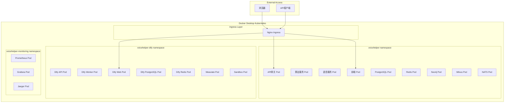

# VoiceHelper Kubernetes 部署指南

## 📋 概述

本指南详细介绍如何在Docker Desktop的Kubernetes集群中部署VoiceHelper的所有服务，包括第三方依赖。

### 🎯 部署架构



---

## 🚀 快速开始

### 1. 环境准备

#### 启用 Docker Desktop Kubernetes

1. 打开 Docker Desktop
2. 进入 Settings → Kubernetes
3. 勾选 "Enable Kubernetes"
4. 点击 "Apply & Restart"
5. 等待 Kubernetes 启动完成

#### 验证环境

```bash
# 检查 Kubernetes 状态
kubectl cluster-info

# 检查节点状态
kubectl get nodes

# 检查当前上下文
kubectl config current-context
# 应该显示: docker-desktop
```

### 2. 一键部署

```bash
# 克隆项目
git clone https://github.com/voicehelper/voicehelper.git
cd voicehelper

# 配置API密钥 (重要!)
cp env.unified .env
# 编辑 .env 文件，设置真实的API密钥

# 一键部署所有服务
./deploy-k8s.sh deploy

# 配置 hosts 文件
echo '127.0.0.1 voicehelper.local admin.voicehelper.local' | sudo tee -a /etc/hosts

# 访问服务
open http://voicehelper.local
```

---

## 📋 详细部署步骤

### 1. 准备配置文件

#### 编辑密钥配置

```bash
# 复制环境配置
cp env.unified .env

# 编辑 .env 文件，设置真实密钥
vim .env
```

**必须配置的密钥:**
```bash
# AI 模型 API 密钥
ARK_API_KEY=your-real-ark-api-key
GLM_API_KEY=your-real-glm-api-key
OPENAI_API_KEY=your-real-openai-key  # 可选

# 微信小程序配置
WECHAT_APP_ID=your-wechat-app-id
WECHAT_APP_SECRET=your-wechat-app-secret
```

#### 更新 Kubernetes Secrets

```bash
# 编辑 secrets.yaml 文件
vim tools/deployment/k8s/secrets.yaml

# 将 your-xxx-api-key-here 替换为真实密钥
```

### 2. 部署选项

#### 选项 A: 完整部署 (推荐)

```bash
# 部署所有服务
./deploy-k8s.sh deploy

# 等效命令
./deploy-k8s.sh -c all -m kubectl deploy
```

#### 选项 B: 分步部署

```bash
# 1. 仅部署核心服务
./deploy-k8s.sh -c core deploy

# 2. 部署 Dify AI 平台
./deploy-k8s.sh -c dify deploy

# 3. 部署监控工具
./deploy-k8s.sh -c monitoring deploy
```

#### 选项 C: 使用 Helm 部署

```bash
# 安装 Helm (如果未安装)
curl https://raw.githubusercontent.com/helm/helm/main/scripts/get-helm-3 | bash

# 使用 Helm 部署
./deploy-k8s.sh -m helm deploy
```

### 3. 验证部署

```bash
# 检查部署状态
./deploy-k8s.sh status

# 检查 Pod 状态
kubectl get pods -A | grep voicehelper

# 检查服务状态
kubectl get svc -A | grep voicehelper

# 检查 Ingress 状态
kubectl get ingress -A
```

---

## 🔧 配置详解

### 命名空间结构

| 命名空间 | 用途 | 主要服务 |
|----------|------|----------|
| `voicehelper` | 核心服务 | Gateway, AlgoService, VoiceService, Frontend, 数据库 |
| `voicehelper-dify` | Dify AI平台 | Dify API, Worker, Web, 独立数据库 |
| `voicehelper-monitoring` | 监控工具 | Prometheus, Grafana, Jaeger |

### 存储配置

#### 持久卷 (PV) 配置

```yaml
# 使用 Docker Desktop 的 hostPath 存储
apiVersion: v1
kind: PersistentVolume
metadata:
  name: postgres-pv
spec:
  capacity:
    storage: 10Gi
  accessModes:
    - ReadWriteOnce
  hostPath:
    path: /tmp/voicehelper/postgres
    type: DirectoryOrCreate
```

#### 存储分配

| 服务 | 存储大小 | 用途 |
|------|----------|------|
| PostgreSQL | 10Gi | 主数据库 |
| Dify PostgreSQL | 10Gi | Dify数据库 |
| Redis | 5Gi | 缓存数据 |
| Dify Redis | 5Gi | Dify缓存 |
| Milvus | 20Gi | 向量数据 |
| Weaviate | 15Gi | Dify向量数据 |
| 应用数据 | 15Gi | 共享应用数据 |

### 网络配置

#### Service 类型

- **ClusterIP**: 内部服务通信
- **NodePort**: 外部访问入口 (Nginx Ingress)
- **LoadBalancer**: 不适用于 Docker Desktop

#### 端口映射

| 服务 | 内部端口 | NodePort | 用途 |
|------|----------|----------|------|
| Nginx Ingress | 80 | 30080 | HTTP 入口 |
| Nginx Ingress | 443 | 30443 | HTTPS 入口 |

### 资源配置

#### CPU 和内存限制

```yaml
# 示例：Gateway 服务资源配置
resources:
  requests:
    memory: "512Mi"
    cpu: "250m"
  limits:
    memory: "2Gi"
    cpu: "1000m"
```

#### 自动扩缩容 (HPA)

```yaml
# Gateway HPA 配置
apiVersion: autoscaling/v2
kind: HorizontalPodAutoscaler
metadata:
  name: gateway-hpa
spec:
  scaleTargetRef:
    apiVersion: apps/v1
    kind: Deployment
    name: gateway
  minReplicas: 2
  maxReplicas: 10
  metrics:
  - type: Resource
    resource:
      name: cpu
      target:
        type: Utilization
        averageUtilization: 70
```

---

## 🌐 访问配置

### 1. 配置 Hosts 文件

#### macOS/Linux

```bash
sudo vim /etc/hosts

# 添加以下行
127.0.0.1 voicehelper.local
127.0.0.1 admin.voicehelper.local
```

#### Windows

```cmd
# 以管理员身份运行记事本
notepad C:\Windows\System32\drivers\etc\hosts

# 添加以下行
127.0.0.1 voicehelper.local
127.0.0.1 admin.voicehelper.local
```

### 2. 服务访问地址

#### 主要服务

| 服务 | 地址 | 描述 |
|------|------|------|
| VoiceHelper Web | http://voicehelper.local | 主应用 |
| Dify 控制台 | http://voicehelper.local/dify | AI应用管理 |
| API 网关 | http://voicehelper.local/api | REST API |

#### 管理工具

| 工具 | 地址 | 用户名 | 密码 |
|------|------|--------|------|
| pgAdmin | http://admin.voicehelper.local/pgadmin | admin@voicehelper.ai | admin123 |
| Redis Commander | http://admin.voicehelper.local/redis | - | - |
| Grafana | http://admin.voicehelper.local/grafana | admin | admin123 |
| Prometheus | http://admin.voicehelper.local/prometheus | - | - |

#### 直接访问 (NodePort)

| 服务 | 地址 | 描述 |
|------|------|------|
| HTTP 入口 | http://localhost:30080 | 直接访问 |
| HTTPS 入口 | https://localhost:30443 | SSL访问 |

---

## 🛠️ 管理操作

### 查看状态

```bash
# 查看所有服务状态
./deploy-k8s.sh status

# 查看特定命名空间
kubectl get all -n voicehelper
kubectl get all -n voicehelper-dify
kubectl get all -n voicehelper-monitoring

# 查看资源使用情况
kubectl top nodes
kubectl top pods -A
```

### 查看日志

```bash
# 查看网关日志
./deploy-k8s.sh logs gateway

# 查看算法服务日志
kubectl logs -f deployment/algo-service -n voicehelper

# 查看 Dify API 日志
kubectl logs -f deployment/dify-api -n voicehelper-dify

# 查看所有 Pod 日志
kubectl logs -f -l app=gateway -n voicehelper
```

### 扩缩容操作

```bash
# 扩容网关服务到 5 个副本
./deploy-k8s.sh scale gateway=5

# 扩容算法服务到 3 个副本
kubectl scale deployment algo-service --replicas=3 -n voicehelper

# 查看扩容状态
kubectl get deployment -n voicehelper
```

### 重启服务

```bash
# 重启所有服务
./deploy-k8s.sh restart

# 重启特定服务
kubectl rollout restart deployment/gateway -n voicehelper

# 查看重启状态
kubectl rollout status deployment/gateway -n voicehelper
```

### 更新配置

```bash
# 更新 ConfigMap
kubectl apply -f tools/deployment/k8s/configmap.yaml

# 更新 Secrets
kubectl apply -f tools/deployment/k8s/secrets.yaml

# 重启相关服务使配置生效
kubectl rollout restart deployment -n voicehelper
```

---

## 🔍 故障排除

### 常见问题

#### 1. Pod 启动失败

```bash
# 查看 Pod 详细信息
kubectl describe pod <pod-name> -n <namespace>

# 查看 Pod 日志
kubectl logs <pod-name> -n <namespace>

# 查看事件
kubectl get events -n <namespace> --sort-by='.lastTimestamp'
```

#### 2. 服务无法访问

```bash
# 检查 Service 配置
kubectl get svc -n voicehelper

# 检查 Ingress 配置
kubectl get ingress -A

# 检查 hosts 文件配置
cat /etc/hosts | grep voicehelper

# 测试内部连通性
kubectl exec -it deployment/gateway -n voicehelper -- curl http://postgres-service:5432
```

#### 3. 存储问题

```bash
# 检查 PV 状态
kubectl get pv

# 检查 PVC 状态
kubectl get pvc -A

# 检查存储类
kubectl get storageclass

# 清理未使用的 PV
kubectl delete pv <pv-name>
```

#### 4. 资源不足

```bash
# 查看节点资源使用
kubectl describe nodes

# 查看 Pod 资源使用
kubectl top pods -A

# 调整资源限制
kubectl patch deployment gateway -n voicehelper -p '{"spec":{"template":{"spec":{"containers":[{"name":"gateway","resources":{"limits":{"memory":"1Gi"}}}]}}}}'
```

### 调试技巧

#### 进入 Pod 调试

```bash
# 进入 Gateway Pod
kubectl exec -it deployment/gateway -n voicehelper -- /bin/sh

# 进入数据库 Pod
kubectl exec -it deployment/postgres -n voicehelper -- psql -U voicehelper

# 临时创建调试 Pod
kubectl run debug --image=busybox:1.35 -it --rm -- /bin/sh
```

#### 网络调试

```bash
# 测试 DNS 解析
kubectl exec -it deployment/gateway -n voicehelper -- nslookup postgres-service

# 测试端口连通性
kubectl exec -it deployment/gateway -n voicehelper -- nc -zv postgres-service 5432

# 查看网络策略
kubectl get networkpolicy -A
```

#### 配置调试

```bash
# 查看 ConfigMap 内容
kubectl get configmap voicehelper-config -n voicehelper -o yaml

# 查看 Secret 内容 (base64 编码)
kubectl get secret voicehelper-secrets -n voicehelper -o yaml

# 验证环境变量
kubectl exec deployment/gateway -n voicehelper -- env | grep POSTGRES
```

---

## 🔄 数据备份与恢复

### 自动备份

```bash
# 执行完整备份
./deploy-k8s.sh backup

# 备份文件位置
ls -la ./backups/k8s/
```

### 手动备份

#### 备份数据库

```bash
# 备份 VoiceHelper 数据库
kubectl exec deployment/postgres -n voicehelper -- pg_dumpall -U voicehelper > voicehelper-backup.sql

# 备份 Dify 数据库
kubectl exec deployment/dify-postgres -n voicehelper-dify -- pg_dumpall -U dify > dify-backup.sql
```

#### 备份配置

```bash
# 备份所有配置
kubectl get all,configmap,secret,pvc -n voicehelper -o yaml > voicehelper-config-backup.yaml
kubectl get all,configmap,secret,pvc -n voicehelper-dify -o yaml > dify-config-backup.yaml
kubectl get all,configmap,secret,pvc -n voicehelper-monitoring -o yaml > monitoring-config-backup.yaml
```

### 数据恢复

```bash
# 恢复数据
./deploy-k8s.sh restore /path/to/backup/directory

# 手动恢复数据库
kubectl exec -i deployment/postgres -n voicehelper -- psql -U voicehelper < voicehelper-backup.sql
```

---

## 🚀 性能优化

### 资源优化

#### 调整副本数

```bash
# 根据负载调整副本数
kubectl scale deployment gateway --replicas=5 -n voicehelper
kubectl scale deployment algo-service --replicas=3 -n voicehelper
```

#### 配置 HPA

```yaml
# 自动扩缩容配置
apiVersion: autoscaling/v2
kind: HorizontalPodAutoscaler
metadata:
  name: gateway-hpa
spec:
  scaleTargetRef:
    apiVersion: apps/v1
    kind: Deployment
    name: gateway
  minReplicas: 2
  maxReplicas: 10
  metrics:
  - type: Resource
    resource:
      name: cpu
      target:
        type: Utilization
        averageUtilization: 70
```

### 存储优化

#### 使用 SSD 存储

```yaml
# 配置高性能存储类
apiVersion: storage.k8s.io/v1
kind: StorageClass
metadata:
  name: fast-ssd
provisioner: docker.io/hostpath
parameters:
  type: DirectoryOrCreate
volumeBindingMode: Immediate
reclaimPolicy: Retain
```

### 网络优化

#### 配置服务网格 (可选)

```bash
# 安装 Istio (可选)
curl -L https://istio.io/downloadIstio | sh -
istioctl install --set values.defaultRevision=default
kubectl label namespace voicehelper istio-injection=enabled
```

---

## 🔒 安全配置

### 网络策略

```yaml
# 限制网络访问
apiVersion: networking.k8s.io/v1
kind: NetworkPolicy
metadata:
  name: voicehelper-network-policy
  namespace: voicehelper
spec:
  podSelector: {}
  policyTypes:
  - Ingress
  - Egress
  ingress:
  - from:
    - namespaceSelector:
        matchLabels:
          name: voicehelper
```

### RBAC 配置

```yaml
# 服务账户权限
apiVersion: rbac.authorization.k8s.io/v1
kind: Role
metadata:
  namespace: voicehelper
  name: voicehelper-role
rules:
- apiGroups: [""]
  resources: ["pods", "services"]
  verbs: ["get", "list", "watch"]
```

### 密钥管理

```bash
# 使用 Kubernetes Secrets 管理敏感信息
kubectl create secret generic api-keys \
  --from-literal=ark-api-key=your-real-key \
  --from-literal=glm-api-key=your-real-key \
  -n voicehelper
```

---

## 📊 监控和告警

### Prometheus 监控

#### 访问 Prometheus

```bash
# 端口转发访问 Prometheus
kubectl port-forward svc/prometheus-service 9090:9090 -n voicehelper-monitoring

# 访问 http://localhost:9090
```

#### 自定义监控指标

```yaml
# 添加自定义监控规则
apiVersion: v1
kind: ConfigMap
metadata:
  name: prometheus-rules
  namespace: voicehelper-monitoring
data:
  voicehelper.yml: |
    groups:
    - name: voicehelper
      rules:
      - alert: HighCPUUsage
        expr: cpu_usage > 80
        for: 5m
        labels:
          severity: warning
        annotations:
          summary: "High CPU usage detected"
```

### Grafana 仪表板

#### 访问 Grafana

```bash
# 端口转发访问 Grafana
kubectl port-forward svc/grafana-service 3000:3000 -n voicehelper-monitoring

# 访问 http://localhost:3000
# 用户名: admin, 密码: admin123
```

#### 导入仪表板

1. 访问 Grafana
2. 点击 "+" → "Import"
3. 输入仪表板 ID 或上传 JSON 文件
4. 配置数据源为 Prometheus

---

## 🔧 高级配置

### 多环境部署

#### 开发环境

```bash
# 部署到开发命名空间
./deploy-k8s.sh -n voicehelper-dev deploy
```

#### 生产环境

```bash
# 使用生产配置部署
./deploy-k8s.sh -n voicehelper-prod -m helm deploy
```

### 蓝绿部署

```bash
# 创建新版本部署
kubectl apply -f tools/deployment/k8s/applications-v2.yaml

# 切换流量
kubectl patch service gateway-service -p '{"spec":{"selector":{"version":"v2"}}}'

# 清理旧版本
kubectl delete deployment gateway-v1
```

### 金丝雀部署

```yaml
# 金丝雀部署配置
apiVersion: argoproj.io/v1alpha1
kind: Rollout
metadata:
  name: gateway-rollout
spec:
  replicas: 5
  strategy:
    canary:
      steps:
      - setWeight: 20
      - pause: {}
      - setWeight: 40
      - pause: {duration: 10}
      - setWeight: 60
      - pause: {duration: 10}
      - setWeight: 80
      - pause: {duration: 10}
```

---

## 📚 参考资源

### 官方文档

- [Kubernetes 官方文档](https://kubernetes.io/docs/)
- [Docker Desktop Kubernetes](https://docs.docker.com/desktop/kubernetes/)
- [Helm 官方文档](https://helm.sh/docs/)

### 社区资源

- [Kubernetes 中文社区](https://kubernetes.io/zh/)
- [CNCF 项目](https://www.cncf.io/projects/)

### 工具推荐

- [kubectl 命令参考](https://kubernetes.io/docs/reference/kubectl/cheatsheet/)
- [k9s - Kubernetes CLI](https://k9scli.io/)
- [Lens - Kubernetes IDE](https://k8slens.dev/)

---

## 🆘 技术支持

### 问题反馈

- **GitHub Issues**: https://github.com/voicehelper/voicehelper/issues
- **文档更新**: 请提交 PR 到 docs 目录

### 社区支持

- **讨论区**: https://github.com/voicehelper/voicehelper/discussions
- **技术交流**: 加入我们的技术交流群

---

*最后更新: 2025-09-23*  
*版本: v2.0.0 - Kubernetes 部署首版*
