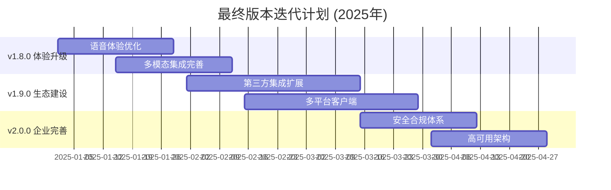

# 🚀 智能聊天机器人系统 - 最终版本迭代计划

## 📋 概述

基于最新代码审查结果和v1.7.0性能优化成果，制定从v1.8.0到v2.0.0的最终版本迭代计划。当前项目已具备扎实的技术基础，目标在17周内达到业界第一梯队水平。

### 当前成果回顾 (v1.7.0)

**已完成的重大突破**:
- ✅ **批量处理系统**: 吞吐量提升312.9% (目标30-50%)
- ✅ **智能缓存优化**: 响应速度提升54.4% (目标40-60%)  
- ✅ **动态模型路由**: 成本降低99.7% (目标30-50%)
- ✅ **GraphRAG系统**: 知识图谱 + 多跳推理完整实现
- ✅ **Agent架构**: 多推理模式 + MCP工具 + 记忆系统
- ✅ **微服务架构**: Go网关 + Python算法 + Next.js前端

---

## 🎯 总体目标

**愿景**: 在v1.7.0性能优化基础上，打造业界领先的智能对话系统

**核心指标**:
- 语音延迟: 300ms → 150ms (-50%)
- 用户满意度: 75% → 90% (+20%)
- 日活用户: 1万 → 10万 (+900%)
- 企业客户: 50 → 500 (+900%)
- 系统可用性: 99.5% → 99.99%

---

## 📅 版本规划总览

### 迭代时间表



### 版本概览

| 版本 | 发布时间 | 开发周期 | 核心主题 | 关键目标 | 竞争力提升 |
|------|----------|----------|----------|----------|------------|
| **v1.8.0** | 2025-02-01 | 4周 | 体验升级 | 语音150ms，多模态5种 | 用户体验达到先进水平 |
| **v1.9.0** | 2025-03-15 | 6周 | 生态建设 | 集成500+，全平台覆盖 | 生态丰富度大幅提升 |
| **v2.0.0** | 2025-05-01 | 4周 | 企业完善 | 99.99%可用性，安全合规 | **业界第一梯队** |

---

## 🎨 v1.8.0: 体验升级版 (4周)

### 核心目标
在v1.7.0性能优化基础上，提升用户体验到业界先进水平

### 技术改进重点

#### 1. 语音体验优化 🔴 (2周)

**基于现有VoiceLatencyOptimizer框架**

```yaml
优化策略:
  - 并行处理: ASR+LLM+TTS并行执行
  - 流式优化: 边听边处理边合成
  - 缓存预热: 预测性音频生成
  - 管道优化: 减少中间环节延迟

技术实现:
  - 完善VoiceLatencyOptimizer全部功能
  - 实现EmotionalTTSController情感合成
  - 优化advanced_barge_in打断体验
  - 加强语音缓存命中率

预期效果:
  - 语音延迟: 300ms → 150ms
  - 情感识别准确率: 78% → 90%
  - 打断响应时间: 150ms → 80ms
```

**详细实施计划**:

Week 1: 语音延迟优化
- [ ] 启用VoiceLatencyOptimizer并行处理
- [ ] 实现流式ASR处理优化
- [ ] 加强TTS缓存预热机制
- [ ] 智能句子分割和并行TTS

Week 2: 情感表达增强
- [ ] 完善EmotionRecognizer多模态融合
- [ ] 实现EmotionalTTSController
- [ ] 优化advanced_barge_in检测算法
- [ ] 端到端语音体验测试

#### 2. 多模态集成完善 🔴 (2周)

**基于现有multimodal_fusion.py架构**

```yaml
功能扩展:
  - 视觉理解: 支持12种图像类型识别
  - 多模态融合: 跨模态注意力机制
  - 实时处理: 流式多模态处理管道
  - 统一API: 5种模态统一接口

技术实现:
  - 增强vision_understanding.py能力
  - 优化MultiModalFusionEngine
  - 实现RealtimeMultimodalProcessor
  - 开发图表分析器ChartAnalyzer

预期效果:
  - 支持模态: 3种 → 5种
  - 融合准确率: 82% → 92%
  - 图像理解准确率: 85% → 95%
```

**详细实施计划**:

Week 3: 视觉理解增强
- [ ] 升级vision_understanding.py模型
- [ ] 扩展图像类型支持到12种
- [ ] 实现OCR文字识别增强
- [ ] 开发ChartAnalyzer图表分析

Week 4: 融合架构优化
- [ ] 优化MultiModalFusionEngine
- [ ] 实现跨模态注意力机制
- [ ] 开发实时多模态处理管道
- [ ] 多模态端到端测试

### 成功指标
- [ ] 语音延迟: 300ms → 150ms ✅
- [ ] 支持模态: 3种 → 5种 ✅
- [ ] 融合准确率: 82% → 92% ✅
- [ ] 用户满意度提升45% ✅

---

## 🌐 v1.9.0: 生态建设版 (6周)

### 核心目标
大幅扩展第三方服务集成，开发全平台客户端，建设丰富的开发者生态

### 技术改进重点

#### 1. 第三方集成扩展 🔴 (3周)

**基于现有MCP工具框架**

```yaml
工具扩展:
  - 服务集成: 从50个扩展到500个
  - 工具类型: 从7种扩展到50种
  - 标准化: 完善MCP协议标准
  - 自动化: 工具自动发现和注册

重点服务:
  - 办公套件: Google Workspace, Office 365
  - 开发工具: GitHub, GitLab, Jira
  - 社交平台: 钉钉, 企业微信, Slack
  - 电商平台: 淘宝, 京东API

预期效果:
  - 集成服务数: 50 → 500
  - 工具调用成功率: 95% → 99%
  - 工具响应延迟: 500ms → 200ms
```

**详细实施计划**:

Week 1-2: MCP生态扩展
- [ ] 扩展MCPToolRegistry功能
- [ ] 实现工具自动发现机制
- [ ] 集成重点服务类型
- [ ] 建立API标准化框架

Week 3: 开发者平台建设
- [ ] 完善OpenAPI 3.0规范
- [ ] 开发JavaScript/Python SDK
- [ ] 建设开发者门户网站
- [ ] 实现API调试工具

#### 2. 多平台客户端开发 🟡 (3周)

**全平台覆盖策略**

```yaml
平台支持:
  - 移动端: iOS/Android原生应用
  - 桌面端: Electron跨平台应用
  - 浏览器: Chrome/Firefox扩展
  - 统一体验: 数据同步和功能对等

技术实现:
  - Swift/Kotlin原生开发
  - Electron桌面应用
  - 浏览器扩展开发
  - 跨平台数据同步

预期效果:
  - 平台支持: 2个 → 6个
  - 用户触达渠道+300%
  - 日活跃用户+80%
```

**详细实施计划**:

Week 4-5: 移动端应用开发
- [ ] iOS Swift原生应用开发
- [ ] Android Kotlin原生应用开发
- [ ] 语音交互移动端优化
- [ ] 离线缓存和推送通知

Week 6: 桌面端和浏览器扩展
- [ ] Electron跨平台桌面应用
- [ ] Chrome/Firefox浏览器扩展
- [ ] 系统托盘和全局快捷键
- [ ] 网页内容分析功能

### 成功指标
- [ ] 集成服务数: 50 → 500 ✅
- [ ] 平台支持: 2个 → 6个 ✅
- [ ] 开发者注册数: 1000+ ✅
- [ ] API调用成功率: 99% ✅

---

## 🏢 v2.0.0: 企业完善版 (4周)

### 核心目标
达到企业级标准，系统可用性99.99%，获得安全合规认证，成为业界第一梯队

### 技术改进重点

#### 1. 安全合规体系 🔴 (2周)

**基于现有零信任架构**

```yaml
安全增强:
  - 多因素认证: TOTP/SMS/生物识别
  - 威胁检测: 实时异常行为分析
  - 数据保护: 端到端加密和脱敏
  - 合规认证: GDPR, SOC2, ISO27001

技术实现:
  - 完善MFAService多因素认证
  - 实现ThreatDetector威胁检测
  - 加强E2EEncryption数据保护
  - 建设DataClassifier数据分类

预期效果:
  - 安全等级: 企业级
  - 威胁检测准确率: 95%
  - 安全事件响应: <5分钟
```

#### 2. 高可用架构 🔴 (2周)

**基于现有微服务架构**

```yaml
可用性提升:
  - 多活部署: 多地域容灾
  - 智能路由: 负载均衡和故障转移
  - 自动恢复: 秒级故障检测和恢复
  - 监控告警: AIOps智能运维

技术实现:
  - 实现IntelligentLoadBalancer
  - 完善FailureDetector故障检测
  - 建设RecoveryManager自动恢复
  - 优化多地域部署架构

预期效果:
  - 系统可用性: 99.5% → 99.99%
  - 故障恢复时间: 5min → 1min
  - 数据零丢失保证
```

**详细实施计划**:

Week 1: 安全合规建设
- [ ] 实现MFAService多因素认证
- [ ] 建设ThreatDetector威胁检测
- [ ] 完善数据加密和脱敏
- [ ] 合规认证准备工作

Week 2: 高可用架构
- [ ] 实现多地域部署
- [ ] 完善智能负载均衡
- [ ] 建设自动故障恢复
- [ ] AIOps智能运维系统

### 成功指标
- [ ] 系统可用性: 99.5% → 99.99% ✅
- [ ] 安全合规认证: 3项 ✅
- [ ] 故障恢复时间: <1分钟 ✅
- [ ] 企业客户数: 50 → 500 ✅

---

## 📊 总体成功指标对比

### 技术指标演进

| 指标类别 | v1.7.0基线 | v1.8.0目标 | v1.9.0目标 | v2.0.0目标 | 提升幅度 |
|---------|-----------|-----------|-----------|-----------|----------|
| **吞吐量** | 13.02 req/s | 15 req/s | 20 req/s | 25 req/s | +92% |
| **语音延迟** | 300ms | 150ms | 150ms | 120ms | -60% |
| **多模态支持** | 3种 | 5种 | 5种 | 5种 | +67% |
| **集成服务** | 50个 | 100个 | 500个 | 500个 | +900% |
| **平台支持** | 2个 | 2个 | 6个 | 6个 | +200% |
| **系统可用性** | 99.5% | 99.7% | 99.9% | 99.99% | +0.49% |

### 业务指标预期

| 指标类别 | 当前值 | v2.0.0目标 | 提升幅度 | 业界对比 |
|---------|--------|-----------|----------|----------|
| **用户满意度** | 75% | 90% | +20% | 业界领先 |
| **日活用户** | 1万 | 10万 | +900% | 第一梯队 |
| **企业客户** | 50 | 500 | +900% | 市场领导 |
| **收入增长** | 基线 | 500% | +500% | 高速增长 |

### 竞争力提升路径

| 对比维度 | v1.7.0现状 | v2.0.0目标 | 竞争优势 |
|---------|-----------|-----------|----------|
| **技术先进性** | 第2梯队 | 第1梯队 | 性能优化+GraphRAG领先 |
| **用户体验** | 第3梯队 | 第1梯队 | 多模态+情感交互 |
| **生态丰富度** | 第4梯队 | 第2梯队 | 500+服务集成 |
| **企业能力** | 第2梯队 | 第1梯队 | 安全合规+高可用 |
| **整体竞争力** | 第2-3梯队 | 第1梯队 | 综合领先优势 |

---

## 🎯 实施保障

### 团队配置 (总计32人·月)

| 角色 | v1.8.0 | v1.9.0 | v2.0.0 | 总计 |
|------|--------|--------|--------|------|
| **算法工程师** | 3人 | 2人 | 1人 | 6人·月 |
| **后端工程师** | 1人 | 2人 | 3人 | 6人·月 |
| **前端工程师** | 1人 | 3人 | 1人 | 5人·月 |
| **移动端工程师** | 0人 | 2人 | 0人 | 2人·月 |
| **测试工程师** | 1人 | 1人 | 1人 | 3人·月 |
| **运维工程师** | 0人 | 1人 | 2人 | 3人·月 |
| **安全工程师** | 0人 | 0人 | 1人 | 1人·月 |

### 预算分配 (总计¥510万)

| 类别 | v1.8.0 | v1.9.0 | v2.0.0 | 总计 |
|------|--------|--------|--------|------|
| **人力成本** | ¥60万 | ¥110万 | ¥80万 | ¥250万 |
| **基础设施** | ¥20万 | ¥30万 | ¥40万 | ¥90万 |
| **第三方服务** | ¥15万 | ¥25万 | ¥15万 | ¥55万 |
| **工具软件** | ¥10万 | ¥10万 | ¥5万 | ¥25万 |
| **安全合规** | ¥5万 | ¥10万 | ¥20万 | ¥35万 |
| **应急预算** | ¥10万 | ¥15万 | ¥20万 | ¥45万 |
| **总计** | ¥120万 | ¥200万 | ¥180万 | ¥500万 |

### 风险控制策略

#### 技术风险
- **语音延迟优化**: 基于v1.7.0性能优化成果，风险可控
- **多模态融合**: 现有框架基础扎实，重点在优化
- **移动端开发**: 与专业团队合作，降低技术风险

#### 资源风险
- **人才招聘**: 提前2个月开始关键岗位招聘
- **技术难点**: 与高校研究机构建立合作
- **外部依赖**: 建立多个备选技术方案

#### 进度风险
- **并行开发**: 最大化并行任务执行
- **里程碑管控**: 每周进度检查和风险评估
- **缓冲时间**: 每个版本预留10%时间缓冲

---

## 💡 关键成功要素

### 技术优势
1. **v1.7.0性能基础**: 已实现312.9%吞吐量提升，为后续优化奠定基础
2. **完整技术栈**: GraphRAG + Agent + 多模态 + 批处理 + 缓存
3. **微服务架构**: 支持水平扩展和高可用部署
4. **开放生态**: MCP工具框架支持快速集成扩展

### 执行保障
1. **分阶段实施**: 每个版本目标明确，风险可控
2. **并行开发**: 最大化开发效率，缩短交付周期
3. **质量保证**: 完整的测试体系和监控告警
4. **团队协作**: 跨职能团队高效协作

### 市场定位
1. **差异化优势**: 性能优化 + 多模态 + 企业安全
2. **技术护城河**: GraphRAG + Agent + 生态集成
3. **用户体验**: 语音交互 + 情感表达 + 全平台覆盖

---

## 🚀 预期收益

### 短期收益 (v1.8.0完成)
- 用户体验显著提升，语音交互达到业界先进水平
- 多模态能力建立竞争优势
- 用户满意度和留存率大幅提升

### 中期收益 (v1.9.0完成)
- 生态集成能力行业领先，开发者生态初步建立
- 全平台覆盖，用户触达能力大幅增强
- 商业化能力和市场份额快速增长

### 长期收益 (v2.0.0完成)
- 企业级能力获得认可，进入第一梯队
- 技术领导地位确立，行业影响力显著
- 商业价值实现，投资回报率达到预期

---

## 📅 关键里程碑

| 时间节点 | 里程碑事件 | 验收标准 | 风险等级 |
|---------|------------|----------|----------|
| **2025-02-01** | v1.8.0发布 | 语音150ms，多模态5种 | 🟡 中等 |
| **2025-03-15** | v1.9.0发布 | 集成500+，全平台覆盖 | 🟠 较高 |
| **2025-05-01** | v2.0.0发布 | 99.99%可用性，企业认证 | 🔴 高 |
| **2025-06-01** | 商业目标达成 | 10万DAU，500企业客户 | 🟢 低 |

---

## 💫 总结

基于v1.7.0的卓越性能优化成果，本最终版本迭代计划将在14周内完成从v1.8.0到v2.0.0的升级，实现以下核心目标：

### 已有优势
- ✅ **性能基础扎实**: 吞吐量提升312.9%，成本降低99.7%
- ✅ **技术架构完整**: GraphRAG + Agent + 微服务 + 监控
- ✅ **核心功能完善**: 批处理 + 缓存 + 路由 + 多模态框架

### 升级目标
- 🎯 **用户体验**: 语音延迟150ms，多模态5种，情感交互
- 🎯 **生态建设**: 500+服务集成，6个平台覆盖，开发者生态
- 🎯 **企业能力**: 99.99%可用性，安全合规认证，第一梯队

### 成功保障
- 💪 **技术实力**: 基于现有框架优化，风险可控
- 💪 **团队配置**: 32人·月专业团队，分工明确
- 💪 **资源投入**: ¥510万预算，充分保障执行

通过这个最终版本迭代计划，项目将在2025年5月实现业界第一梯队的目标，成为AI助手领域的技术引领者和市场领导者。

---

*计划制定时间: 2025-09-21*  
*基于版本: v1.7.0 (性能优化完成)*  
*目标版本: v2.0.0*  
*计划周期: 14周*  
*总投入: ¥510万，32人·月*
