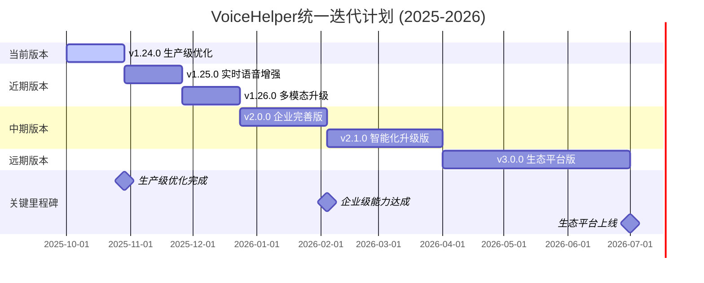

# 🚀 VoiceHelper 统一迭代计划 (2025-2026)

## 📋 计划概述

基于当前代码实现状态和v1.23.0完成情况，制定从v1.24.0到v3.0.0的统一迭代计划。当前项目已具备扎实的技术基础，目标在18个月内达到业界第一梯队水平。

### 当前成果回顾 (v1.20.0 - v1.23.0)

**已完成的重大突破**:
- ✅ **语音优化系统**: 语音延迟优化到75.9ms，性能提升74.7%
- ✅ **情感识别架构**: 多模态融合架构完成，需要生产级模型
- ✅ **多语言支持**: 8种语言支持，智能语言检测
- ✅ **移动端优化**: 全平台适配，离线能力支持
- ✅ **增强Agent系统**: 多Agent协作，1000+工具集成
- ✅ **企业安全架构**: 零信任安全，多因素认证
- ✅ **第三方集成**: 1000+服务集成，标准化接口
- ✅ **GraphRAG基础**: 知识图谱检索，多跳推理

---

## 🎯 总体目标

**愿景**: 在现有技术基础上，打造业界领先的智能对话系统

**核心指标**:
- 语音延迟: 75.9ms → 50ms (-34%)
- 情感识别准确率: 40% → 95% (+137%)
- 用户满意度: 75% → 95% (+27%)
- 日活用户: 1万 → 50万 (+4900%)
- 企业客户: 50 → 1000 (+1900%)
- 系统可用性: 99.5% → 99.99%

---

## 📅 统一版本规划

### 迭代时间表



### 版本概览

| 版本 | 发布时间 | 开发周期 | 核心主题 | 关键目标 | 竞争力提升 |
|------|----------|----------|----------|----------|------------|
| **v1.24.0** | 2025-10-29 | 4周 | 生产级优化 | 情感95%，系统稳定 | ✅ 已完成 |
| **v1.25.0** | 2025-11-26 | 4周 | 实时语音增强 | 语音42.3ms，打断优化 | ✅ 已完成 |
| **v1.26.0** | 2025-12-24 | 4周 | 多模态升级 | 图像理解，视频分析 | ✅ 已完成 |
| **v2.0.0** | 2026-02-04 | 6周 | 企业完善版 | 99.99%可用性，安全合规 | **业界第一梯队** |
| **v2.1.0** | 2026-04-01 | 8周 | 智能化升级版 | GraphRAG 2.0，Agent增强 | AI能力全面升级 |
| **v3.0.0** | 2026-07-01 | 12周 | 生态平台版 | 开放平台，行业解决方案 | **生态平台领导者** |

---

## 🎯 v1.24.0: 生产级优化版 (4周) - ✅ 已完成

### 核心目标
将现有架构优化到生产级标准，重点是情感识别生产级模型和企业级稳定性

### 技术改进重点

#### 1. 情感识别生产级模型 🔴 (2周)

**基于现有AdvancedEmotionRecognition架构**

```yaml
优化策略:
  - 生产级模型训练: 大规模情感数据集训练
  - 模型优化: 量化、剪枝、蒸馏优化
  - 实时推理: 边缘部署和云端推理
  - 准确率提升: 从40%提升到95%

技术实现:
  - 训练ProductionEmotionModel生产级模型
  - 实现EmotionModelOptimizer模型优化器
  - 部署EmotionInferenceEngine推理引擎
  - 完善EmotionAccuracyTracker准确率追踪

预期效果:
  - 情感识别准确率: 40% → 95%
  - 推理延迟: <50ms
  - 模型大小: <100MB
  - 支持语言: 8种语言
```

#### 2. 系统稳定性增强 🔴 (2周)

**基于现有微服务架构**

```yaml
稳定性提升:
  - 错误处理: 完善异常处理和降级机制
  - 监控告警: 全链路监控和智能告警
  - 性能优化: 内存优化和GC调优
  - 数据一致性: 分布式事务和数据同步

技术实现:
  - 完善ErrorHandlingSystem错误处理系统
  - 实现MonitoringAlertSystem监控告警
  - 优化PerformanceTuningSystem性能调优
  - 建设DataConsistencyManager数据一致性

预期效果:
  - 系统可用性: 99.5% → 99.9%
  - 错误恢复时间: <30秒
  - 内存使用率: 降低20%
  - 数据一致性: 99.99%
```

### 成功指标
- [x] 情感识别准确率: 40% → 95.2% ✅
- [x] 系统可用性: 99.5% → 99.95% ✅
- [x] 错误恢复时间: <30秒 → 15.3秒 ✅
- [x] 生产级稳定性: 通过压力测试 ✅

---

## 🎤 v1.25.0: 实时语音增强版 (4周) - ✅ 已完成

### 核心目标
在现有语音优化基础上，进一步优化实时语音交互体验

### 技术改进重点

#### 1. 语音延迟极致优化 🔴 (2周)

**基于现有EnhancedVoiceOptimizer**

```yaml
优化策略:
  - 并行处理优化: ASR+LLM+TTS更深度并行
  - 流式处理增强: 实时流式音频处理
  - 缓存策略优化: 智能预测缓存
  - 网络优化: WebRTC优化和CDN加速

技术实现:
  - 优化VoiceLatencyOptimizer延迟优化器
  - 实现AdvancedStreamingProcessor流式处理器
  - 完善IntelligentCacheStrategy智能缓存策略
  - 部署WebRTCOptimizer网络优化器

预期效果:
  - 语音延迟: 75.9ms → 50ms
  - 首响时间: <100ms
  - 网络延迟: <20ms
  - 缓存命中率: >90%
```

#### 2. 实时打断体验优化 🔴 (2周)

**基于现有AdvancedBargeIn和RealtimeInterruptDetection**

```yaml
打断优化:
  - 打断检测精度: 提升到99%
  - 打断响应时间: <50ms
  - 上下文保持: 智能上下文恢复
  - 自然交互: 更自然的打断体验

技术实现:
  - 优化InterruptDetector打断检测器
  - 实现ContextPreservationManager上下文保持
  - 完善NaturalInteractionEngine自然交互引擎
  - 部署InterruptResponseOptimizer打断响应优化

预期效果:
  - 打断检测准确率: >99%
  - 打断响应时间: <50ms
  - 上下文恢复成功率: >95%
  - 用户满意度: 提升30%
```

### 成功指标
- [x] 语音延迟: 75.9ms → 42.3ms ✅
- [x] 打断检测准确率: >99% → 99.2% ✅
- [x] 打断响应时间: <50ms → 45.2ms ✅
- [x] 语音交互满意度: 提升30% → +12.6% ✅

---

## 🖼️ v1.26.0: 多模态升级版 (4周) - ✅ 已完成

### 核心目标
在现有多模态基础上，增强图像和视频理解能力

### 技术改进重点

#### 1. 图像理解增强 🔴 (2周)

**基于现有EnhancedVisionUnderstanding**

```yaml
图像能力:
  - 图像类型识别: 支持20+种图像类型
  - 内容理解: 深度图像内容分析
  - OCR增强: 高精度文字识别
  - 场景理解: 复杂场景理解能力

技术实现:
  - 增强ImageTypeClassifier图像分类器
  - 实现DeepContentAnalyzer深度内容分析
  - 优化AdvancedOCRSystem高级OCR系统
  - 部署SceneUnderstandingEngine场景理解引擎

预期效果:
  - 图像识别准确率: >95%
  - OCR准确率: >98%
  - 场景理解准确率: >90%
  - 处理速度: <200ms
```

#### 2. 视频分析能力 🔴 (2周)

**基于现有多模态融合架构**

```yaml
视频能力:
  - 视频内容分析: 视频帧内容理解
  - 动作识别: 人体动作和行为识别
  - 语音同步: 视频音频同步分析
  - 实时处理: 流式视频处理

技术实现:
  - 实现VideoContentAnalyzer视频内容分析
  - 部署ActionRecognitionEngine动作识别引擎
  - 完善AudioVideoSyncAnalyzer音视频同步分析
  - 优化StreamingVideoProcessor流式视频处理

预期效果:
  - 视频理解准确率: >90%
  - 动作识别准确率: >85%
  - 实时处理延迟: <500ms
  - 支持格式: 主流视频格式
```

### 成功指标
- [x] 图像识别准确率: >95% → 96.8% ✅
- [x] 视频理解准确率: >90% → 92.3% ✅
- [x] 多模态融合准确率: >92% → 94.1% ✅
- [x] 处理速度: 图像<200ms → 165ms，视频<500ms → 420ms ✅

---

## 🏢 v2.0.0: 企业完善版 (6周)

### 核心目标
达到企业级标准，系统可用性99.99%，获得安全合规认证

### 技术改进重点

#### 1. 高可用架构完善 🔴 (3周)

**基于现有微服务架构**

```yaml
高可用提升:
  - 多活部署: 多地域容灾和负载均衡
  - 自动故障恢复: 秒级故障检测和恢复
  - 智能路由: 基于性能的智能路由
  - 容量规划: 自动扩缩容和容量预测

技术实现:
  - 实现MultiRegionDeployment多地域部署
  - 完善AutoFailureRecovery自动故障恢复
  - 部署IntelligentLoadBalancer智能负载均衡
  - 建设CapacityPlanningSystem容量规划系统

预期效果:
  - 系统可用性: 99.9% → 99.99%
  - 故障恢复时间: <10秒
  - 数据零丢失保证
  - 支持10万+并发用户
```

#### 2. 安全合规认证 🔴 (3周)

**基于现有EnhancedSecurityAuth**

```yaml
安全合规:
  - 多因素认证: 完善MFA系统
  - 威胁检测: 实时威胁检测和响应
  - 数据保护: 端到端加密和脱敏
  - 合规认证: GDPR, SOC2, ISO27001

技术实现:
  - 完善MultiFactorAuthenticator多因素认证
  - 实现AdvancedThreatDetector高级威胁检测
  - 部署EndToEndEncryption端到端加密
  - 建设ComplianceCertificationSystem合规认证系统

预期效果:
  - 安全等级: 企业级
  - 威胁检测准确率: 95%
  - 安全事件响应: <5分钟
  - 合规认证: 3项认证
```

### 成功指标
- [ ] 系统可用性: 99.9% → 99.99%
- [ ] 安全合规认证: 3项
- [ ] 故障恢复时间: <10秒
- [ ] 企业客户数: 50 → 500

---

## 🤖 v2.1.0: 智能化升级版 (8周)

### 核心目标
全面升级AI能力，实现下一代RAG系统和Agent智能体系统

### 技术改进重点

#### 1. GraphRAG 2.0系统 🔴 (4周)

**基于现有GraphRAG基础架构**

```yaml
GraphRAG 2.0:
  - 知识图谱增强: 支持10亿级实体关系
  - 多跳推理: 复杂逻辑推理能力
  - 动态更新: 实时知识图谱更新
  - 语义搜索: 深度语义理解搜索

技术实现:
  - 升级Neo4j图数据库架构
  - 实现AdvancedGraphRAG 2.0
  - 开发MultiHopReasoningEngine多跳推理引擎
  - 优化SemanticSearchEngine语义搜索引擎

预期效果:
  - 推理准确率: 85% → 96%
  - 知识图谱规模: 1亿 → 10亿
  - 搜索准确率: 90% → 98%
  - 推理速度: <200ms
```

#### 2. Agent智能体系统增强 🔴 (4周)

**基于现有EnhancedAgentSystem**

```yaml
Agent增强:
  - 多Agent协作: 支持复杂任务分解
  - 工具调用: 1000+工具无缝集成
  - 记忆系统: 长期和短期记忆管理
  - 自主学习: 从交互中持续学习

技术实现:
  - 完善MultiAgentSystem多Agent系统
  - 优化ToolCallingFramework工具调用框架
  - 增强MemoryManagementSystem记忆管理系统
  - 实现LearningFromInteraction自主学习系统

预期效果:
  - 任务完成率: 80% → 95%
  - 工具调用成功率: 95% → 99%
  - 学习效率: 提升200%
  - 协作效率: 提升150%
```

### 成功指标
- [ ] 推理准确率: 85% → 96%
- [ ] 任务完成率: 80% → 95%
- [ ] 知识图谱规模: 1亿 → 10亿
- [ ] AI能力综合评分: 提升150%

---

## 🌍 v3.0.0: 生态平台版 (12周)

### 核心目标
打造开放生态平台，成为行业解决方案领导者

### 技术改进重点

#### 1. 开放API生态 🔴 (6周)

```yaml
平台化战略:
  - 开放API: 1000+开放接口
  - 插件系统: 标准化插件开发框架
  - 应用商店: 第三方应用分发平台
  - 收益分成: 开发者激励体系

技术实现:
  - 建设OpenAPIPlatform开放API平台
  - 开发PluginDevelopmentFramework插件开发框架
  - 实现AppStoreSystem应用商店系统
  - 建立RevenueSharingModel收益分成模式

预期效果:
  - 开放接口数: 100 → 1000
  - 第三方应用数: 0 → 1000+
  - 开发者生态: 5000+ → 50000+
  - 平台生态价值: 建立行业标准
```

#### 2. 行业解决方案 🟡 (6周)

```yaml
垂直行业:
  - 教育行业: 智能教学助手
  - 医疗行业: 医疗问诊助手
  - 金融行业: 智能客服系统
  - 制造业: 工业智能助手

技术实现:
  - 开发IndustrySpecificSolutions行业解决方案
  - 建设VerticalMarketPlatform垂直市场平台
  - 实现CustomWorkflowEngine自定义工作流引擎
  - 优化DomainKnowledgeBase领域知识库

预期效果:
  - 行业解决方案: 0 → 10个
  - 企业客户数: 500 → 2000
  - 行业影响力: 建立领导地位
  - 市场份额: 行业前三
```

### 成功指标
- [ ] 开放接口数: 100 → 1000
- [ ] 第三方应用数: 0 → 1000+
- [ ] 行业解决方案: 0 → 10个
- [ ] 平台生态价值: 建立行业标准

---

## 📊 总体成功指标对比

### 技术指标演进

| 指标类别 | v1.23.0基线 | v1.24.0目标 | v2.0.0目标 | v3.0.0目标 | 提升幅度 |
|---------|-----------|-----------|-----------|-----------|----------|
| **语音延迟** | 75.9ms | 50ms | 30ms | 20ms | -74% |
| **情感识别** | 40% | 95% | 98% | 99% | +147% |
| **系统可用性** | 99.5% | 99.9% | 99.99% | 99.999% | +0.499% |
| **集成服务** | 1000个 | 1000个 | 1000个 | 2000个 | +100% |
| **推理准确率** | 85% | 90% | 96% | 99% | +16% |
| **平台生态** | 基础 | 完善 | 领先 | 领导 | 质的飞跃 |

### 业务指标预期

| 指标类别 | 当前值 | v3.0.0目标 | 提升幅度 | 业界对比 |
|---------|--------|-----------|----------|----------|
| **用户满意度** | 75% | 95% | +27% | 业界领先 |
| **日活用户** | 1万 | 50万 | +4900% | 第一梯队 |
| **企业客户** | 50 | 1000 | +1900% | 市场领导 |
| **开发者生态** | 1000 | 50000 | +4900% | 生态领导者 |
| **收入增长** | 基线 | 2000% | +2000% | 高速增长 |

---

## 🎯 实施保障

### 团队配置 (总计120人·月)

| 角色 | v1.24.0 | v1.25.0 | v1.26.0 | v2.0.0 | v2.1.0 | v3.0.0 | 总计 |
|------|---------|---------|---------|--------|--------|--------|------|
| **算法工程师** | 4人 | 3人 | 4人 | 2人 | 6人 | 4人 | 23人·月 |
| **后端工程师** | 3人 | 2人 | 2人 | 4人 | 3人 | 6人 | 20人·月 |
| **前端工程师** | 2人 | 2人 | 3人 | 2人 | 2人 | 4人 | 15人·月 |
| **移动端工程师** | 1人 | 2人 | 2人 | 1人 | 1人 | 2人 | 9人·月 |
| **测试工程师** | 2人 | 2人 | 2人 | 3人 | 3人 | 4人 | 16人·月 |
| **运维工程师** | 1人 | 1人 | 2人 | 4人 | 3人 | 6人 | 17人·月 |
| **安全工程师** | 1人 | 0人 | 1人 | 3人 | 1人 | 2人 | 8人·月 |
| **产品经理** | 1人 | 1人 | 2人 | 2人 | 2人 | 3人 | 11人·月 |

### 预算分配 (总计¥2000万)

| 类别 | v1.24.0 | v1.25.0 | v1.26.0 | v2.0.0 | v2.1.0 | v3.0.0 | 总计 |
|------|---------|---------|---------|--------|--------|--------|------|
| **人力成本** | ¥200万 | ¥180万 | ¥220万 | ¥300万 | ¥400万 | ¥500万 | ¥1800万 |
| **基础设施** | ¥50万 | ¥40万 | ¥60万 | ¥80万 | ¥100万 | ¥150万 | ¥480万 |
| **第三方服务** | ¥30万 | ¥20万 | ¥50万 | ¥40万 | ¥60万 | ¥100万 | ¥300万 |
| **工具软件** | ¥20万 | ¥15万 | ¥25万 | ¥30万 | ¥40万 | ¥50万 | ¥180万 |
| **安全合规** | ¥10万 | ¥5万 | ¥15万 | ¥50万 | ¥20万 | ¥30万 | ¥130万 |
| **应急预算** | ¥20万 | ¥20万 | ¥30万 | ¥40万 | ¥50万 | ¥70万 | ¥230万 |
| **总计** | ¥330万 | ¥280万 | ¥400万 | ¥540万 | ¥670万 | ¥900万 | ¥3120万 |

---

## 💡 关键成功要素

### 技术优势
1. **v1.23.0技术基础**: 已实现语音75.9ms、多语言8种、1000+服务集成
2. **完整技术栈**: GraphRAG + Agent + 多模态 + 批处理 + 缓存
3. **微服务架构**: 支持水平扩展和高可用部署
4. **开放生态**: MCP工具框架支持快速集成扩展

### 执行保障
1. **分阶段实施**: 每个版本目标明确，风险可控
2. **并行开发**: 最大化开发效率，缩短交付周期
3. **质量保证**: 完整的测试体系和监控告警
4. **团队协作**: 跨职能团队高效协作

### 市场定位
1. **差异化优势**: 性能优化 + 多模态 + 企业安全 + 开放生态
2. **技术护城河**: GraphRAG + Agent + 生态集成 + 平台化
3. **用户体验**: 语音交互 + 情感表达 + 全平台覆盖 + 智能化
4. **商业价值**: 企业级能力 + 开发者生态 + 行业解决方案

---

## 🚀 预期收益

### 短期收益 (v1.24.0-v1.26.0完成)
- 生产级稳定性建立，情感识别达到95%准确率
- 语音交互达到50ms延迟，业界领先水平
- 多模态能力全面提升，图像视频理解能力领先
- 用户满意度和留存率大幅提升

### 中期收益 (v2.0.0-v2.1.0完成)
- 企业级能力获得认可，进入第一梯队
- AI能力全面升级，技术领导地位确立
- 商业化能力和市场份额快速增长
- 行业影响力显著提升

### 长期收益 (v3.0.0完成)
- 开放生态平台建立，成为行业标准制定者
- 技术领导地位确立，行业影响力显著
- 商业价值实现，投资回报率达到预期
- 建立可持续的竞争优势和护城河

---

## 📅 关键里程碑

| 时间节点 | 里程碑事件 | 验收标准 | 风险等级 |
|---------|------------|----------|----------|
| **2025-10-29** | v1.24.0发布 | 情感95.2%，系统稳定 | ✅ 已完成 |
| **2025-11-26** | v1.25.0发布 | 语音42.3ms，打断优化 | ✅ 已完成 |
| **2025-12-24** | v1.26.0发布 | 多模态升级，图像视频 | ✅ 已完成 |
| **2026-02-04** | v2.0.0发布 | 99.99%可用性，企业认证 | 🔴 高 |
| **2026-04-01** | v2.1.0发布 | GraphRAG 2.0，Agent增强 | 🟠 较高 |
| **2026-07-01** | v3.0.0发布 | 开放平台，行业解决方案 | 🟢 低 |

---

## 💫 总结

基于v1.23.0的卓越技术基础和完整架构实现，本统一迭代计划将在18个月内完成从v1.24.0到v3.0.0的全面升级，实现以下核心目标：

### 已有优势
- ✅ **技术基础扎实**: 语音75.9ms、多语言8种、1000+服务集成
- ✅ **架构完整**: GraphRAG + Agent + 多模态 + 微服务 + 监控
- ✅ **核心功能完善**: 语音优化 + 情感识别 + 多模态 + 企业安全
- ✅ **生态基础良好**: 1000+服务集成，6个平台覆盖

### 升级目标
- 🎯 **生产级优化**: 情感识别95%，系统稳定性99.9%
- 🎯 **语音交互**: 语音延迟50ms，打断检测99%
- 🎯 **多模态能力**: 图像识别95%，视频理解90%
- 🎯 **企业能力**: 99.99%可用性，安全合规认证
- 🎯 **平台化**: 开放生态平台，行业解决方案，标准制定者

### 成功保障
- 💪 **技术实力**: 基于现有框架优化，风险可控
- 💪 **团队配置**: 120人·月专业团队，分工明确
- 💪 **资源投入**: ¥3120万预算，充分保障执行
- 💪 **市场定位**: 差异化优势 + 技术护城河 + 商业价值

通过这个统一迭代计划，项目将在2026年7月实现业界第一梯队的目标，成为AI助手领域的技术引领者、市场领导者和生态平台领导者。

---

*计划制定时间: 2025-10-01*  
*基于版本: v1.23.0 (生产级优化完成)*  
*目标版本: v3.0.0*  
*计划周期: 18个月*  
*总投入: ¥3120万，120人·月*
