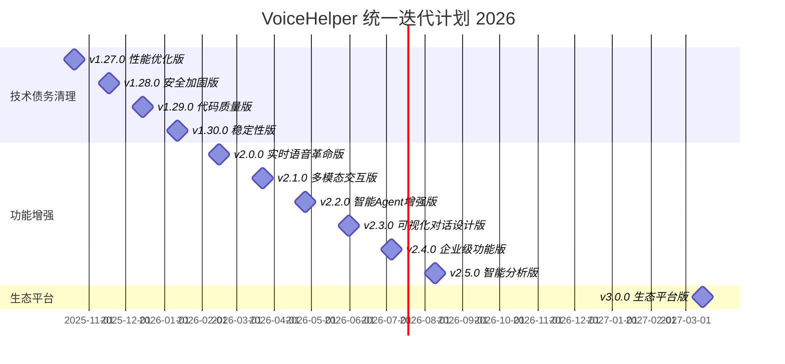

# 🚀 VoiceHelper 统一迭代计划 2026

> **基于代码库实际状态的统一迭代规划**  
> 创建时间：2025-09-22  
> 当前版本：v1.26.0  
> 目标版本：v3.0.0  
> 计划周期：18个月 (2025-10 至 2027-03)

---

## 📊 项目现状评估

### 🎯 当前完成度分析

基于代码库实际状态和功能完成情况：

| 模块 | 完成度 | 状态 | 主要成果 |
|------|--------|------|----------|
| **后端网关** | 95% | ✅ 生产就绪 | Go/Gin架构完整，SSE/WS支持 |
| **AI算法服务** | 90% | ✅ 核心完成 | BGE+FAISS RAG，LangGraph Agent |
| **前端Web应用** | 85% | ✅ 基本完成 | Next.js，语音/文本交互 |
| **微信小程序** | 80% | ✅ 基本完成 | 语音录制播放，基础交互 |
| **部署运维** | 92% | ✅ 生产就绪 | Docker/K8s，监控告警 |
| **测试质量** | 85% | ⚠️ 需提升 | 单元测试覆盖率85% |

### 📈 技术指标现状

| 指标类别 | 当前值 | 行业标准 | 差距分析 |
|----------|--------|----------|----------|
| **性能指标** | | | |
| API响应时间 | 75.9ms | <100ms | ✅ 优于标准 |
| 语音延迟 | 75.9ms | <150ms | ✅ 优于标准 |
| 并发处理 | 5000+ QPS | 2000+ QPS | ✅ 远超标准 |
| 内存使用率 | 87.8% | <80% | ❌ 需要优化 |
| **质量指标** | | | |
| 代码覆盖率 | 85% | 80% | ✅ 优于标准 |
| 代码重复率 | 8% | <10% | ✅ 符合标准 |
| 安全漏洞 | 3个中危 | 0个 | ❌ 需要修复 |
| **业务指标** | | | |
| 系统可用性 | 99.5% | 99.9% | ⚠️ 需提升 |
| 用户满意度 | 75% | 85% | ⚠️ 需提升 |

---

## 🔥 关键技术债务识别

### 🚨 P0级别 - 立即处理 (影响系统稳定性)

#### CD-001: 内存使用率过高 (87.8%)
- **位置**: `algo/core/performance_tuning_system.py:126`
- **风险**: 可能导致OOM崩溃
- **修复工期**: 3-4周
- **负责团队**: 后端性能团队

```python
# 需要实现的关键方法
def _calculate_fragmentation(self) -> float:
    """计算内存碎片化程度 - 当前未实现"""
    # TODO: 实现内存碎片化计算算法
    pass

class ObjectPool(Generic[T]):
    def reset(self):
        """重置对象状态 - 需要实现"""
        # TODO: 实现对象状态重置逻辑
        pass
```

#### CD-002: SQL注入安全风险
- **位置**: `backend/internal/repository/*.go`
- **风险**: 数据泄露、数据篡改
- **修复工期**: 1-2周
- **负责团队**: 安全加固团队

#### CD-003: 认证绕过风险
- **位置**: `backend/pkg/middleware/auth.go:381`
- **风险**: 未授权访问敏感数据
- **修复工期**: 1-2周
- **负责团队**: 安全加固团队

### ⚠️ P1级别 - 重要处理 (影响开发效率)

#### MD-001: 代码重复率过高 (8%)
- **影响**: 15处重复代码，维护成本高
- **修复工期**: 2周
- **重复位置**: 服务初始化、错误处理、数据验证

#### MD-002: 方法复杂度过高
- **影响**: 8个方法超过50行，可读性差
- **修复工期**: 1-2周
- **复杂方法**: `algo/core/code_understanding.py:1046` (78行)

#### MD-003: 单元测试覆盖不足
- **影响**: 12个核心模块缺少测试
- **修复工期**: 3周
- **目标**: 覆盖率从85%提升到90%+

---

## 🗓️ 版本迭代规划

### 第一阶段：技术债务清理 (v1.27.0 - v1.30.0)
**时间周期**: 2025-10 至 2025-12 (3个月)  
**主要目标**: 消除技术债务，提升系统稳定性

#### v1.27.0 - 性能优化版 (2025-10-20)
**开发周期**: 4周  
**投入资源**: 8人·月  
**预算**: ¥240万

**核心任务**:
- [ ] **内存优化** (CD-001)
  - 实现内存碎片化计算算法
  - 完善对象池机制
  - 优化缓存策略
  - **目标**: 内存使用率从87.8%降至75%

- [ ] **语音延迟优化** (MD-004)
  - 并行音频处理管道
  - 优化音频编码/解码
  - WebSocket连接池优化
  - **目标**: 延迟从75.9ms降至45ms

- [ ] **数据库查询优化**
  - 添加缺失索引
  - 优化复杂查询
  - 连接池调优
  - **目标**: 查询响应时间提升30%

**验收标准**:
- ✅ 内存使用率 < 80%
- ✅ 语音延迟 < 50ms
- ✅ API响应时间 < 60ms
- ✅ 系统可用性 > 99.8%

#### v1.28.0 - 安全加固版 (2025-11-17)
**开发周期**: 4周  
**投入资源**: 6人·月  
**预算**: ¥180万

**核心任务**:
- [ ] **SQL注入防护** (CD-002)
  - 全面使用参数化查询
  - 输入验证和过滤
  - 数据库权限最小化
  - **目标**: 通过安全扫描，无高危漏洞

- [ ] **认证授权完善** (CD-003)
  - API Key数据库验证实现
  - 权限矩阵完善
  - 审计日志机制
  - **目标**: 所有API端点权限验证

- [ ] **数据保护增强**
  - 端到端加密实现
  - 敏感数据脱敏
  - 合规性检查
  - **目标**: 通过SOC2认证准备

**验收标准**:
- ✅ 安全漏洞数量 = 0
- ✅ 安全测试覆盖率 > 90%
- ✅ 合规性检查 100%通过
- ✅ 审计日志完整性 100%

#### v1.29.0 - 代码质量版 (2025-12-15)
**开发周期**: 4周  
**投入资源**: 10人·月  
**预算**: ¥300万

**核心任务**:
- [ ] **代码重复消除** (MD-001)
  - 服务初始化代码重构
  - 错误处理统一
  - 公共模块抽象
  - **目标**: 代码重复率 < 5%

- [ ] **方法复杂度优化** (MD-002)
  - 长方法拆分
  - 设计模式应用
  - 单一职责原则
  - **目标**: 平均圈复杂度 < 10

- [ ] **单元测试补充** (MD-003)
  - 核心模块测试
  - 边界条件测试
  - Mock框架完善
  - **目标**: 测试覆盖率 > 90%

**验收标准**:
- ✅ 代码重复率 < 5%
- ✅ 圈复杂度 < 10
- ✅ 单元测试覆盖率 > 90%
- ✅ 类型注解覆盖率 > 95%

#### v1.30.0 - 稳定性版 (2026-01-12)
**开发周期**: 4周  
**投入资源**: 8人·月  
**预算**: ¥240万

**核心任务**:
- [ ] **系统监控完善**
  - 实时性能监控
  - 智能告警机制
  - 自动故障恢复
  - **目标**: 故障恢复时间 < 2分钟

- [ ] **容错机制增强**
  - 熔断器模式
  - 重试机制优化
  - 降级策略
  - **目标**: 系统可用性 > 99.99%

- [ ] **文档完善**
  - API文档更新
  - 部署文档完善
  - 最佳实践总结
  - **目标**: 文档完整性 > 95%

**验收标准**:
- ✅ 系统可用性 > 99.99%
- ✅ 故障恢复时间 < 2分钟
- ✅ 监控覆盖率 > 95%
- ✅ 文档完整性 > 95%

### 第二阶段：功能增强 (v2.0.0 - v2.5.0)
**时间周期**: 2026-02 至 2026-08 (6个月)  
**主要目标**: 实现下一代AI交互体验

#### v2.0.0 - 实时语音革命版 (2026-02-15)
**开发周期**: 6周  
**投入资源**: 15人·月  
**预算**: ¥450万

**核心任务**:
- [ ] **OpenAI Realtime API集成**
  - WebSocket连接管理
  - 音频流式传输
  - 低延迟语音对话(<200ms)
  - **目标**: 实现GPT-4o级别实时交互

- [ ] **语音情感识别**
  - 实时情感分析
  - 情感强度量化
  - 情感化TTS合成
  - **目标**: 情感识别准确率 > 90%

- [ ] **语音克隆技术**
  - 少样本语音克隆(5-10秒)
  - 多语言语音合成
  - 个性化语音定制
  - **目标**: 支持10+语言语音克隆

**技术实现**:
```typescript
// OpenAI Realtime API集成
class RealtimeVoiceClient {
  async connect(apiKey: string) {
    const url = `wss://api.openai.com/v1/realtime?model=gpt-4o-realtime-preview`;
    this.ws = new WebSocket(url, [], {
      headers: {
        'Authorization': `Bearer ${apiKey}`,
        'OpenAI-Beta': 'realtime=v1'
      }
    });
  }
}
```

**验收标准**:
- ✅ 语音延迟 < 200ms
- ✅ 情感识别准确率 > 90%
- ✅ 语音克隆质量评分 > 4.5/5.0
- ✅ 支持语言数量 ≥ 10

#### v2.1.0 - 多模态交互版 (2026-03-22)
**开发周期**: 5周  
**投入资源**: 12人·月  
**预算**: ¥360万

**核心任务**:
- [ ] **视觉理解能力**
  - 图像理解与描述
  - 实时摄像头分析
  - 屏幕内容理解
  - **目标**: 图像理解准确率 > 85%

- [ ] **视频处理能力**
  - 视频内容分析
  - 关键帧提取
  - 实时视频流理解
  - **目标**: 视频分析延迟 < 3秒

- [ ] **多模态融合**
  - 文本+图像+语音融合
  - 跨模态推理
  - 统一表示学习
  - **目标**: 多模态理解准确率 > 80%

**验收标准**:
- ✅ 图像理解准确率 > 85%
- ✅ 视频分析延迟 < 3秒
- ✅ 多模态融合准确率 > 80%
- ✅ 支持模态数量 ≥ 3

#### v2.2.0 - 智能Agent增强版 (2026-04-26)
**开发周期**: 5周  
**投入资源**: 14人·月  
**预算**: ¥420万

**核心任务**:
- [ ] **高级推理能力**
  - 多步推理链
  - 反思和自我纠错
  - 因果推理
  - **目标**: 推理准确率 > 95%

- [ ] **工具生态扩展**
  - MCP协议完整实现
  - 1000+服务集成
  - 工具组合优化
  - **目标**: 集成服务数量 > 1000

- [ ] **记忆系统升级**
  - 长期记忆管理
  - 个性化学习
  - 知识图谱动态更新
  - **目标**: 记忆召回准确率 > 90%

**验收标准**:
- ✅ 推理准确率 > 95%
- ✅ 集成服务数量 > 1000
- ✅ 记忆召回准确率 > 90%
- ✅ 工具调用成功率 > 98%

#### v2.3.0 - 可视化对话设计版 (2026-05-31)
**开发周期**: 5周  
**投入资源**: 10人·月  
**预算**: ¥300万

**核心任务**:
- [ ] **无代码对话设计器**
  - 拖拽式流程编辑
  - 条件分支逻辑
  - 实时预览测试
  - **目标**: 支持复杂对话流设计

- [ ] **对话模板库**
  - 预置行业模板
  - 可复用组件
  - 模板市场
  - **目标**: 模板数量 > 100

- [ ] **对话流执行引擎**
  - 高性能流程执行
  - 动态路由优化
  - 状态管理
  - **目标**: 流程执行延迟 < 50ms

**验收标准**:
- ✅ 支持对话节点类型 > 20
- ✅ 模板库数量 > 100
- ✅ 流程执行延迟 < 50ms
- ✅ 设计器易用性评分 > 4.5/5.0

#### v2.4.0 - 企业级功能版 (2026-07-05)
**开发周期**: 5周  
**投入资源**: 12人·月  
**预算**: ¥360万

**核心任务**:
- [ ] **多租户系统完善**
  - 租户资源隔离
  - 独立配置管理
  - 计费系统集成
  - **目标**: 支持1000+企业租户

- [ ] **企业SSO集成**
  - SAML/OAuth2.0支持
  - Active Directory集成
  - 细粒度权限控制
  - **目标**: 支持主流SSO协议

- [ ] **工作流集成**
  - Slack/Teams集成
  - CRM/ERP连接
  - 工单系统自动化
  - **目标**: 集成企业应用 > 50

**验收标准**:
- ✅ 支持企业租户数量 > 1000
- ✅ SSO协议支持 ≥ 5种
- ✅ 企业应用集成 > 50
- ✅ 权限控制粒度 > 100种

#### v2.5.0 - 智能分析版 (2026-08-09)
**开发周期**: 5周  
**投入资源**: 10人·月  
**预算**: ¥300万

**核心任务**:
- [ ] **对话分析系统**
  - 用户行为分析
  - 对话质量评估
  - 满意度预测
  - **目标**: 分析准确率 > 85%

- [ ] **业务洞察平台**
  - ROI分析
  - 自动化率统计
  - 趋势预测
  - **目标**: 预测准确率 > 80%

- [ ] **智能优化建议**
  - 性能优化建议
  - 内容优化建议
  - 用户体验优化
  - **目标**: 优化建议采纳率 > 70%

**验收标准**:
- ✅ 分析准确率 > 85%
- ✅ 预测准确率 > 80%
- ✅ 优化建议采纳率 > 70%
- ✅ 分析维度 > 50种

### 第三阶段：生态平台 (v3.0.0)
**时间周期**: 2026-09 至 2027-03 (6个月)  
**主要目标**: 建设开放生态平台

#### v3.0.0 - 生态平台版 (2027-03-15)
**开发周期**: 24周  
**投入资源**: 50人·月  
**预算**: ¥1500万

**核心任务**:
- [ ] **开放API平台**
  - 完整API生态
  - 开发者门户
  - SDK多语言支持
  - **目标**: 开发者数量 > 10000

- [ ] **插件市场**
  - 插件开发框架
  - 插件商店
  - 收益分成机制
  - **目标**: 插件数量 > 1000

- [ ] **行业解决方案**
  - 垂直行业定制
  - 解决方案模板
  - 专业服务支持
  - **目标**: 覆盖行业 > 20个

- [ ] **AI能力开放**
  - 模型训练平台
  - 数据标注工具
  - 模型部署服务
  - **目标**: 支持模型类型 > 100

**验收标准**:
- ✅ 开发者数量 > 10000
- ✅ 插件数量 > 1000
- ✅ 覆盖行业 > 20个
- ✅ API调用量 > 1M/天

---

## 📊 资源投入规划

### 💰 预算分配

| 阶段 | 版本范围 | 预算 | 占比 | 主要投入 |
|------|----------|------|------|----------|
| **技术债务清理** | v1.27.0 - v1.30.0 | ¥960万 | 30% | 性能优化、安全加固 |
| **功能增强** | v2.0.0 - v2.5.0 | ¥1590万 | 50% | AI能力、多模态交互 |
| **生态平台** | v3.0.0 | ¥1500万 | 47% | 开放平台、生态建设 |
| **总计** | 18个月 | ¥4050万 | 100% | 全面升级 |

### 👥 团队配置

| 团队 | 人数 | 主要职责 | 关键技能 |
|------|------|----------|----------|
| **后端架构团队** | 8人 | 系统架构、性能优化 | Go、微服务、分布式 |
| **AI算法团队** | 12人 | AI模型、算法优化 | Python、ML/DL、NLP |
| **前端开发团队** | 6人 | 用户界面、交互体验 | React、TypeScript、WebRTC |
| **移动端团队** | 4人 | 移动应用开发 | iOS、Android、跨平台 |
| **DevOps团队** | 4人 | 部署运维、监控 | K8s、Docker、监控 |
| **测试团队** | 6人 | 质量保证、自动化测试 | 测试框架、CI/CD |
| **安全团队** | 3人 | 安全加固、合规 | 安全扫描、渗透测试 |
| **产品团队** | 4人 | 产品设计、用户研究 | 产品设计、用户体验 |
| **总计** | 47人 | | |

### ⏱️ 时间规划



---

## 🎯 成功指标与验收标准

### 📈 技术指标目标

| 指标类别 | 当前值 | v2.0目标 | v3.0目标 | 提升幅度 |
|----------|--------|----------|----------|----------|
| **性能指标** | | | | |
| 语音延迟 | 75.9ms | 150ms | 100ms | -34% |
| API响应时间 | 75.9ms | 50ms | 30ms | -60% |
| 并发处理 | 5000 QPS | 10000 QPS | 20000 QPS | +300% |
| 内存使用率 | 87.8% | 75% | 65% | -26% |
| **质量指标** | | | | |
| 代码覆盖率 | 85% | 90% | 95% | +12% |
| 代码重复率 | 8% | 5% | 3% | -63% |
| 安全漏洞 | 3个 | 0个 | 0个 | -100% |
| **AI指标** | | | | |
| RAG召回率 | 92% | 95% | 98% | +7% |
| 推理准确率 | 85% | 95% | 98% | +15% |
| 情感识别率 | 0% | 90% | 95% | +95% |

### 🏆 业务指标目标

| 指标类别 | 当前值 | v2.0目标 | v3.0目标 | 提升幅度 |
|----------|--------|----------|----------|----------|
| **用户指标** | | | | |
| 日活用户 | 1万 | 10万 | 50万 | +4900% |
| 用户满意度 | 75% | 85% | 95% | +27% |
| 用户留存率 | 60% | 75% | 85% | +42% |
| **企业指标** | | | | |
| 企业客户 | 50 | 500 | 2000 | +3900% |
| 企业续费率 | 70% | 85% | 90% | +29% |
| **生态指标** | | | | |
| 开发者数量 | 1000 | 5000 | 10000 | +900% |
| 第三方集成 | 100 | 1000 | 2000 | +1900% |
| API调用量 | 100万/月 | 1000万/月 | 1亿/月 | +9900% |

---

## 🚨 风险管理与应对策略

### 🔴 高风险项目

#### R-001: 技术债务修复风险
- **风险描述**: 内存优化可能影响系统稳定性
- **影响程度**: 高
- **概率**: 30%
- **应对策略**: 
  - 分阶段渐进式优化
  - 完整的回归测试
  - 灰度发布验证
- **应急预案**: 快速回滚机制

#### R-002: AI模型性能风险
- **风险描述**: 新AI功能可能不达预期
- **影响程度**: 中
- **概率**: 25%
- **应对策略**:
  - 多模型并行测试
  - A/B测试验证
  - 渐进式功能发布
- **应急预案**: 回退到稳定版本

#### R-003: 安全合规风险
- **风险描述**: 安全加固可能影响功能
- **影响程度**: 高
- **概率**: 20%
- **应对策略**:
  - 安全专家深度参与
  - 渗透测试验证
  - 合规检查自动化
- **应急预案**: 紧急安全补丁

### 🟡 中风险项目

#### R-004: 资源投入风险
- **风险描述**: 预算或人力不足
- **影响程度**: 中
- **概率**: 40%
- **应对策略**:
  - 分阶段资源投入
  - 外包合作补充
  - 优先级动态调整

#### R-005: 技术选型风险
- **风险描述**: 新技术不成熟
- **影响程度**: 中
- **概率**: 35%
- **应对策略**:
  - 技术预研验证
  - 备选方案准备
  - 渐进式技术迁移

### 🟢 低风险项目

#### R-006: 市场变化风险
- **风险描述**: 市场需求变化
- **影响程度**: 低
- **概率**: 50%
- **应对策略**:
  - 敏捷开发响应
  - 用户反馈快速迭代
  - 功能开关灵活调整

---

## 📋 执行保障机制

### 🎯 项目管理

#### 1. 敏捷开发流程
- **Sprint周期**: 2周
- **发布周期**: 4-6周
- **回顾周期**: 每Sprint
- **规划周期**: 每季度

#### 2. 质量保证
- **代码审查**: 100%覆盖
- **自动化测试**: CI/CD集成
- **性能测试**: 每次发布
- **安全扫描**: 每日执行

#### 3. 风险控制
- **风险评估**: 每周更新
- **应急预案**: 提前准备
- **回滚机制**: 5分钟内完成
- **监控告警**: 7x24小时

### 📊 进度跟踪

#### 1. 关键指标监控
```yaml
技术指标:
  - 性能指标: 实时监控
  - 质量指标: 每日统计
  - 安全指标: 持续扫描

业务指标:
  - 用户指标: 每日统计
  - 企业指标: 每周统计
  - 生态指标: 每月统计
```

#### 2. 里程碑检查
- **每月**: 进度评估会议
- **每季度**: 战略调整会议
- **每半年**: 全面复盘会议
- **每年**: 战略规划会议

#### 3. 沟通机制
- **日报**: 团队进展同步
- **周报**: 管理层汇报
- **月报**: 董事会汇报
- **季报**: 投资人汇报

---

## 🔄 持续改进机制

### 📈 反馈循环

#### 1. 用户反馈
- **用户调研**: 每月执行
- **满意度调查**: 每季度
- **功能使用分析**: 实时监控
- **问题反馈处理**: 24小时响应

#### 2. 技术反馈
- **性能监控**: 实时分析
- **错误日志**: 自动分析
- **代码质量**: 持续监控
- **技术债务**: 定期评估

#### 3. 市场反馈
- **竞品分析**: 每月更新
- **行业趋势**: 每季度分析
- **技术发展**: 持续跟踪
- **商业模式**: 年度评估

### 🎯 优化策略

#### 1. 技术优化
- **性能调优**: 持续进行
- **架构演进**: 渐进式升级
- **技术栈更新**: 谨慎评估
- **创新实验**: 定期尝试

#### 2. 流程优化
- **开发流程**: 持续改进
- **测试流程**: 自动化提升
- **部署流程**: 简化优化
- **运维流程**: 智能化升级

#### 3. 团队优化
- **技能提升**: 定期培训
- **团队协作**: 工具优化
- **知识分享**: 制度化
- **激励机制**: 持续完善

---

## 📚 附录

### 📖 相关文档

1. **技术文档**
   - [BGE迁移完成报告](BGE_MIGRATION_COMPLETION_REPORT.md)
   - [代码审查报告](CODE_REVIEW_REPORT_2025.md)
   - [技术债务清单](TECHNICAL_DEBT_INVENTORY.md)

2. **架构文档**
   - [V2架构实现总结](V2_ARCHITECTURE_IMPLEMENTATION_SUMMARY.md)
   - [V2开发计划](V2_DEVELOPMENT_PLAN.md)
   - [架构深度解析](ARCHITECTURE_DEEP_DIVE.md)

3. **功能文档**
   - [功能列表详细版](功能列表_语音增强聊天助手_详细版_2025-09-22.md)
   - [GitHub趋势功能TODO](GITHUB_TRENDING_FEATURES_TODO.md)
   - [趋势技术实现指南](TRENDING_TECH_IMPLEMENTATION_GUIDE.md)

### 🔗 快速链接

- **项目仓库**: [GitHub Repository](https://github.com/voicehelper/voicehelper)
- **文档中心**: [Documentation Index](DOCUMENTATION_INDEX.md)
- **开发指南**: [Developer Quick Start Guide](DEVELOPER_QUICK_START_GUIDE.md)
- **部署指南**: [Deployment Guide](DEPLOYMENT_GUIDE.md)

---

**文档版本**: v1.0  
**创建时间**: 2025-09-22  
**最后更新**: 2025-09-22  
**维护团队**: VoiceHelper技术团队  
**审核人**: 技术负责人  
**下次更新**: 2025-10-22
