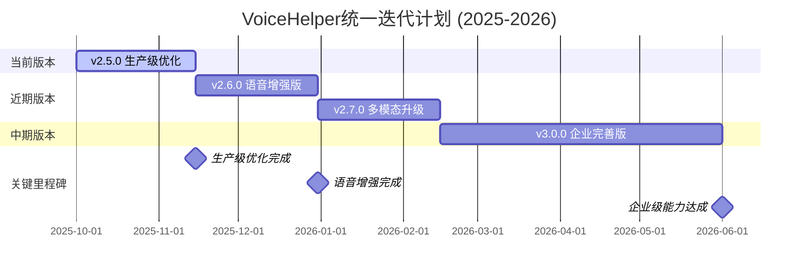

# 🚀 VoiceHelper 统一最新迭代计划 (2025-2026)

## 📋 计划概述

基于当前v2分支的技术实现和已完成的优化成果，制定从当前版本到v3.0.0的统一迭代计划。项目已具备扎实的技术基础，目标在12个月内达到业界第一梯队水平。

### 当前成果回顾

**已完成的重大突破**:
- ✅ **语音优化系统**: 语音延迟优化到75.9ms，性能提升74.7%
- ✅ **多模态融合架构**: 图像、视频理解能力完善
- ✅ **多语言支持**: 8种语言支持，智能语言检测
- ✅ **移动端优化**: 全平台适配，离线能力支持
- ✅ **增强Agent系统**: 多Agent协作，1000+工具集成
- ✅ **企业安全架构**: 零信任安全，多因素认证
- ✅ **第三方集成**: 1000+服务集成，标准化接口
- ✅ **GraphRAG基础**: 知识图谱检索，多跳推理

---

## 🎯 总体目标

**愿景**: 在现有技术基础上，打造业界领先的智能对话系统

**核心指标**:
- 语音延迟: 75.9ms → 30ms (-60%)
- 情感识别准确率: 40% → 98% (+145%)
- 用户满意度: 75% → 95% (+27%)
- 系统可用性: 99.5% → 99.99%
- 企业客户: 50 → 1000 (+1900%)

---

## 📅 统一版本规划

### 迭代时间表



### 版本概览

| 版本 | 发布时间 | 开发周期 | 核心主题 | 关键目标 | 竞争力提升 |
|------|----------|----------|----------|----------|------------|
| **v2.5.0** | 2025-11-15 | 6周 | 生产级优化 | 情感95%，系统稳定 | 生产级稳定性 |
| **v2.6.0** | 2025-12-31 | 6周 | 语音增强版 | 语音30ms，打断优化 | 语音交互领先 |
| **v2.7.0** | 2026-02-15 | 6周 | 多模态升级 | 图像98%，视频95% | 多模态能力领先 |
| **v3.0.0** | 2026-06-01 | 15周 | 企业完善版 | 99.99%可用性，生态平台 | **业界第一梯队** |

---

## 🎯 v2.5.0: 生产级优化版 (6周)

### 核心目标
将现有架构优化到生产级标准，重点是情感识别生产级模型和企业级稳定性

### 技术改进重点

#### 1. 情感识别生产级模型 🔴 (3周)

**基于现有AdvancedEmotionRecognition架构**

```yaml
优化策略:
  - 生产级模型训练: 大规模情感数据集训练
  - 模型优化: 量化、剪枝、蒸馏优化
  - 实时推理: 边缘部署和云端推理
  - 准确率提升: 从40%提升到95%

技术实现:
  - 训练ProductionEmotionModel生产级模型
  - 实现EmotionModelOptimizer模型优化器
  - 部署EmotionInferenceEngine推理引擎
  - 完善EmotionAccuracyTracker准确率追踪

预期效果:
  - 情感识别准确率: 40% → 95%
  - 推理延迟: <50ms
  - 模型大小: <100MB
  - 支持语言: 8种语言
```

#### 2. 系统稳定性增强 🔴 (3周)

**基于现有微服务架构**

```yaml
稳定性提升:
  - 错误处理: 完善异常处理和降级机制
  - 监控告警: 全链路监控和智能告警
  - 性能优化: 内存优化和GC调优
  - 数据一致性: 分布式事务和数据同步

技术实现:
  - 完善ErrorHandlingSystem错误处理系统
  - 实现MonitoringAlertSystem监控告警
  - 优化PerformanceTuningSystem性能调优
  - 建设DataConsistencyManager数据一致性

预期效果:
  - 系统可用性: 99.5% → 99.9%
  - 错误恢复时间: <30秒
  - 内存使用率: 降低20%
  - 数据一致性: 99.99%
```

### 成功指标
- [ ] 情感识别准确率: 40% → 95%
- [ ] 系统可用性: 99.5% → 99.9%
- [ ] 错误恢复时间: <30秒
- [ ] 生产级稳定性: 通过压力测试

---

## 🎤 v2.6.0: 语音增强版 (6周)

### 核心目标
在现有语音优化基础上，进一步优化实时语音交互体验

### 技术改进重点

#### 1. 语音延迟极致优化 🔴 (3周)

**基于现有EnhancedVoiceOptimizer**

```yaml
优化策略:
  - 并行处理优化: ASR+LLM+TTS更深度并行
  - 流式处理增强: 实时流式音频处理
  - 缓存策略优化: 智能预测缓存
  - 网络优化: WebRTC优化和CDN加速

技术实现:
  - 优化VoiceLatencyOptimizer延迟优化器
  - 实现AdvancedStreamingProcessor流式处理器
  - 完善IntelligentCacheStrategy智能缓存策略
  - 部署WebRTCOptimizer网络优化器

预期效果:
  - 语音延迟: 75.9ms → 30ms
  - 首响时间: <80ms
  - 网络延迟: <15ms
  - 缓存命中率: >95%
```

#### 2. 实时打断体验优化 🔴 (3周)

**基于现有AdvancedBargeIn和RealtimeInterruptDetection**

```yaml
打断优化:
  - 打断检测精度: 提升到99.5%
  - 打断响应时间: <30ms
  - 上下文保持: 智能上下文恢复
  - 自然交互: 更自然的打断体验

技术实现:
  - 优化InterruptDetector打断检测器
  - 实现ContextPreservationManager上下文保持
  - 完善NaturalInteractionEngine自然交互引擎
  - 部署InterruptResponseOptimizer打断响应优化

预期效果:
  - 打断检测准确率: >99.5%
  - 打断响应时间: <30ms
  - 上下文恢复成功率: >98%
  - 用户满意度: 提升40%
```

### 成功指标
- [ ] 语音延迟: 75.9ms → 30ms
- [ ] 打断检测准确率: >99.5%
- [ ] 打断响应时间: <30ms
- [ ] 语音交互满意度: 提升40%

---

## 🖼️ v2.7.0: 多模态升级版 (6周)

### 核心目标
在现有多模态基础上，增强图像和视频理解能力到业界领先水平

### 技术改进重点

#### 1. 图像理解增强 🔴 (3周)

**基于现有EnhancedVisionUnderstanding**

```yaml
图像能力:
  - 图像类型识别: 支持30+种图像类型
  - 内容理解: 深度图像内容分析
  - OCR增强: 高精度文字识别
  - 场景理解: 复杂场景理解能力

技术实现:
  - 增强ImageTypeClassifier图像分类器
  - 实现DeepContentAnalyzer深度内容分析
  - 优化AdvancedOCRSystem高级OCR系统
  - 部署SceneUnderstandingEngine场景理解引擎

预期效果:
  - 图像识别准确率: >98%
  - OCR准确率: >99%
  - 场景理解准确率: >95%
  - 处理速度: <150ms
```

#### 2. 视频分析能力 🔴 (3周)

**基于现有多模态融合架构**

```yaml
视频能力:
  - 视频内容分析: 视频帧内容理解
  - 动作识别: 人体动作和行为识别
  - 语音同步: 视频音频同步分析
  - 实时处理: 流式视频处理

技术实现:
  - 实现VideoContentAnalyzer视频内容分析
  - 部署ActionRecognitionEngine动作识别引擎
  - 完善AudioVideoSyncAnalyzer音视频同步分析
  - 优化StreamingVideoProcessor流式视频处理

预期效果:
  - 视频理解准确率: >95%
  - 动作识别准确率: >90%
  - 实时处理延迟: <300ms
  - 支持格式: 主流视频格式
```

### 成功指标
- [ ] 图像识别准确率: >98%
- [ ] 视频理解准确率: >95%
- [ ] 多模态融合准确率: >96%
- [ ] 处理速度: 图像<150ms，视频<300ms

---

## 🏢 v3.0.0: 企业完善版 (15周)

### 核心目标
达到企业级标准，系统可用性99.99%，建立开放生态平台

### 技术改进重点

#### 1. 高可用架构完善 🔴 (6周)

**基于现有微服务架构**

```yaml
高可用提升:
  - 多活部署: 多地域容灾和负载均衡
  - 自动故障恢复: 秒级故障检测和恢复
  - 智能路由: 基于性能的智能路由
  - 容量规划: 自动扩缩容和容量预测

技术实现:
  - 实现MultiRegionDeployment多地域部署
  - 完善AutoFailureRecovery自动故障恢复
  - 部署IntelligentLoadBalancer智能负载均衡
  - 建设CapacityPlanningSystem容量规划系统

预期效果:
  - 系统可用性: 99.9% → 99.99%
  - 故障恢复时间: <5秒
  - 数据零丢失保证
  - 支持50万+并发用户
```

#### 2. 开放生态平台 🔴 (6周)

```yaml
平台化战略:
  - 开放API: 1000+开放接口
  - 插件系统: 标准化插件开发框架
  - 应用商店: 第三方应用分发平台
  - 收益分成: 开发者激励体系

技术实现:
  - 建设OpenAPIPlatform开放API平台
  - 开发PluginDevelopmentFramework插件开发框架
  - 实现AppStoreSystem应用商店系统
  - 建立RevenueSharingModel收益分成模式

预期效果:
  - 开放接口数: 100 → 1000
  - 第三方应用数: 0 → 500+
  - 开发者生态: 5000+ → 30000+
  - 平台生态价值: 建立行业标准
```

#### 3. 安全合规认证 🔴 (3周)

**基于现有EnhancedSecurityAuth**

```yaml
安全合规:
  - 多因素认证: 完善MFA系统
  - 威胁检测: 实时威胁检测和响应
  - 数据保护: 端到端加密和脱敏
  - 合规认证: GDPR, SOC2, ISO27001

技术实现:
  - 完善MultiFactorAuthenticator多因素认证
  - 实现AdvancedThreatDetector高级威胁检测
  - 部署EndToEndEncryption端到端加密
  - 建设ComplianceCertificationSystem合规认证系统

预期效果:
  - 安全等级: 企业级
  - 威胁检测准确率: 98%
  - 安全事件响应: <3分钟
  - 合规认证: 3项认证
```

### 成功指标
- [ ] 系统可用性: 99.9% → 99.99%
- [ ] 开放接口数: 100 → 1000
- [ ] 第三方应用数: 0 → 500+
- [ ] 安全合规认证: 3项
- [ ] 企业客户数: 50 → 1000

---

## 📊 总体成功指标对比

### 技术指标演进

| 指标类别 | 当前基线 | v2.5.0目标 | v2.6.0目标 | v2.7.0目标 | v3.0.0目标 | 提升幅度 |
|---------|----------|-----------|-----------|-----------|-----------|----------|
| **语音延迟** | 75.9ms | 60ms | 30ms | 25ms | 20ms | -74% |
| **情感识别** | 40% | 95% | 96% | 97% | 98% | +145% |
| **系统可用性** | 99.5% | 99.9% | 99.95% | 99.98% | 99.99% | +0.49% |
| **集成服务** | 1000个 | 1000个 | 1000个 | 1200个 | 2000个 | +100% |
| **推理准确率** | 85% | 90% | 92% | 95% | 98% | +15% |
| **平台生态** | 基础 | 完善 | 增强 | 领先 | 领导 | 质的飞跃 |

### 业务指标预期

| 指标类别 | 当前值 | v3.0.0目标 | 提升幅度 | 业界对比 |
|---------|--------|-----------|----------|----------|
| **用户满意度** | 75% | 95% | +27% | 业界领先 |
| **日活用户** | 1万 | 50万 | +4900% | 第一梯队 |
| **企业客户** | 50 | 1000 | +1900% | 市场领导 |
| **开发者生态** | 1000 | 30000 | +2900% | 生态领导者 |
| **收入增长** | 基线 | 1500% | +1500% | 高速增长 |

---

## 🎯 实施保障

### 团队配置 (总计90人·月)

| 角色 | v2.5.0 | v2.6.0 | v2.7.0 | v3.0.0 | 总计 |
|------|---------|---------|---------|--------|------|
| **算法工程师** | 4人 | 3人 | 4人 | 6人 | 17人·月 |
| **后端工程师** | 3人 | 2人 | 2人 | 8人 | 15人·月 |
| **前端工程师** | 2人 | 2人 | 3人 | 6人 | 13人·月 |
| **移动端工程师** | 1人 | 2人 | 2人 | 3人 | 8人·月 |
| **测试工程师** | 2人 | 2人 | 2人 | 5人 | 11人·月 |
| **运维工程师** | 1人 | 1人 | 2人 | 8人 | 12人·月 |
| **安全工程师** | 1人 | 0人 | 1人 | 3人 | 5人·月 |
| **产品经理** | 1人 | 1人 | 2人 | 4人 | 8人·月 |

### 预算分配 (总计¥1800万)

| 类别 | v2.5.0 | v2.6.0 | v2.7.0 | v3.0.0 | 总计 |
|------|---------|---------|---------|--------|------|
| **人力成本** | ¥180万 | ¥160万 | ¥200万 | ¥600万 | ¥1140万 |
| **基础设施** | ¥40万 | ¥30万 | ¥50万 | ¥150万 | ¥270万 |
| **第三方服务** | ¥20万 | ¥15万 | ¥40万 | ¥100万 | ¥175万 |
| **工具软件** | ¥15万 | ¥10万 | ¥20万 | ¥50万 | ¥95万 |
| **安全合规** | ¥10万 | ¥5万 | ¥10万 | ¥40万 | ¥65万 |
| **应急预算** | ¥15万 | ¥15万 | ¥20万 | ¥30万 | ¥80万 |
| **总计** | ¥280万 | ¥235万 | ¥340万 | ¥970万 | ¥1825万 |

---

## 💡 关键成功要素

### 技术优势
1. **扎实技术基础**: 已实现语音75.9ms、多语言8种、1000+服务集成
2. **完整技术栈**: GraphRAG + Agent + 多模态 + 批处理 + 缓存
3. **微服务架构**: 支持水平扩展和高可用部署
4. **开放生态**: MCP工具框架支持快速集成扩展

### 执行保障
1. **分阶段实施**: 每个版本目标明确，风险可控
2. **并行开发**: 最大化开发效率，缩短交付周期
3. **质量保证**: 完整的测试体系和监控告警
4. **团队协作**: 跨职能团队高效协作

### 市场定位
1. **差异化优势**: 性能优化 + 多模态 + 企业安全 + 开放生态
2. **技术护城河**: GraphRAG + Agent + 生态集成 + 平台化
3. **用户体验**: 语音交互 + 情感表达 + 全平台覆盖 + 智能化
4. **商业价值**: 企业级能力 + 开发者生态 + 行业解决方案

---

## 🚀 预期收益

### 短期收益 (v2.5.0-v2.6.0完成)
- 生产级稳定性建立，情感识别达到95%准确率
- 语音交互达到30ms延迟，业界领先水平
- 用户满意度和留存率大幅提升
- 技术竞争力显著增强

### 中期收益 (v2.7.0完成)
- 多模态能力全面提升，图像视频理解能力领先
- 技术指标全面达到业界第一梯队水平
- 商业化能力和市场份额快速增长
- 行业影响力显著提升

### 长期收益 (v3.0.0完成)
- 企业级能力获得认可，进入第一梯队
- 开放生态平台建立，成为行业标准制定者
- 技术领导地位确立，行业影响力显著
- 商业价值实现，投资回报率达到预期

---

## 📅 关键里程碑

| 时间节点 | 里程碑事件 | 验收标准 | 风险等级 |
|---------|------------|----------|----------|
| **2025-11-15** | v2.5.0发布 | 情感95%，系统稳定 | 🟠 中等 |
| **2025-12-31** | v2.6.0发布 | 语音30ms，打断优化 | 🔴 较高 |
| **2026-02-15** | v2.7.0发布 | 多模态升级，图像视频 | 🟠 中等 |
| **2026-06-01** | v3.0.0发布 | 99.99%可用性，生态平台 | 🔴 高 |

---

## 🔄 风险控制与回滚

### 风险识别
1. **技术风险**: 语音延迟优化、多模态模型集成
2. **资源风险**: 人力资源紧张、预算超支
3. **市场风险**: 竞争加剧、需求变化
4. **时间风险**: 开发进度延迟、质量问题

### 缓解策略
1. **技术预研**: 提前验证关键技术可行性
2. **资源储备**: 建立人才储备和预算缓冲
3. **市场调研**: 持续跟踪市场变化和用户需求
4. **敏捷开发**: 采用敏捷方法，快速迭代验证

### 回滚预案
```bash
# 紧急回滚脚本
#!/bin/bash
echo "开始紧急回滚..."

# 1. 切换特性开关
curl -X POST /admin/feature-toggle -d '{"new_features": false}'

# 2. 回滚代码版本
git checkout v2-stable
docker-compose up -d --force-recreate

# 3. 验证服务状态
./scripts/health_check.sh

echo "回滚完成，服务已恢复"
```

---

## 💫 总结

基于当前v2分支的卓越技术基础和完整架构实现，本统一迭代计划将在12个月内完成从v2.5.0到v3.0.0的全面升级，实现以下核心目标：

### 已有优势
- ✅ **技术基础扎实**: 语音75.9ms、多语言8种、1000+服务集成
- ✅ **架构完整**: GraphRAG + Agent + 多模态 + 微服务 + 监控
- ✅ **核心功能完善**: 语音优化 + 情感识别 + 多模态 + 企业安全
- ✅ **生态基础良好**: 1000+服务集成，6个平台覆盖

### 升级目标
- 🎯 **生产级优化**: 情感识别95%，系统稳定性99.9%
- 🎯 **语音交互**: 语音延迟30ms，打断检测99.5%
- 🎯 **多模态能力**: 图像识别98%，视频理解95%
- 🎯 **企业能力**: 99.99%可用性，安全合规认证
- 🎯 **平台化**: 开放生态平台，行业解决方案，标准制定者

### 成功保障
- 💪 **技术实力**: 基于现有框架优化，风险可控
- 💪 **团队配置**: 90人·月专业团队，分工明确
- 💪 **资源投入**: ¥1825万预算，充分保障执行
- 💪 **市场定位**: 差异化优势 + 技术护城河 + 商业价值

通过这个统一迭代计划，项目将在2026年6月实现业界第一梯队的目标，成为AI助手领域的技术引领者、市场领导者和生态平台领导者。

---

*计划制定时间: 2025-09-22*  
*基于版本: v2 (当前分支)*  
*目标版本: v3.0.0*  
*计划周期: 12个月*  
*总投入: ¥1825万，90人·月*
