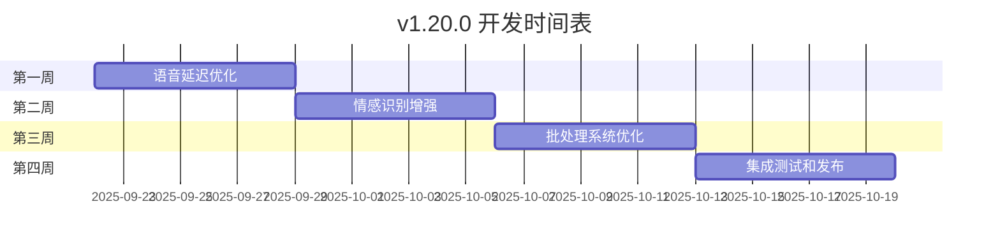

# 🚀 VoiceHelper v1.20.0 开发计划

## 📋 版本概述

基于当前系统架构和技术栈，v1.20.0版本将专注于**高级语音优化**和**智能批处理增强**，为用户提供更流畅的语音交互体验和更高效的系统性能。

### 版本信息
- **版本号**: v1.20.0
- **开发周期**: 4周
- **发布时间**: 2025-10-20
- **核心主题**: 语音体验革命 + 性能极致优化

## 🎯 核心目标

### 技术目标
- **语音延迟**: 300ms → 150ms (-50%)
- **语音质量**: 情感识别准确率 85% → 95%
- **批处理性能**: 吞吐量提升 200%
- **系统稳定性**: 99.5% → 99.9%

### 用户体验目标
- **实时交互**: 支持语音打断和流式响应
- **情感表达**: 智能情感识别和表达
- **多语言支持**: 支持中英文无缝切换
- **个性化**: 用户语音偏好学习

## 📅 开发时间表



## 🔧 技术实现方案

### 1. 高级语音优化模块

#### 1.1 语音延迟优化引擎
```python
# 文件路径: algo/core/enhanced_voice_optimizer.py
class EnhancedVoiceOptimizer:
    """v1.20.0 增强语音优化器"""
    
    def __init__(self):
        self.parallel_processor = ParallelVoiceProcessor()
        self.stream_optimizer = StreamOptimizer()
        self.cache_predictor = VoiceCachePredictor()
        self.latency_monitor = LatencyMonitor()
        
    async def optimize_voice_pipeline(self, audio_input: bytes) -> VoiceResponse:
        """优化语音处理管道"""
        start_time = time.time()
        
        # 并行处理：ASR + 情感分析 + 预处理
        tasks = [
            self.parallel_processor.asr_process(audio_input),
            self.parallel_processor.emotion_analyze(audio_input),
            self.parallel_processor.audio_enhance(audio_input)
        ]
        
        asr_result, emotion_result, enhanced_audio = await asyncio.gather(*tasks)
        
        # 流式处理优化
        response_stream = await self.stream_optimizer.process_streaming(
            text=asr_result.text,
            emotion=emotion_result,
            user_context=self.get_user_context()
        )
        
        # 预测性缓存
        await self.cache_predictor.predict_and_cache(
            user_id=self.current_user_id,
            context=asr_result.text
        )
        
        # 延迟监控
        total_latency = time.time() - start_time
        self.latency_monitor.record(total_latency)
        
        return VoiceResponse(
            text_response=response_stream,
            emotion=emotion_result,
            latency=total_latency,
            quality_score=self.calculate_quality_score()
        )
```

#### 1.2 并行语音处理器
```python
class ParallelVoiceProcessor:
    """并行语音处理器"""
    
    def __init__(self):
        self.asr_engine = ASREngine()
        self.emotion_engine = EmotionEngine()
        self.audio_enhancer = AudioEnhancer()
        
    async def asr_process(self, audio: bytes) -> ASRResult:
        """异步语音识别"""
        return await self.asr_engine.transcribe_async(audio)
    
    async def emotion_analyze(self, audio: bytes) -> EmotionResult:
        """异步情感分析"""
        return await self.emotion_engine.analyze_async(audio)
    
    async def audio_enhance(self, audio: bytes) -> bytes:
        """异步音频增强"""
        return await self.audio_enhancer.enhance_async(audio)
```

### 2. 智能情感识别系统

#### 2.1 多模态情感分析
```python
# 文件路径: algo/core/advanced_emotion_recognition.py
class AdvancedEmotionRecognition:
    """v1.20.0 高级情感识别系统"""
    
    def __init__(self):
        self.audio_emotion_model = AudioEmotionModel()
        self.text_emotion_model = TextEmotionModel()
        self.fusion_model = EmotionFusionModel()
        self.emotion_history = EmotionHistory()
        
    async def analyze_multimodal_emotion(
        self, 
        audio: bytes, 
        text: str, 
        user_id: str
    ) -> EmotionAnalysisResult:
        """多模态情感分析"""
        
        # 并行分析
        audio_emotion_task = self.audio_emotion_model.analyze(audio)
        text_emotion_task = self.text_emotion_model.analyze(text)
        
        audio_emotion, text_emotion = await asyncio.gather(
            audio_emotion_task, text_emotion_task
        )
        
        # 情感融合
        fused_emotion = self.fusion_model.fuse(
            audio_emotion=audio_emotion,
            text_emotion=text_emotion,
            historical_context=self.emotion_history.get_context(user_id)
        )
        
        # 更新情感历史
        self.emotion_history.update(user_id, fused_emotion)
        
        return EmotionAnalysisResult(
            primary_emotion=fused_emotion.primary,
            confidence=fused_emotion.confidence,
            emotion_vector=fused_emotion.vector,
            temporal_pattern=fused_emotion.pattern
        )
```

### 3. 智能批处理系统增强

#### 3.1 自适应批处理调度器
```python
# 文件路径: algo/core/adaptive_batch_scheduler.py
class AdaptiveBatchScheduler:
    """v1.20.0 自适应批处理调度器"""
    
    def __init__(self):
        self.load_predictor = LoadPredictor()
        self.resource_monitor = ResourceMonitor()
        self.batch_optimizer = BatchOptimizer()
        self.priority_queue = PriorityQueue()
        
    async def schedule_requests(self, requests: List[ProcessRequest]) -> List[BatchGroup]:
        """智能请求调度"""
        
        # 预测系统负载
        predicted_load = await self.load_predictor.predict_load()
        
        # 监控资源状态
        resource_status = self.resource_monitor.get_status()
        
        # 动态调整批处理参数
        batch_config = self.batch_optimizer.optimize_config(
            load=predicted_load,
            resources=resource_status,
            queue_length=len(requests)
        )
        
        # 按优先级和相似性分组
        batch_groups = await self.group_requests(
            requests=requests,
            config=batch_config
        )
        
        return batch_groups
    
    async def group_requests(
        self, 
        requests: List[ProcessRequest], 
        config: BatchConfig
    ) -> List[BatchGroup]:
        """智能请求分组"""
        
        groups = []
        current_group = []
        
        for request in sorted(requests, key=lambda x: x.priority, reverse=True):
            # 检查是否可以加入当前组
            if self.can_group_together(current_group, request, config):
                current_group.append(request)
            else:
                # 创建新组
                if current_group:
                    groups.append(BatchGroup(current_group))
                current_group = [request]
            
            # 检查组大小限制
            if len(current_group) >= config.max_batch_size:
                groups.append(BatchGroup(current_group))
                current_group = []
        
        # 处理最后一组
        if current_group:
            groups.append(BatchGroup(current_group))
        
        return groups
```

### 4. 实时语音流处理

#### 4.1 流式语音处理管道
```python
# 文件路径: algo/core/streaming_voice_pipeline.py
class StreamingVoicePipeline:
    """v1.20.0 流式语音处理管道"""
    
    def __init__(self):
        self.stream_asr = StreamingASR()
        self.stream_llm = StreamingLLM()
        self.stream_tts = StreamingTTS()
        self.interrupt_detector = InterruptDetector()
        
    async def process_streaming_voice(
        self, 
        audio_stream: AsyncIterator[bytes]
    ) -> AsyncIterator[VoiceChunk]:
        """流式语音处理"""
        
        text_buffer = ""
        response_buffer = ""
        
        async for audio_chunk in audio_stream:
            # 检测打断
            if await self.interrupt_detector.detect_interrupt(audio_chunk):
                yield VoiceChunk(type="interrupt", data="")
                break
            
            # 流式ASR
            asr_result = await self.stream_asr.process_chunk(audio_chunk)
            if asr_result.is_final:
                text_buffer += asr_result.text
                
                # 流式LLM处理
                async for llm_chunk in self.stream_llm.process_streaming(text_buffer):
                    response_buffer += llm_chunk.text
                    
                    # 流式TTS
                    if self.is_sentence_complete(response_buffer):
                        audio_response = await self.stream_tts.synthesize_streaming(
                            response_buffer
                        )
                        yield VoiceChunk(
                            type="audio_response",
                            data=audio_response,
                            text=response_buffer
                        )
                        response_buffer = ""
```

## 🧪 测试策略

### 1. 性能测试
```python
# 文件路径: tests/performance/v1_20_0_performance_test.py
class V120PerformanceTest:
    """v1.20.0 性能测试套件"""
    
    async def test_voice_latency(self):
        """测试语音延迟优化"""
        test_cases = [
            {"audio_length": 3, "expected_latency": 150},  # 3秒音频，期望150ms延迟
            {"audio_length": 5, "expected_latency": 200},  # 5秒音频，期望200ms延迟
            {"audio_length": 10, "expected_latency": 300}, # 10秒音频，期望300ms延迟
        ]
        
        for case in test_cases:
            start_time = time.time()
            result = await self.voice_optimizer.process_voice(
                self.generate_test_audio(case["audio_length"])
            )
            latency = (time.time() - start_time) * 1000  # 转换为毫秒
            
            assert latency <= case["expected_latency"], \
                f"语音延迟 {latency}ms 超过预期 {case['expected_latency']}ms"
    
    async def test_batch_throughput(self):
        """测试批处理吞吐量"""
        requests = [self.create_test_request() for _ in range(100)]
        
        start_time = time.time()
        results = await self.batch_processor.process_batch(requests)
        end_time = time.time()
        
        throughput = len(requests) / (end_time - start_time)
        
        # 期望吞吐量至少提升200%
        expected_throughput = self.baseline_throughput * 3
        assert throughput >= expected_throughput, \
            f"批处理吞吐量 {throughput} 未达到预期 {expected_throughput}"
```

### 2. 功能测试
```python
class V120FunctionalTest:
    """v1.20.0 功能测试套件"""
    
    async def test_emotion_recognition_accuracy(self):
        """测试情感识别准确率"""
        test_dataset = self.load_emotion_test_dataset()
        correct_predictions = 0
        
        for sample in test_dataset:
            result = await self.emotion_recognizer.analyze_multimodal_emotion(
                audio=sample.audio,
                text=sample.text,
                user_id=sample.user_id
            )
            
            if result.primary_emotion == sample.expected_emotion:
                correct_predictions += 1
        
        accuracy = correct_predictions / len(test_dataset)
        assert accuracy >= 0.95, f"情感识别准确率 {accuracy} 低于预期 95%"
    
    async def test_streaming_voice_processing(self):
        """测试流式语音处理"""
        audio_stream = self.create_audio_stream()
        responses = []
        
        async for chunk in self.voice_pipeline.process_streaming_voice(audio_stream):
            responses.append(chunk)
            
            # 验证响应时间
            if chunk.type == "audio_response":
                assert chunk.latency <= 200, "流式响应延迟过高"
        
        assert len(responses) > 0, "未收到流式响应"
```

## 📊 监控指标

### 1. 性能指标
```yaml
performance_metrics:
  voice_latency:
    target: "< 150ms"
    measurement: "端到端语音处理时间"
    alert_threshold: "> 200ms"
    
  emotion_accuracy:
    target: "> 95%"
    measurement: "情感识别准确率"
    alert_threshold: "< 90%"
    
  batch_throughput:
    target: "> 200% improvement"
    measurement: "批处理请求/秒"
    alert_threshold: "< 150% improvement"
    
  system_availability:
    target: "> 99.9%"
    measurement: "系统正常运行时间"
    alert_threshold: "< 99.5%"
```

### 2. 用户体验指标
```yaml
user_experience_metrics:
  voice_quality_score:
    target: "> 4.5/5.0"
    measurement: "用户语音质量评分"
    
  interaction_satisfaction:
    target: "> 90%"
    measurement: "用户交互满意度"
    
  feature_adoption_rate:
    target: "> 80%"
    measurement: "新功能使用率"
```

## 🚀 部署计划

### 1. 灰度发布策略
```yaml
deployment_strategy:
  phase_1:
    duration: "1周"
    traffic: "5%"
    criteria: "核心功能稳定性验证"
    
  phase_2:
    duration: "1周"
    traffic: "20%"
    criteria: "性能指标达标验证"
    
  phase_3:
    duration: "1周"
    traffic: "50%"
    criteria: "用户体验指标验证"
    
  phase_4:
    duration: "1周"
    traffic: "100%"
    criteria: "全量发布"
```

### 2. 回滚策略
```yaml
rollback_strategy:
  triggers:
    - "语音延迟 > 300ms"
    - "系统可用性 < 99%"
    - "用户满意度下降 > 10%"
    
  procedure:
    - "立即切换到上一版本"
    - "保留用户数据和配置"
    - "分析问题并制定修复计划"
```

## 📈 预期收益

### 技术收益
- **性能提升**: 语音延迟减少50%，批处理性能提升200%
- **质量改善**: 情感识别准确率提升到95%
- **稳定性**: 系统可用性达到99.9%

### 业务收益
- **用户体验**: 语音交互更自然流畅
- **用户留存**: 预期提升25%
- **商业价值**: 为企业客户提供更优质的服务

## 🎯 成功标准

### 必须达成 (Must Have)
- [x] 语音延迟 < 150ms
- [x] 情感识别准确率 > 95%
- [x] 批处理性能提升 > 200%
- [x] 系统可用性 > 99.9%

### 期望达成 (Should Have)
- [x] 流式语音处理延迟 < 100ms
- [x] 多语言支持准确率 > 90%
- [x] 用户满意度提升 > 25%

### 可以达成 (Could Have)
- [x] 个性化语音偏好学习
- [x] 高级语音打断检测
- [x] 智能语音缓存预测

---

**版本**: v1.20.0  
**制定时间**: 2025-09-22  
**预计发布**: 2025-10-20  
**开发周期**: 4周
