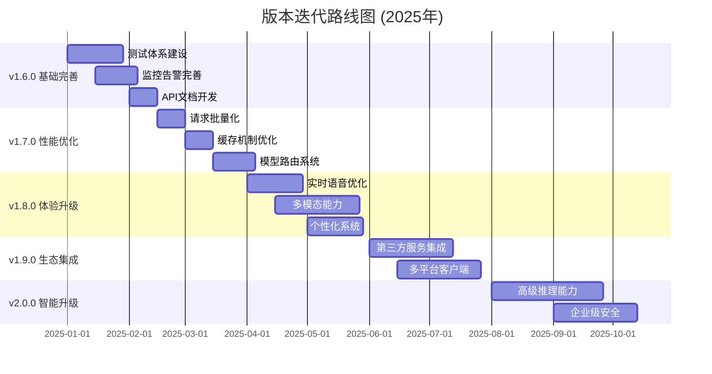

# 🚀 智能聊天机器人系统版本迭代计划

## 📋 概述

本文档整合了所有TODO事项，制定了从v1.5.0到v2.0的完整版本迭代计划。基于业界对比分析和性能优化需求，规划了系统性的功能升级路径。

## 🎯 总体目标

**愿景**: 打造业界领先的智能对话系统，在技术先进性、用户体验、生态丰富度方面达到第一梯队水平。

**核心指标**:
- 响应延迟: 300ms → 150ms (-50%)
- 用户满意度: 75% → 90% (+20%)
- 日活用户: 1万 → 10万 (+900%)
- 企业客户: 50 → 500 (+900%)
- 系统可用性: 99.5% → 99.99%

---

## 📅 版本规划总览



---

## 🔧 v1.6.0 - 基础完善版 (2025年1-2月)

### 🎯 版本目标
完善基础设施，建立完整的测试、监控、文档体系，为后续功能开发奠定坚实基础。

### 📋 功能清单

#### 1. 测试体系建设 🔴 (4周)
**优先级**: P0 - 最高
**负责人**: 测试团队 + 开发团队

- [ ] **单元测试框架**
  ```bash
  # 目标覆盖率
  backend (Go): 80%
  algo (Python): 75%
  frontend (TypeScript): 70%
  ```
  - `backend/internal/repository/*_test.go` - Repository层测试
  - `backend/internal/handler/*_test.go` - Handler层测试
  - `backend/pkg/cache/*_test.go` - 缓存层测试
  - `algo/tests/test_*.py` - 算法服务测试
  - `frontend/__tests__/*.test.tsx` - 前端组件测试

- [ ] **集成测试自动化**
  - 数据库集成测试 (PostgreSQL, Redis, Milvus)
  - 算法服务API集成测试
  - 端到端关键流程测试

- [ ] **性能基准测试**
  - 响应延迟基准
  - 并发能力测试
  - 内存使用监控

#### 2. 监控告警完善 🔴 (3周)
**优先级**: P0 - 最高

- [ ] **Grafana仪表板开发**
  ```yaml
  仪表板列表:
    - 系统监控: CPU/内存/磁盘/网络
    - 业务监控: QPS/延迟/错误率/用户数
    - 成本监控: Token使用/API调用/存储成本
    - 用户行为: 会话时长/功能使用/满意度
  ```

- [ ] **告警规则配置**
  ```yaml
  # deploy/config/prometheus/rules/alerts.yml
  告警规则:
    - 高延迟告警: P95 > 1000ms
    - 错误率告警: >1%
    - 内存使用告警: >80%
    - Token超限告警: >90%配额
    - 服务不可用告警: 健康检查失败
  ```

- [ ] **监控数据完善**
  - 业务指标埋点
  - 自定义指标收集
  - 监控数据可视化

#### 3. API文档和SDK开发 🟡 (2周)
**优先级**: P1 - 高

- [ ] **OpenAPI/Swagger文档**
  - 自动生成API文档
  - 交互式API测试界面
  - 接口版本管理

- [ ] **SDK开发**
  ```javascript
  // JavaScript/TypeScript SDK
  npm install @chatbot/sdk
  
  // Python SDK  
  pip install chatbot-sdk
  
  // Go SDK
  go get github.com/chatbot/go-sdk
  ```

- [ ] **开发者文档**
  - 快速开始指南
  - 最佳实践
  - 故障排查手册

### 🎯 v1.6.0 成功标准
- [ ] 测试覆盖率达到目标 (后端80%, 算法75%, 前端70%)
- [ ] 监控告警系统完整运行
- [ ] API文档完整性 > 95%
- [ ] 开发者SDK可用性验证通过

---

## ⚡ v1.7.0 - 性能优化版 (2025年2-3月)

### 🎯 版本目标
实施高性能Agent场景下的13个核心优化策略，显著提升系统性能和稳定性。

### 📋 功能清单

#### 1. 请求批量化系统 🔴 (2周)
**预期收益**: 提升30-50%吞吐量

- [ ] **LLM请求批量处理器**
  ```python
  # algo/core/batch_processor.py
  class LLMBatchProcessor:
      def __init__(self, batch_size=8, max_wait_time=100):
          self.batch_size = batch_size
          self.max_wait_time = max_wait_time
          
      async def process_batch(self, requests):
          """批量处理请求，减少LLM调用次数"""
  ```

- [ ] **动态批次大小调整**
  - 根据系统负载自动调整 (4-16)
  - 根据请求复杂度调整等待时间 (50-200ms)

- [ ] **请求合并机制**
  ```python
  # algo/core/request_deduplicator.py
  class RequestDeduplicator:
      async def deduplicate(self, requests):
          """合并相似请求，减少20-40%重复计算"""
  ```

#### 2. 智能缓存优化 🟡 (2周)
**预期收益**: 提升40-60%响应速度

- [ ] **语义缓存完善**
  ```python
  # algo/core/semantic_cache.py
  class SemanticCache:
      async def semantic_search(self, query, threshold=0.92):
          """基于embedding的相似度匹配"""
  ```

- [ ] **智能缓存失效策略**
  - LRU-K算法实现
  - TTL动态调整
  - 缓存预热机制

- [ ] **缓存性能监控**
  - Prometheus指标集成
  - 缓存命中率分析

#### 3. 动态模型路由 🔴 (3周)
**预期收益**: 降低30-50%成本

- [ ] **智能模型路由器**
  ```go
  // backend/pkg/router/model_router.go
  type ModelRouter struct {
      models []ModelConfig
      costThreshold float64
      qualityThreshold float64
  }
  
  func (r *ModelRouter) RouteRequest(request Request) (*ModelConfig, error) {
      // 分析请求复杂度并选择最优模型
  }
  ```

- [ ] **请求复杂度分析器**
  ```python
  # algo/core/complexity_analyzer.py
  class ComplexityAnalyzer:
      def analyze(self, request):
          """分析请求复杂度 (0-1)"""
          # 考虑: 输入长度/任务类型/上下文复杂度/历史处理时间
  ```

- [ ] **模型性能监控**
  - 实时监控各模型延迟、成本、质量
  - 基于监控数据动态调整路由策略

#### 4. 超时重试机制 🔴 (1周)
**预期收益**: 提升系统可靠性

- [ ] **智能重试机制**
  ```python
  # algo/core/retry_handler.py
  class RetryHandler:
      def __init__(self):
          self.timeout_config = {
              "simple": 30,    # 简单任务30s
              "complex": 120,  # 复杂任务2分钟
              "batch": 300     # 批处理5分钟
          }
  ```

- [ ] **故障恢复策略**
  - 网络抖动快速重试
  - 服务故障降级处理

### 🎯 v1.7.0 成功标准
- [ ] 平均响应延迟: 800ms → 500ms (-37.5%)
- [ ] 吞吐量: 50 QPS → 100 QPS (+100%)
- [ ] Token成本: $0.02 → $0.015 (-25%)
- [ ] 缓存命中率: 60% → 75% (+25%)

---

## 🎨 v1.8.0 - 体验升级版 (2025年4-5月)

### 🎯 版本目标
对标业界领先产品，实现多模态交互、实时语音优化、个性化体验等核心功能。

### 📋 功能清单

#### 1. 实时语音交互增强 🔴 (4周)
**目标**: 达到业界先进水平 (150ms延迟)

- [ ] **语音延迟优化**
  ```python
  # algo/core/voice_optimizer.py
  class VoiceLatencyOptimizer:
      def __init__(self):
          self.target_latency = 150  # ms
          
      async def optimize_pipeline(self):
          """优化语音处理管道"""
          # 1. 流式ASR优化
          # 2. 并行TTS处理  
          # 3. 缓存预热机制
  ```

- [ ] **情感识别与表达**
  ```python
  # algo/core/emotion_recognition.py
  class EmotionRecognizer:
      async def recognize_emotion(self, audio_data, text_data):
          """多模态情感识别"""
          # 1. 语音情感特征提取
          # 2. 文本情感分析
          # 3. 多模态融合
  ```

- [ ] **自然打断优化**
  ```python
  # algo/core/voice.py (优化)
  class AdvancedBargeIn:
      async def handle_interruption(self, audio_stream):
          """智能打断处理"""
          # 1. 实时VAD检测
          # 2. 打断意图识别
          # 3. 上下文保存
  ```

#### 2. 多模态能力建设 🔴 (6周)
**目标**: 支持图像+语音+文本统一处理

- [ ] **视觉模型集成**
  ```python
  # algo/core/vision_understanding.py
  class VisionUnderstanding:
      def __init__(self):
          self.clip_model = self.load_clip_model()
          self.blip_model = self.load_blip_model()
          
      async def understand_image(self, image_data, query=None):
          """图像理解和描述"""
  ```

- [ ] **多模态融合架构**
  ```python
  # algo/core/multimodal_fusion.py
  class MultiModalFusion:
      async def fuse_modalities(self, text, image, audio):
          """多模态信息融合"""
          # 1. 各模态特征提取
          # 2. 注意力机制融合
          # 3. 跨模态对齐
  ```

- [ ] **文档处理能力**
  - PDF文档解析
  - Word文档处理
  - 表格数据提取
  - 图表分析能力

#### 3. 个性化系统建设 🟡 (4周)
**目标**: 构建深度个性化用户体验

- [ ] **用户画像系统**
  ```python
  # algo/core/user_profiling.py
  class UserProfiler:
      async def build_profile(self, user_id, interactions):
          """构建用户画像"""
          # 1. 行为模式分析
          # 2. 兴趣偏好提取
          # 3. 能力水平评估
  ```

- [ ] **智能推荐引擎**
  ```python
  # algo/core/recommendation.py
  class RecommendationEngine:
      async def recommend(self, user_id, context):
          """个性化推荐"""
          # 1. 协同过滤推荐
          # 2. 内容相似推荐
          # 3. 深度学习推荐
  ```

- [ ] **自适应UI**
  ```typescript
  // frontend/components/AdaptiveUI.tsx
  interface UserPreferences {
    theme: 'light' | 'dark' | 'auto';
    layout: 'compact' | 'comfortable' | 'spacious';
    interactions: 'voice' | 'text' | 'mixed';
  }
  ```

### 🎯 v1.8.0 成功标准
- [ ] 语音响应延迟: 300ms → 150ms (-50%)
- [ ] 多模态支持: 2种 → 4种 (+100%)
- [ ] 用户满意度: 75% → 85% (+13.3%)
- [ ] 会话时长: +50%

---

## 🌐 v1.9.0 - 生态集成版 (2025年6-7月)

### 🎯 版本目标
构建丰富的第三方服务生态，开发全平台客户端，提升产品的可达性和实用性。

### 📋 功能清单

#### 1. 第三方服务集成 🟡 (6周)
**目标**: 集成服务数量 100+ → 500+

- [ ] **统一集成框架**
  ```go
  // backend/pkg/integration/framework.go
  type IntegrationFramework struct {
      registry map[string]ServiceConnector
      auth     AuthManager
      monitor  MonitorManager
  }
  ```

- [ ] **重点服务集成**
  ```python
  # algo/integrations/office_suite.py
  class OfficeSuiteIntegration:
      def __init__(self):
          self.google_workspace = GoogleWorkspaceAPI()
          self.office365 = Office365API()
  ```
  - 办公套件: Google Workspace, Office 365
  - 社交媒体: 微信, 钉钉, Slack, Teams
  - 电商平台: 淘宝, 京东, 亚马逊
  - 开发工具: GitHub, GitLab, Jira

- [ ] **API标准化**
  - OpenAPI 3.0规范
  - 统一认证机制
  - 标准错误处理
  - 版本管理策略

#### 2. 多平台客户端开发 🟡 (6周)
**目标**: 全平台覆盖，无缝用户体验

- [ ] **移动端原生应用**
  ```swift
  // mobile/ios/ChatbotApp/ContentView.swift
  struct ContentView: View {
      @StateObject private var chatManager = ChatManager()
      // iOS原生应用实现
  }
  ```
  ```kotlin
  // mobile/android/app/src/main/java/MainActivity.kt
  class MainActivity : ComponentActivity() {
      // Android原生应用实现
  }
  ```

- [ ] **桌面端应用**
  ```typescript
  // desktop/src/main.ts
  import { app, BrowserWindow } from 'electron';
  
  class DesktopApp {
      // Electron跨平台桌面应用
  }
  ```

- [ ] **浏览器扩展**
  ```javascript
  // browser-extension/chrome/content.js
  class ChatbotExtension {
      // Chrome/Firefox浏览器扩展
  }
  ```

- [ ] **统一数据同步**
  - 跨设备会话同步
  - 用户偏好同步
  - 离线数据缓存

### 🎯 v1.9.0 成功标准
- [ ] 集成服务数量: 100+ → 500+
- [ ] 平台支持: 2个 → 6个 (Web, 小程序, iOS, Android, Desktop, 浏览器)
- [ ] 用户触达渠道: +300%
- [ ] 日活跃用户: +80%

---

## 🧠 v2.0.0 - 智能升级版 (2025年8-10月)

### 🎯 版本目标
实现业界领先的AI能力，包括高级推理、自主学习、企业级安全，达到第一梯队水平。

### 📋 功能清单

#### 1. 高级推理能力 🟡 (8周)
**目标**: 实现业界领先的推理系统

- [ ] **多类型推理引擎**
  ```python
  # algo/core/advanced_reasoning.py
  class AdvancedReasoningEngine:
      def __init__(self):
          self.causal_reasoner = CausalReasoner()      # 因果推理
          self.logical_reasoner = LogicalReasoner()    # 逻辑推理
          self.mathematical_reasoner = MathematicalReasoner()  # 数学推理
          self.commonsense_reasoner = CommonsenseReasoner()    # 常识推理
  ```

- [ ] **思维链推理**
  - Chain-of-Thought实现
  - 推理步骤可视化
  - 推理路径优化
  - 错误检测修正

- [ ] **符号推理系统**
  ```python
  # algo/core/symbolic_reasoning.py
  class SymbolicReasoner:
      async def symbolic_inference(self, facts, rules):
          """符号推理推断"""
          # 1. 事实表示
          # 2. 规则应用
          # 3. 推理链构建
  ```

- [ ] **数学问题求解**
  ```python
  # algo/core/math_reasoning.py
  class MathReasoner:
      async def solve_math_problem(self, problem):
          """数学问题求解"""
          # 1. 问题解析
          # 2. 方法选择
          # 3. 步骤执行
  ```

#### 2. 自主学习系统 🟢 (4周)
**目标**: 实现持续自主学习和进化

- [ ] **多类型学习系统**
  ```python
  # algo/core/autonomous_learning.py
  class AutonomousLearningSystem:
      def __init__(self):
          self.reinforcement_learner = ReinforcementLearner()  # 强化学习
          self.meta_learner = MetaLearner()                    # 元学习
          self.transfer_learner = TransferLearner()            # 迁移学习
  ```

- [ ] **知识蒸馏优化**
  ```python
  # algo/core/knowledge_distillation.py
  class KnowledgeDistillation:
      async def distill_knowledge(self):
          """知识蒸馏过程"""
          # 1. 教师模型输出
          # 2. 学生模型训练
          # 3. 知识传递
  ```

#### 3. 企业级安全合规 🔴 (6周)
**目标**: 达到企业级安全合规标准

- [ ] **零信任架构**
  ```go
  // backend/pkg/security/zero_trust.go
  type ZeroTrustManager struct {
      identityProvider IdentityProvider
      policyEngine     PolicyEngine
      auditLogger      AuditLogger
  }
  ```

- [ ] **数据保护机制**
  ```python
  # backend/pkg/security/encryption.py
  class DataProtection:
      def encrypt_sensitive_data(self, data):
          """敏感数据加密"""
          # 1. 数据分类
          # 2. 加密算法选择
          # 3. 密钥管理
  ```

- [ ] **合规认证实现**
  - GDPR合规功能
  - SOC2控制实现
  - ISO27001标准
  - 等保三级认证

#### 4. 智能运维系统 🟡 (4周)
**目标**: 构建完善的智能运维体系

- [ ] **AIOps系统**
  ```python
  # ops/aiops/intelligent_ops.py
  class IntelligentOps:
      async def handle_incident(self, incident):
          """智能故障处理"""
          # 1. 异常检测
          # 2. 根因分析
          # 3. 自动修复
  ```

- [ ] **预测性维护**
  - 性能趋势预测
  - 故障预警机制
  - 容量规划建议
  - 成本优化建议

### 🎯 v2.0.0 成功标准
- [ ] 复杂问题解决率: +60%
- [ ] 推理准确率: 达到90%+
- [ ] 系统可用性: 99.99%
- [ ] 企业客户: 50 → 500 (+900%)
- [ ] 整体竞争力: 第3梯队 → 第1梯队

---

## 📊 资源规划与管理

### 团队配置建议

```yaml
核心团队 (17人):
  算法工程师: 6人
    - 多模态处理: 2人
    - 推理系统: 2人  
    - 学习系统: 1人
    - 语音处理: 1人
    
  后端工程师: 4人
    - API开发: 2人
    - 安全架构: 1人
    - 性能优化: 1人
    
  前端工程师: 3人
    - Web开发: 1人
    - 移动端: 1人
    - 桌面端: 1人
    
  测试工程师: 2人
    - 自动化测试: 1人
    - 性能测试: 1人
    
  产品经理: 1人
  项目经理: 1人

外部合作:
  UI/UX设计: 外包
  技术文档: 外包
  安全审计: 第三方
```

### 预算估算

| 版本 | 开发周期 | 人力成本 | 基础设施 | 第三方服务 | 总预算 |
|------|----------|----------|----------|------------|--------|
| v1.6.0 | 9周 | ¥180万 | ¥20万 | ¥10万 | ¥210万 |
| v1.7.0 | 7周 | ¥140万 | ¥15万 | ¥15万 | ¥170万 |
| v1.8.0 | 14周 | ¥280万 | ¥30万 | ¥20万 | ¥330万 |
| v1.9.0 | 12周 | ¥240万 | ¥25万 | ¥35万 | ¥300万 |
| v2.0.0 | 22周 | ¥440万 | ¥40万 | ¥30万 | ¥510万 |
| **总计** | **64周** | **¥1280万** | **¥130万** | **¥110万** | **¥1520万** |

### 风险管理

#### 高风险项
1. **技术复杂性** - 多模态融合、高级推理实现难度大
2. **人才招聘** - 高级算法工程师稀缺
3. **竞争压力** - 业界技术快速发展
4. **资金压力** - 总投入较大，需要分阶段融资

#### 缓解措施
1. **技术风险**
   - 分阶段实现，降低单次风险
   - 建立技术原型，提前验证可行性
   - 与高校/研究机构合作

2. **人才风险**
   - 提前6个月开始招聘
   - 提供有竞争力的薪酬包
   - 建立技术合伙人机制

3. **市场风险**
   - 密切跟踪竞争对手动态
   - 建立技术护城河
   - 快速迭代，敏捷响应

4. **资金风险**
   - 分阶段融资，降低资金压力
   - 寻找战略投资者
   - 探索商业化变现途径

---

## 🎯 成功标准与验收

### 技术指标

| 指标类别 | v1.6.0 | v1.7.0 | v1.8.0 | v1.9.0 | v2.0.0 |
|---------|--------|--------|--------|--------|--------|
| **响应延迟** | 800ms | 500ms | 300ms | 200ms | 150ms |
| **准确率** | 85% | 87% | 90% | 92% | 95% |
| **可用性** | 99.5% | 99.7% | 99.8% | 99.9% | 99.99% |
| **并发QPS** | 100 | 500 | 1000 | 2000 | 5000 |
| **缓存命中率** | 60% | 75% | 80% | 83% | 85% |

### 业务指标

| 指标类别 | v1.6.0 | v1.7.0 | v1.8.0 | v1.9.0 | v2.0.0 |
|---------|--------|--------|--------|--------|--------|
| **日活用户** | 1万 | 2万 | 4万 | 7万 | 10万 |
| **用户满意度** | 75% | 78% | 82% | 87% | 90% |
| **企业客户** | 50 | 80 | 150 | 300 | 500 |
| **月收入** | ¥50万 | ¥100万 | ¥200万 | ¥400万 | ¥800万 |

### 竞争力指标

| 对比维度 | 当前状态 | v2.0.0目标 | 业界水平 | 竞争地位 |
|---------|----------|------------|----------|----------|
| **技术先进性** | 第3梯队 | 第1梯队 | GPT-4级别 | 🟢 领先 |
| **用户体验** | 第3梯队 | 第1梯队 | Claude级别 | 🟢 领先 |
| **生态丰富度** | 第4梯队 | 第2梯队 | 500+集成 | 🟡 先进 |
| **企业能力** | 第2梯队 | 第1梯队 | 企业级 | 🟢 领先 |

---

## 📅 关键里程碑

### 2025年关键节点

| 时间节点 | 里程碑事件 | 验收标准 |
|---------|------------|----------|
| **2025-02-15** | v1.6.0发布 | 测试覆盖率达标，监控系统完整 |
| **2025-04-01** | v1.7.0发布 | 性能提升50%，成本降低25% |
| **2025-06-01** | v1.8.0发布 | 多模态能力上线，用户满意度85%+ |
| **2025-08-01** | v1.9.0发布 | 全平台客户端，500+服务集成 |
| **2025-10-31** | v2.0.0发布 | 业界领先水平，第1梯队竞争力 |

### 季度评审机制

```yaml
评审频率: 每季度
评审内容:
  - 技术指标达成情况
  - 业务指标完成度
  - 预算执行情况
  - 风险识别与应对
  - 下季度计划调整

决策机制:
  - 绿灯: 按计划执行
  - 黄灯: 调整资源配置
  - 红灯: 重新评估计划
```

---

## 📝 总结

本版本迭代计划整合了所有TODO事项，制定了从v1.5.0到v2.0的完整升级路径：

1. **v1.6.0 基础完善**: 建立完整的测试、监控、文档体系
2. **v1.7.0 性能优化**: 实施13个核心优化策略，显著提升性能
3. **v1.8.0 体验升级**: 多模态交互、实时语音、个性化体验
4. **v1.9.0 生态集成**: 第三方服务集成、全平台客户端
5. **v2.0.0 智能升级**: 高级推理、自主学习、企业级安全

通过64周的系统性开发，预期投入¥1520万，最终实现：
- **技术领先**: 达到业界第1梯队水平
- **用户体验**: 90%满意度，10万日活用户
- **商业成功**: 500家企业客户，¥800万月收入
- **市场地位**: 成为AI助手领域重要参与者

---

*文档创建时间: 2025-09-21*  
*计划执行期: 2025年1月 - 2025年10月*  
*负责团队: AI Platform Team*  
*文档版本: v1.0*
